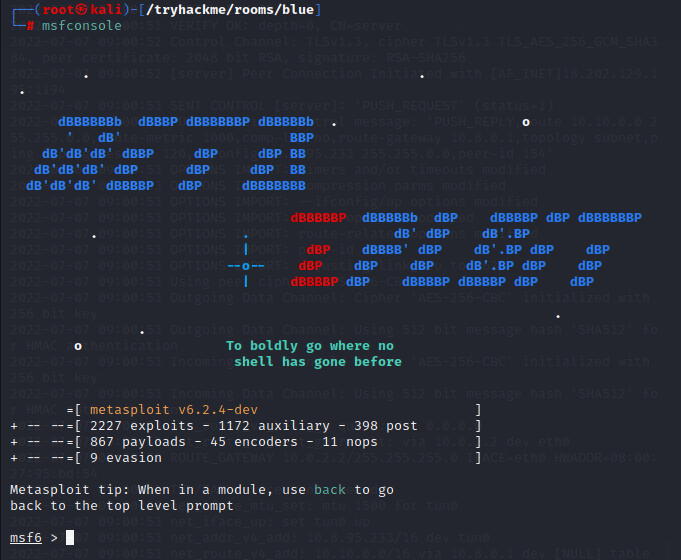
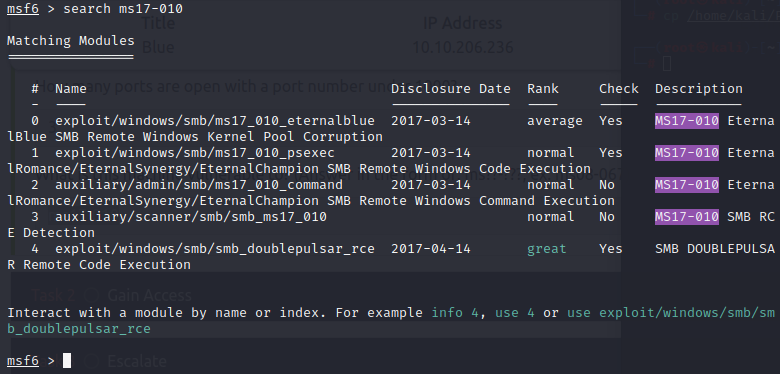

# Introdução

A room trata de um exploiting de um windows com vulnerabilidade eternal blue.

A room não é um CTF, serve mais para prática de pentest.

# Execução

## 1 - Reconnaissance (Recon)

### Questões:
- a. *Scan the machine.*.

Execução do nmap, no terminal:
```bash
export TARGET=10.10.206.236  

nmap -sS -sV -O -sC --script vuln -T5 -Pn -p- $TARGET -oN portscan.nmap -v
```
- Primeiro, um export para uma variável de ambiente contendo o IP da VM alvo (esse ip vai mudar a cada deploy da VM no ambiente TryHackMe);
- O segundo comando é a execução do nmap. Mais detalhes sobre o comando [aqui](https://explainshell.com/explain?cmd=nmap+-sS+-sV+-O+-sC+--script+vuln+-T5+-Pn+-p-+%24TARGET+-oN+portscan.nmap+-v).

***Resposta da questão a***: *Não é necessário*

- b. *How many ports are open with a port number under 1000?*

Após a execução do nmap, constatou-se 3 portas abertas abaixo de 1000 (139/tcp, 445/tcp e 135/tcp)

***Resposta da questão b***: *3*

- c. *What is this machine vulnerable to? (Answer in the form of: ms??-???, ex: ms08-067)*

Após a execução do nmap, basta verificar ou mesmo ler no arquivo de saída geradao "portscan.nmap" as vulnerabilidades detectadas. No trecho abaixo, temos a resposta:

```shell
Host script results:
|_smb-vuln-ms10-054: false
| smb-vuln-ms17-010: 
|   VULNERABLE:
|   Remote Code Execution vulnerability in Microsoft SMBv1 servers (ms17-010)
|     State: VULNERABLE
|     IDs:  CVE:CVE-2017-0143
|     Risk factor: HIGH
|       A critical remote code execution vulnerability exists in Microsoft SMBv1
|        servers (ms17-010).
|           
|     Disclosure date: 2017-03-14
|     References:
|       https://technet.microsoft.com/en-us/library/security/ms17-010.aspx
|       https://blogs.technet.microsoft.com/msrc/2017/05/12/customer-guidance-for-wannacrypt-attacks/
|_      https://cve.mitre.org/cgi-bin/cvename.cgi?name=CVE-2017-0143
|_samba-vuln-cve-2012-1182: NT_STATUS_ACCESS_DENIED
|_smb-vuln-ms10-061: NT_STATUS_ACCESS_DENIED

```

***Resposta da questão c***: *ms17-010*

## 2 - Gain access

### Questões:

- a. *Start metasploit*: *Não é necessário responder*

Para iniciar o metasploit, basta executar no terminal:
```shell
msfsconsole
```



- b. *Find the exploitation code we will run against the machine. What is the full path of the code? (Ex: exploit/........)*

Para responder essa questão, basta executar o comando abaixo no msfconsole:

```shell
search ms17-010
```
Ou seja, fazer uma busca pela vulnerabilidade detectada na etapa de recon.




***Resposta da questão b***: *exploit/windows/smb/ms17_010_eternalblue*