# Introdução

A room discutirá os vários recursos que o MITRE disponibilizou para a comunidade de segurança cibernética.

# Execução

## Task 1 - Introduction to MITRE

Para iniciantes em Cybersecurity, talvez nunca se ouviu falar em [MITRE](https://attack.mitre.org/), talvez tenha apenas falar sobre MITRE em relação a lista de CVEs ([Common Vulnerabilities and Exposures](https://cve.mitre.org/)). Mas a MITRE pesquisa em muitas áreas, fora da segurança cibernética. Essas áreas incluem inteligência artificial, informática em saúde, segurança espacial, apenas alguns exemplos.

De acordo com o próprio site oficial do MITRE: *No MITRE, resolvemos problemas para um mundo mais seguro. Por meio de nossos centros de P&D financiados pelo governo federal e parcerias público-privadas, trabalhamos em todo o governo para enfrentar os desafios à segurança, estabilidade e bem-estar de nossa nação.*

O MITRE é uma organização sediada em Bedford, Massachusetts, Estados Unidos.

Nesta room, concentrou-se em projetos/pesquisas que o MITRE, organização sem fins lucrativos, criou para a comunidade de Cybersecurity, especificamente:

- ATT&CK® (Adversarial Tactics, Techniques, and Common Knowledge) Framework
- CAR (Cyber Analytics Repository) Knowledge Base
- ENGAGE (sorry, not a fancy acronym)
- D3FEND (Detection, Denial, and Disruption Framework Empowering Network Defense)
- AEP (ATT&CK Emulation Plans)

### Questões:

- a. ***Read the above*** *Não há necessidade de resposta*

## Task 2 - Basic Terminology

Antes de iniciar o aprofundamento, uma discussão breve sobre alguns termos que você ouvirá com frequência ao lidar com a estrutura, inteligência de ameaças (threat intelligence) etc.

**APT** é um acrônimo para ***Advanced Persistent Threat***. Isso pode ser considerado uma equipe/grupo (grupo de ameaça), ou mesmo país (grupo de estado-nação), que se envolve em ataques de longo prazo contra organizações e/ou países.

O termo 'Advanced' pode ser enganoso, pois tenderá a nos levar a acreditar que cada grupo APT possui alguma super arma, por exemplo, um exploit de dia zero, que eles usam. Esse não é o caso. Como veremos um pouco mais tarde, as técnicas que esses grupos de APT usam são bastante comuns e podem ser detectadas com as implementações corretas. Você pode ver a lista atual de grupos APT da FireEye [aqui](https://www.mandiant.com/resources/insights/advanced-persistent-threats-apts).

**TTP** é um acrônimo para ***Tactics, Techniques and Procedures***. O que significa cada um desses termos:

- A ***Tactic*** é a meta ou objetivo.
- A ***Technique*** é como se atinge a meta ou objetivo.
- O ***Procedude*** é como se executa a técnica.

Com o progedir do conhecimento, esses termos vão ficando mais claros.

### Questões:

- a. ***Read the above*** *Não há necessidade de resposta*

## Task 3 - ATT&CK® Framework

O que é ATT&CK® framework? De acordo com [website oficial](https://attack.mitre.org/) "MITRE ATT&CK® é uma base de conhecimento de táticas e técnicas adversárias baseadas em observações de cenários reais". Em 2013, o MITRE começou a registrar/documentar **TTPs**(***Tactics, Techniques e Procedures***) que times **APT** (***Advanced Persistent Threat***) usaram em redes corporativas com Windows.

Essa iniciativa de documentação inicou em um projeto interno conhecido como **FMX** (***Fort Meade Experiment***). Nesse projeto, profissionais de segurança selecionados foram encarregados de emular TTPs de adversários (atacantes) contra uma rede, sendo que os dados dos ataques foram coletados. Esses dados, ajudaram a desenvolver as peças iniciais do que se conhece como a estrutura do ATT&CK®.

A estrutura ATT&CK® cresceu e se expandiu ao longo dos anos. Uma expansão expressiva foi que o framework inicialmente focava em ambientes Windows, mas também começou a cobrir outras plataformas, como MacOS e Linux. A estrutura do framework recebe fortes contribuiões de várias fontes, como pesquisadores de segurança e relatórios de inteligência (Threat Intelligence). O framework não é só uma opção para ***blue teamers***, sendo útil também para ***red teamers***.

Já na página inicial do site oficial, é possível visualizar a "***ATT&CK Matrix for Enterprise***". Existem 14 categorias e cada categoria contém técnicas que um adversário(atacante) pode utilizar para alcançar um objetivo ou meta (tática). As categorias cobrem o Ciclo de Vida de Ataque Cibernético de sete estágios (crédito Lockheed Martin pela [Cyber Kill Chain](https://www.lockheedmartin.com/en-us/capabilities/cyber/cyber-kill-chain.html)).

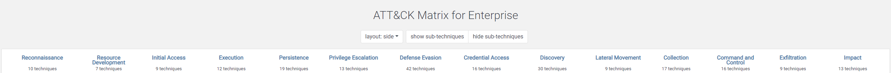

Apenas para exemplificar, observando abaixo da categoria ***Initial Access***, existem 9 técnicas. Algumas técnicas, possuem sub-técnicas, como a de ***Phishing***.

Se clicar em ***Phishing***, é possível observar as sub-técnicas.

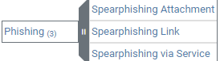

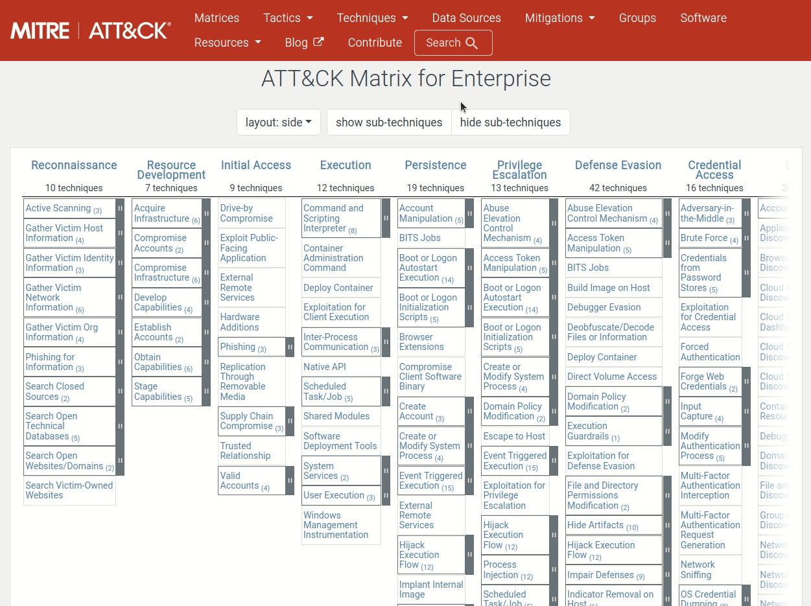

Para ler mais detalhes sobre a técnica e sub-técnicas (quando houver), basta clicar na técnica, por exemplo, clique em ***Phishing***. Será aberta uma página dedicada à técnica, contendo informações como descrição, exemplos de procedimentos e ações de mitigação. Imagem abaixo mostra o exemplo:

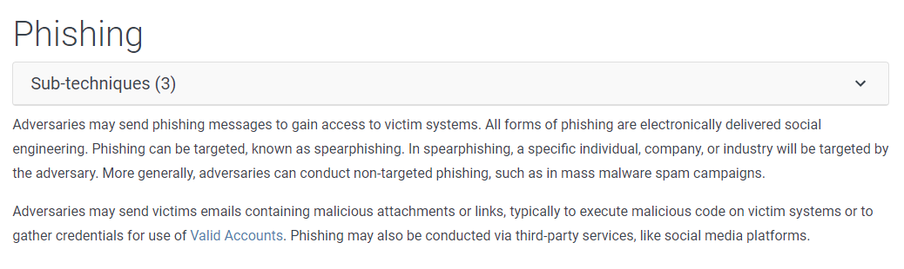

Uma outra alternativa é utilizar o sistema de busca do site.

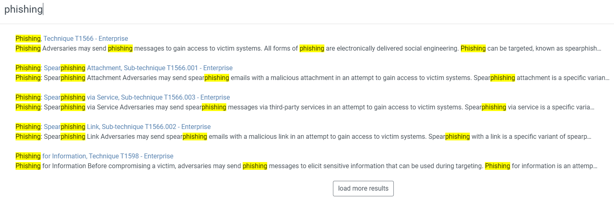

As informações também podem ser visualizadas através do MITRE ATT&CK® Navigator. É possível acessar o Navigator quando se visita a página de um grupo ou ferramenta, onde é possível um botão com "***ATT&CK® Navigator Layers***".

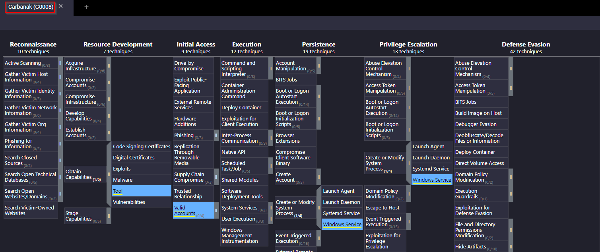

Para conhecer a ferramenta Navigator, visite o link [ATT&CK® Navigator for Carbanak](https://mitre-attack.github.io/attack-navigator//#layerURL=https%3A%2F%2Fattack.mitre.org%2Fgroups%2FG0008%2FG0008-enterprise-layer.json).

No canto superior esquerdo, há 3 conjuntos de controles: controles de seleção, controles de camada e controles de técnica. Recomend-se que se inspecione cada uma das opções sob cada controle para se familiarizar com elas. O ponto de interrogação na extrema direita fornecerá informações adicionais sobre o Navigator.

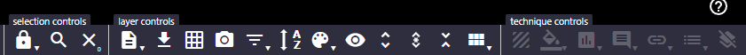

Em resumo, pode-se usar a matriz ATT&CK para mapear um determinado grupo de ameaças e suas táticas e técnicas.

Para responder as questões, inicie pela página da técnica de Phishing.

### Questões:

- a. ***Besides blue teamers, who else will use the ATT&CK Matrix?*** *red teamers*

- b. ***What is the ID for this technique?*** *T1566*

- c. ***Based on this technique, what mitigation covers identifying social engineering techniques?*** *User Training*

- d. ***What are the data sources for Detection? (format: source1,source2,source3 with no spaces after commas)*** *Application Log,File,Network Traffic*

- e. ***What groups have used spear-phishing in their campaigns? (format: group1,group2)*** *Axiom,GOLD SOUTHFIELD* 

- f. ***Based on the information for the first group, what are their associated groups?*** *Group 72*

- g. ***What software is associated with this group that lists phishing as a technique?*** *Hikit*

- h. ***What is the description for this software?*** *Hikit is malware that has been used by Axiom for late-stage persistence and exfiltration after the initial compromise*

- i. ***This group overlaps (slightly) with which other group?*** *Winnti Group*

- j. ***How many techniques are attributed to this group?*** *15*

Todas as questões podem ser respondidas apenas nevagando nos hiperlinks da página de Phishing.

## Task 4 - CAR Knowledge Base 

### Cyber Analytics Repository

A definição ofical para CAR é "*O MITRE Cyber Analytics Repository (CAR) é uma base de conhecimento de análise desenvolvida pela MITRE com base no modelo de adversários MITRE ATT&CK®. O CAR define um modelo de dados que é aproveitado em suas representações de pseudocódigo, mas também inclui implementações direcionadas diretamente a ferramentas específicas (por exemplo, Splunk, EQL) em suas análises. No que diz respeito à cobertura, o CAR está focado em fornecer um conjunto de análises validadas e bem explicadas, em particular no que diz respeito à sua teoria e lógica de operação.*" - Tradução direta.

Para iniciar, acesse [CAR-2020-09-001: Scheduled Task - File Access](https://car.mitre.org/analytics/CAR-2020-09-001/). Ao acessar a página, é exibida uma breve descrição da análise e referências ao ATT&CK (com técnica, sub-técnica e tática).

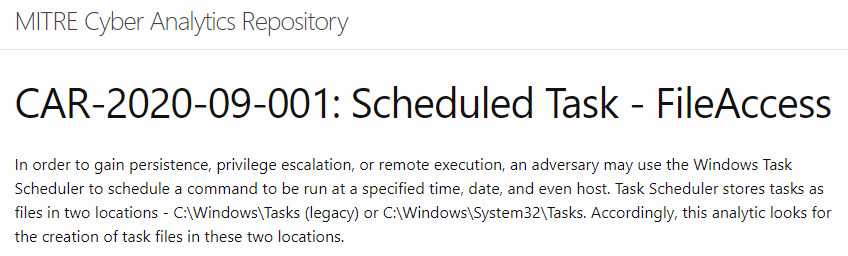

Também pode-se visualizar o Pseudocódigo e uma consulta sobre como pesquisar essa análise específica no **Splunk**. Um pseudocódigo é uma maneira simples e legível para descrever um conjunto de instruções ou algoritmos que um programa ou sistema executará.

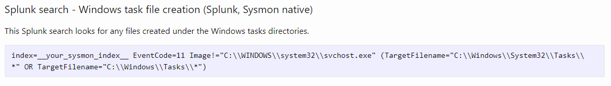

Para tirar o máximo proveito do CAR, é possível visualizar a ***[Full Analytic List](https://car.mitre.org/analytics)*** ou ***[CAR ATT&CK® Navigator](https://mitre-attack.github.io/attack-navigator/#layerURL=https://raw.githubusercontent.com/mitre-attack/car/master/docs/coverage/car_analytic_coverage_04_05_2022.json)*** para visualizar todas as análises.

### Full Analytic List

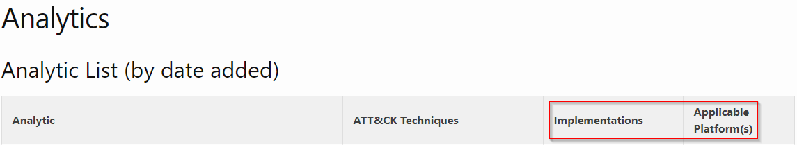

Na visualização Full Analytic List, podemos ver quais implementações estão disponíveis para qualquer análise em uma única olhada, juntamente com a plataforma de SO à qual ela se aplica.

### CAR ATT&CK Navigator

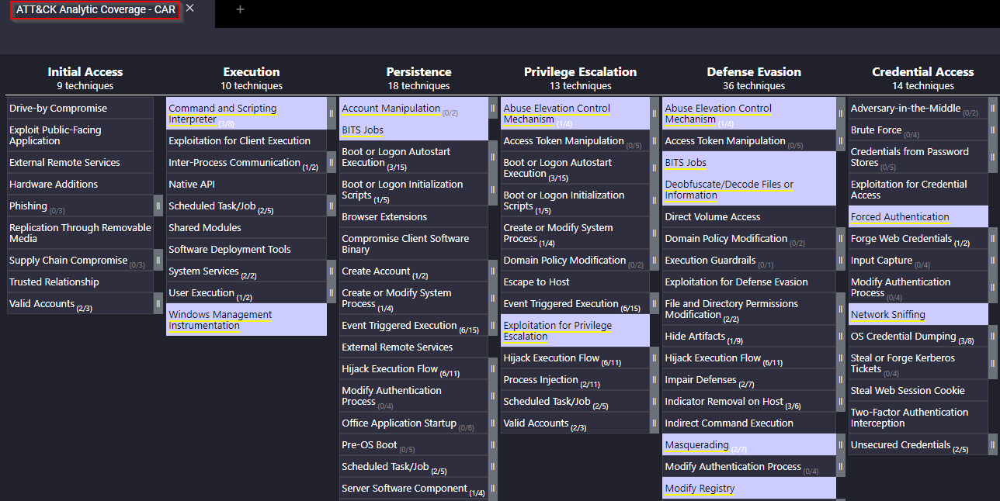

(As técnicas destacadas em lilás são as análises atualmente no CAR)

Para ilustrar melhor, outra análise que pode ser visualizada de uma implementação diferente é a [CAR-2014-11-004: Remote PowerShell Sessions](https://car.mitre.org/analytics/CAR-2014-11-004/).

Em Implementações, um pseudocódigo é fornecido e uma versão EQL do pseudocódigo. EQL (pronunciado como 'igual'), e é um acrônimo para Event Query Language. EQL pode ser utilizado para consultar, analisar e organizar dados de eventos do Sysmon. Você pode ler mais sobre isso [aqui](https://eql.readthedocs.io/en/latest/).

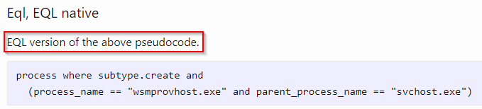

Para resumir, o CAR é um ótimo lugar para encontrar análises que nos levam além dos resumos de Mitigação e Detecção na estrutura ATT&CK®. Esta ferramenta não substitui o ATT&CK®, mas sim um recurso adicional.

### Questões:

- a. ***For the above analytic, what is the pseudocode a representation of?*** *Splunk search*

Para responder questão basta acessar o link da [CAR-2020-09-001](https://car.mitre.org/analytics/CAR-2020-09-001/). A resposta é seção após Pseudocódigo.

- b. ***What tactic has an ID of TA0003?*** *Persistence*

Na questão B, pode-se utilizar a busca do site MITRE ATT&CK.

- c. ***What is the name of the library that is a collection of Zeek (BRO) scripts?*** *BZAR*

Para responder a questão ***c***, basta a acessar a página principal CAR.

- d. ***What is the name of the technique for running executables with the same hash and different names?*** *Masquerading*

Para responder a aquestão ***d***, basta acessar a Full List de análises.

- e. ***Examine CAR-2013-05-004, besides Implementations, what additional information is provided to analysts to ensure coverage for this technique?*** *Unit Tests*

## Task 5 - MITRE Engage 

De acordo com o site oficial "*MITRE Engage é uma estrutura para planejar e discutir operações de engajamento de adversários que permite que você engaje seus adversários e atinja suas metas de segurança cibernética.*" - Tradução direta.

O MITRE Engage é considerado uma Abordagem de Engajamento Adversário. Isso é realizado pela implementação de **Cyber Denial** e **Cyber Deception**.

Com o **Cyber Denial** impedimos a capacidade do adversário de conduzir suas operações e com o **Cyber Deception** plantamos intencionalmente artefatos para enganar o adversário.

O site Engage fornece um [started kit](https://engage.mitre.org/starter-kit/) para se possa 'começar' com a Abordagem de Engajamento Adversário (Adversary Engagement Approach). O starter kit é uma coleção de whitepapers e PDFs que explicam várias listas de verificação, metodologias e processos para você começar.

Assim como o MITRE ATT&CK, o Engage possui sua própria matriz. Abaixo está um visual da ***Engage Matrix***.

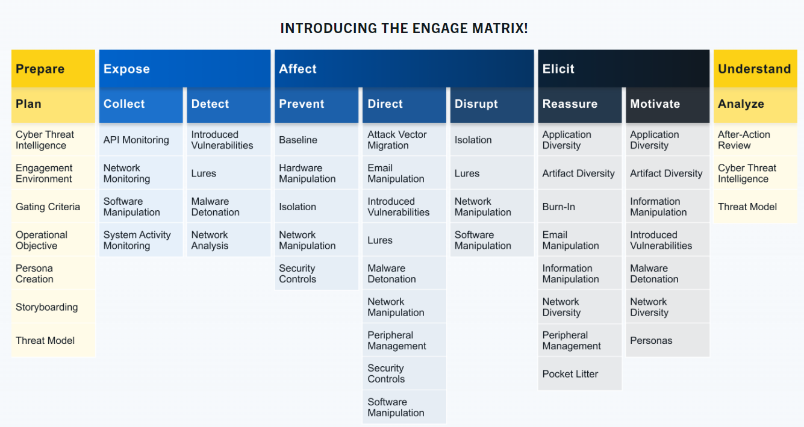

Abaixo um breve descrição das categorias, de acordo com site Engage Matrix:

- **Prepare**: Conjunto de ações operacionais que levará a um resultado desejado (input).
- **Expose**: Quando adversários acionam atividades de Cyber Deception implantadas.
- **Affect**: Quando os adversário executam ações que geram impacto negativo em suas operações.
- **Elicit**: Informações obtidas observando o adversário, aprende-se mais sobre seu modus operandi (TTPs).
- **Understand**: Resultados das ações operacionais (output).

Para obter mais informações, acesseo [Engage Handbook](https://engage.mitre.org/wp-content/uploads/2022/04/EngageHandbook-v1.0.pdf).

É possível acessar e interagir com a [Engage Matrix Explorer](https://engage.mitre.org/matrix). Pode-se filtrar por informações do [MITRE ATT&CK](https://attack.mitre.org/).

Ao acessar a Engage Matrix Explore, observe que, por padrão, a matriz se concentra em ***Operate***, que envolve ***Expose***, ***Affect*** e ***Elicit***.

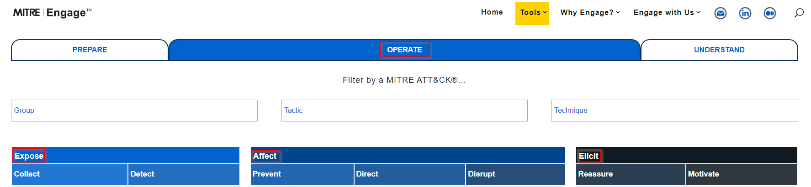

Pode-se clicar em ***Prepare*** ou ***Understand*** se desejar se concentrar apenas nessa parte da matriz.

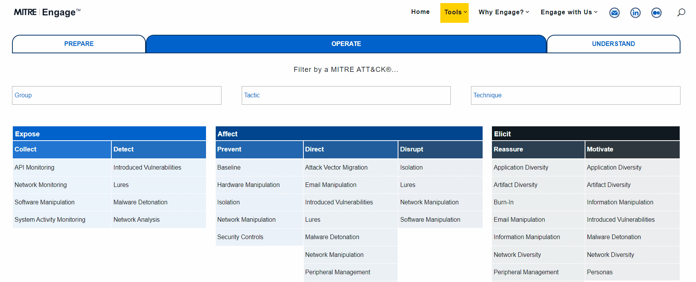

### Questões:

- a. ***Under Prepare, what is ID SAC0002?*** *Persona Creation*
- b. ***What is the name of the resource to aid you with the engagement activity from the previous question?*** *Persona Profile Worksheet*

Para responder a questão b, a dica foi acessar Tools > All tools

- c. ***Which engagement activity baits a specific response from the adversary?*** *Lures*

- d. ***What is the definition of Threat Model?*** *A risk assessment that models organizational strengths and weaknesses* 

As respostas podem ser obtidas explorando a matriz de engagamento.

