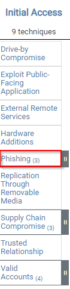

# Introdução

A room discutirá os vários recursos que o MITRE disponibilizou para a comunidade de segurança cibernética.

# Execução

## Task 1 - Introduction to MITRE

Para iniciantes em Cybersecurity, talvez nunca se ouviu falar em [MITRE](https://attack.mitre.org/), talvez tenha apenas falar sobre MITRE em relação a lista de CVEs ([Common Vulnerabilities and Exposures](https://cve.mitre.org/)). Mas a MITRE pesquisa em muitas áreas, fora da segurança cibernética. Essas áreas incluem inteligência artificial, informática em saúde, segurança espacial, apenas alguns exemplos.

De acordo com o próprio site oficial do MITRE: *No MITRE, resolvemos problemas para um mundo mais seguro. Por meio de nossos centros de P&D financiados pelo governo federal e parcerias público-privadas, trabalhamos em todo o governo para enfrentar os desafios à segurança, estabilidade e bem-estar de nossa nação.*

O MITRE é uma organização sediada em Bedford, Massachusetts, Estados Unidos.

Nesta room, concentrou-se em projetos/pesquisas que o MITRE, organização sem fins lucrativos, criou para a comunidade de Cybersecurity, especificamente:

- ATT&CK® (Adversarial Tactics, Techniques, and Common Knowledge) Framework
- CAR (Cyber Analytics Repository) Knowledge Base
- ENGAGE (sorry, not a fancy acronym)
- D3FEND (Detection, Denial, and Disruption Framework Empowering Network Defense)
- AEP (ATT&CK Emulation Plans)

### Questões:

- a. ***Read the above*** *Não há necessidade de resposta*

## Task 2 - Basic Terminology

Antes de iniciar o aprofundamento, uma discussão breve sobre alguns termos que você ouvirá com frequência ao lidar com a estrutura, inteligência de ameaças (threat intelligence) etc.

**APT** é um acrônimo para ***Advanced Persistent Threat***. Isso pode ser considerado uma equipe/grupo (grupo de ameaça), ou mesmo país (grupo de estado-nação), que se envolve em ataques de longo prazo contra organizações e/ou países.

O termo 'Advanced' pode ser enganoso, pois tenderá a nos levar a acreditar que cada grupo APT possui alguma super arma, por exemplo, um exploit de dia zero, que eles usam. Esse não é o caso. Como veremos um pouco mais tarde, as técnicas que esses grupos de APT usam são bastante comuns e podem ser detectadas com as implementações corretas. Você pode ver a lista atual de grupos APT da FireEye [aqui](https://www.mandiant.com/resources/insights/advanced-persistent-threats-apts).

**TTP** é um acrônimo para ***Tactics, Techniques and Procedures***. O que significa cada um desses termos:

- A ***Tactic*** é a meta ou objetivo.
- A ***Technique*** é como se atinge a meta ou objetivo.
- O ***Procedude*** é como se executa a técnica.

Com o progedir do conhecimento, esses termos vão ficando mais claros.

### Questões:

- a. ***Read the above*** *Não há necessidade de resposta*

## Task 3 - ATT&CK® Framework

O que é ATT&CK® framework? De acordo com [website oficial](https://attack.mitre.org/) "MITRE ATT&CK® é uma base de conhecimento de táticas e técnicas adversárias baseadas em observações de cenários reais". Em 2013, o MITRE começou a registrar/documentar **TTPs**(***Tactics, Techniques e Procedures***) que times **APT** (***Advanced Persistent Threat***) usaram em redes corporativas com Windows.

Essa iniciativa de documentação inicou em um projeto interno conhecido como **FMX** (***Fort Meade Experiment***). Nesse projeto, profissionais de segurança selecionados foram encarregados de emular TTPs de adversários (atacantes) contra uma rede, sendo que os dados dos ataques foram coletados. Esses dados, ajudaram a desenvolver as peças iniciais do que se conhece como a estrutura do ATT&CK®.

A estrutura ATT&CK® cresceu e se expandiu ao longo dos anos. Uma expansão expressiva foi que o framework inicialmente focava em ambientes Windows, mas também começou a cobrir outras plataformas, como MacOS e Linux. A estrutura do framework recebe fortes contribuiões de várias fontes, como pesquisadores de segurança e relatórios de inteligência (Threat Intelligence). O framework não é só uma opção para ***blue teamers***, sendo útil também para ***red teamers***.

Já na página inicial do site oficial, é possível visualizar a "***ATT&CK Matrix for Enterprise***". Existem 14 categorias e cada categoria contém técnicas que um adversário(atacante) pode utilizar para alcançar um objetivo ou meta (tática). As categorias cobrem o Ciclo de Vida de Ataque Cibernético de sete estágios (crédito Lockheed Martin pela [Cyber Kill Chain](https://www.lockheedmartin.com/en-us/capabilities/cyber/cyber-kill-chain.html)).

Apenas para exemplificar, observando abaixo da categoria ***Initial Access***, existem 9 técnicas. Algumas técnicas, possuem sub-técnicas, como a de ***Phishing***.

Se clicar em ***Phishing***, é possível observar as sub-técnicas.

Para ler mais detalhes sobre a técnica e sub-técnicas (quando houver), basta clicar na técnica, por exemplo, clique em ***Phishing***. Será aberta uma página dedicada à técnica, contendo informações como descrição, exemplos de procedimentos e ações de mitigação. Imagem abaixo mostra o exemplo:

Uma outra alternativa é utilizar o sistema de busca do site.

As informações também podem ser visualizadas através do MITRE ATT&CK® Navigator. É possível acessar o Navigator quando se visita a página de um grupo ou ferramenta, onde é possível um botão com "***ATT&CK® Navigator Layers***".

Para conhecer a ferramenta Navigator, visite o link [ATT&CK® Navigator for Carbanak](https://mitre-attack.github.io/attack-navigator//#layerURL=https%3A%2F%2Fattack.mitre.org%2Fgroups%2FG0008%2FG0008-enterprise-layer.json).

No canto superior esquerdo, há 3 conjuntos de controles: controles de seleção, controles de camada e controles de técnica. Recomend-se que se inspecione cada uma das opções sob cada controle para se familiarizar com elas. O ponto de interrogação na extrema direita fornecerá informações adicionais sobre o Navigator.

Em resumo, pode-se usar a matriz ATT&CK para mapear um determinado grupo de ameaças e suas táticas e técnicas.

Para responder as questões, inicie pela página da técnica de Phishing.

### Questões:

- a. ***Besides blue teamers, who else will use the ATT&CK Matrix?*** *red teamers*

- b. ***What is the ID for this technique?*** *T1566*

- c. ***Based on this technique, what mitigation covers identifying social engineering techniques?*** *User Training*

- d. ***What are the data sources for Detection? (format: source1,source2,source3 with no spaces after commas)*** *Application Log,File,Network Traffic*

- e. ***What groups have used spear-phishing in their campaigns? (format: group1,group2)*** *Axiom,GOLD SOUTHFIELD* 

- f. ***Based on the information for the first group, what are their associated groups?*** *Group 72*

- g. ***What software is associated with this group that lists phishing as a technique?*** *Hikit*

- h. ***What is the description for this software?*** *Hikit is malware that has been used by Axiom for late-stage persistence and exfiltration after the initial compromise*

- i. ***This group overlaps (slightly) with which other group?*** *Winnti Group*

- j. ***How many techniques are attributed to this group?*** *15*

Todas as questões podem ser respondidas apenas nevagando nos hiperlinks da página de Phishing.
