# Nessus

Neste room será demonstrado como instalar, configurar e utilizar o Nessus, um scanner de vulnerabilidades muito popular.

# Execução

## Task 1 - Introduction

O ***Nessus Vulnerability Scanner*** é exatamente o que diz ser em seu nome - um scanner de vulnerabilidades!

As técnicas utilizadas pela ferramentas são similares às que o Nmap utiliza para localizar e reportar vulnerabilidades, porém no Nessus existe uma GUI mais amigável de utilização.

O Nessus é diferente de outros scanners, pois não faz suposições ao executar um scanner, por exemplo, assumir que um sistema web está executando na porta 80.

Existe uma licença gratuita e outra paga para utilização do Nessus. Na gratuita, algumas funcionalidades e recursos são deixados de fora. O preço da licença paga é similar ao Burp Suite.

Na room será utilizada a versão free.

Mais informações sobre o Nessus [aqui](https://www.tenable.com/products/nessus).

### Questões:

- a. ***I have read the description!*** *Não há necessidade de resposta*

## Task 2 - Installation

Mais informações sobre o processo de instalação [aqui](https://docs.tenable.com/nessus/Content/GettingStarted.htm).

### Questões:

**Passo 1**

Navegue até https://www.tenable.com/products/nessus/nessus-essentials e realize um registro de conta de usuário.

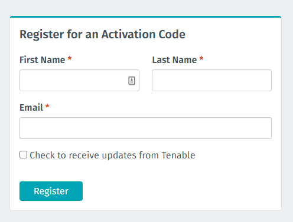

Após o registro, será enviado para o e-mail uma chave de licença.

- a. ***You will need to do this for an activation code.*** *Não há necessidade de resposta*

**Passo 2**

Após o preenchimento de registro de conta, clique no botão Download. No e-mail enviado com a chave de licneça, também tem um link para a página de download.

Realiza-se o download do pacote ***.deb*** para o Kali Linux 64 bits.

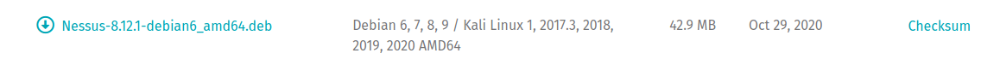

- b. ***Save it to your /Downloads/ folder*** *Não há necessidade de resposta*

**Passo 3**

Em um terminal, dentro da pasta Downloads, basta executar o comando abaixo para instalar:

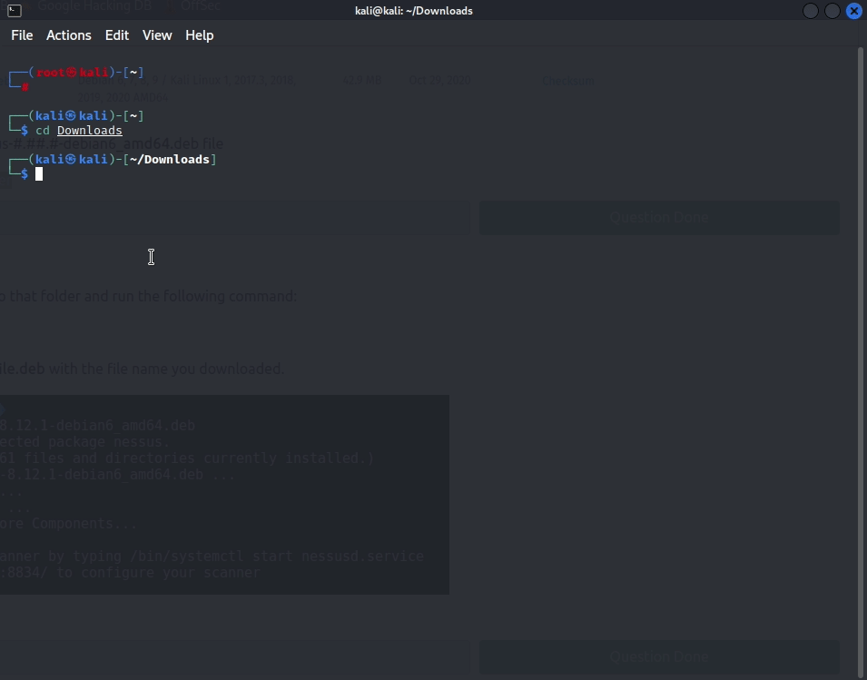

No final da instalação são repassadas informações úteis:

```shell
 - You can start Nessus Scanner by typing /bin/systemctl start nessusd.service
 - Then go to https://kali:8834/ to configure your scanner
```

- c. ***Informações sobre a instalaçao*** *Não há necessidade de resposta*

**Passo 4** 

Nesse passo, é apenas para iniciar o serviço do Nessus no S.O.

```shell
sudo /bin/systemctl start nessusd.service
```

- d. ***Iniciar o serviço*** *Não há necessidade de resposta*

**Passo 5**

Abra no navegador o endereço https://localhost:8834. Será exibido um alerta sobre o certificado, basta aceitar o risco. O alerta se dá pelo fato do Nessus utilizar um certificado TLS/SSL autoassinado.

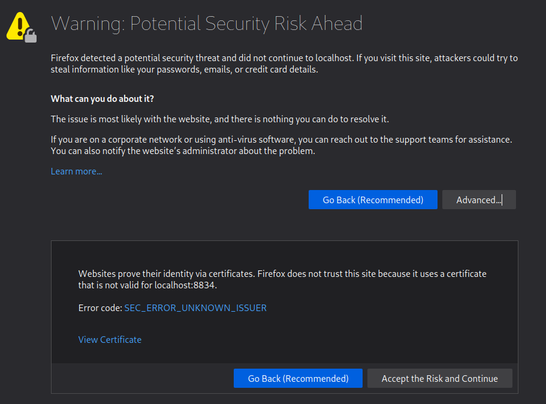

- e. ***Abrir o Nessus no browser*** *Não há necessidade de resposta*

**Passo 6** 

Na próxima etapa, será solicitado marcar qual opção do Nessus deseja utilizar. Marque ***Nessus Essentials***. Clique em ***Continue***

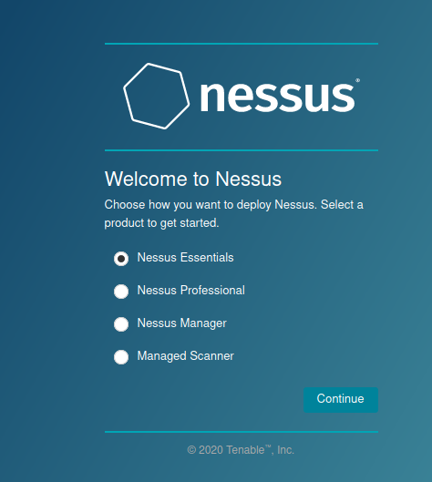

Na próxima etapa, é solicitado preenchimento para receber um código de ativação. Clique em ***skip***, pois já foi feito esse registro e a chave de ativação foi enviada por e-mail.

Na próxima etapa, informe o código de ativação enviado por e-mail e clique em ***Continue***.

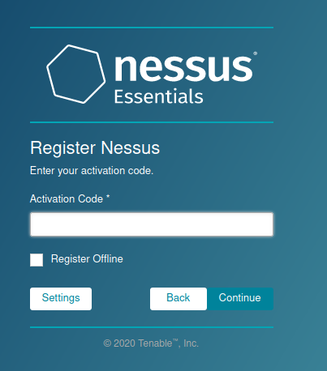

- f. ***Iniciando o Nessus pela primeira vez*** *Não há necessidade de resposta*

**Passo 7**

Configure um usuário e senha na próxima etapa.

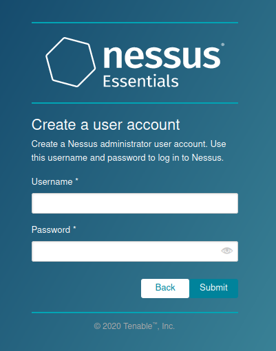

- g. ***Configurando usuário e senha*** *Não há necessidade de resposta*

**Passo 8**

Após configurar usuário e senha, o Nessus vai realizar a instalação de plugins requeridos para o seu funcionamento adequado.

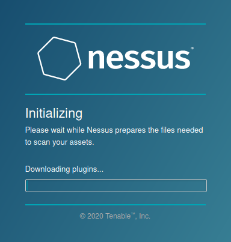

- h. ***Instalação de plugins*** *Não há necessidade de resposta*

Esse processo é demorado, aguarde concluir.

**Passo 9**

Na próxima etapa, basta efetuar login no Nessus.

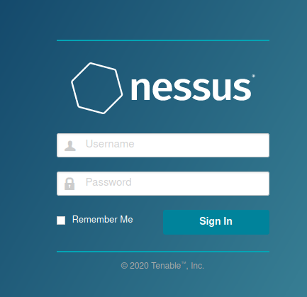

- i. ***Login*** *Não há necessidade de resposta*

**Passo 10**

Após o login, Nessus foi instalado e configurado com sucesso.

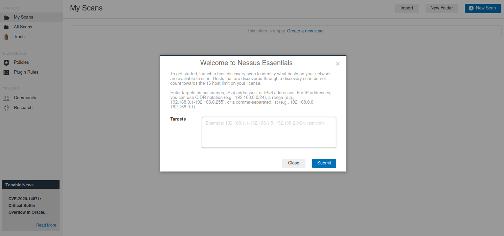

- j. ***Nessus instalado*** *Não há necessidade de resposta*

## Task 3 - Navigation and Scans

Ao logar, será exibida a tela abaixo, após clicar no botão ***New Scan***:

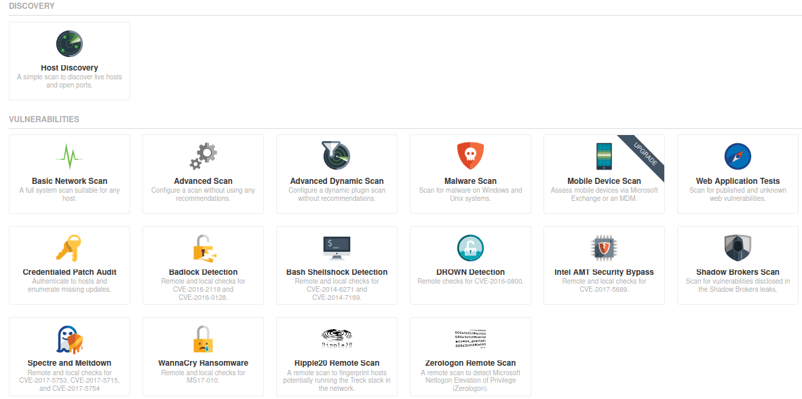

### Questões:

- a. ***What is the name of the button which is used to launch a scan?*** *New Scan*

- b. ***What side menu option allows us to create custom templates?*** *Policies*

- c. ***What menu allows us to change plugin properties such as hiding them or changing their severity?*** *Plugin Rules*

- d. ***In the 'Scan Templates' section after clicking on 'New Scan', what scan allows us to see simply what hosts are alive?*** *Host Discovery*

- e. ***One of the most useful scan types, which is considered to be 'suitable for any host'?*** *Basic Network Scan*

- f. ***What scan allows you to 'Authenticate to hosts and enumerate missing updates'?*** *Credentialed Patch Audit*

- g. ***What scan is specifically used for scanning Web Applications?*** *Web Application Tests*

As respostas acima são bem fáceis de encontrar na UI do Nessus.

