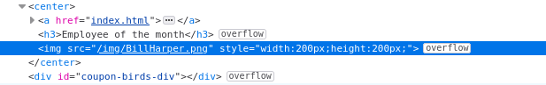

# Introdução

O objetivo dessa room é hackear uma máquina Windows com tema Mr. Robot. Uso do metasploit para acesso inicial, utilização de powershell para enumeração de escalonamento de privilégios do Windows e uso de uma nova técnica para obter acesso de administrador.

# Execução

## Task 1 - Introduction

A primeira tarefa consiste apenas em realizar o deploy da VM alvo e responder uma questão. 

Ao abrir o ip da VM no navegador, é exibida a página, conforme figura abaixo:

Como dica para resposta da questão da task: ***Reverse image search***.

Primeira medida, consultar o código fonte da página para ver se tem alguma pista:

Nome do arquivo da foto do empregado: ***BillHarper.png***. Está ai a resposta!!!
### Questões:

- a. ***Who is the employee of the month?*** *Bill Harper*

## Task 2 - Initial Access  

## Task 3 - Privilege Escalation  

## Task 4 - Access and Escalation Without Metasploit 

