# Introdução

A room oferece oportunidade de aprendizado sobre o básico do Wireshark e como analisar vários protocolos e PCAPs.

# Execução

## Task 1 - Introduction

O Wireshark é uma ferramenta usada para criar e analisar PCAPs (arquivos de captura de pacotes de rede). É uma das melhores ferramentas de análise de pacotes. 

Nesta room, serão abordados os fundamentos da instalação do Wireshark e seu uso para realizar a análise básica de pacotes e examinar detalhadamente cada protocolo de rede comum.

### Questões:

- a. ***Informações*** *Não há necessidade de resposta*

## Task 2 - Installation

A instalação do wireshark é bem simples. Mais informações no [link](https://www.wireshark.org/download.html).

Na maioria das distribuições Linux já existe no repositório de pacotes para instalação, bastando utilizar o gerenciador pacotes para instalar (apt, yum, dnf, etc).

### Questões:

- a. ***Read the above, and ensure you have Wireshark installed.*** *Não há necessidade de resposta*

## Task 3 - Wireshark Overview 

A primeira tela ao abrir o wireshark mostra opções sobre seleção de interface, filtros:

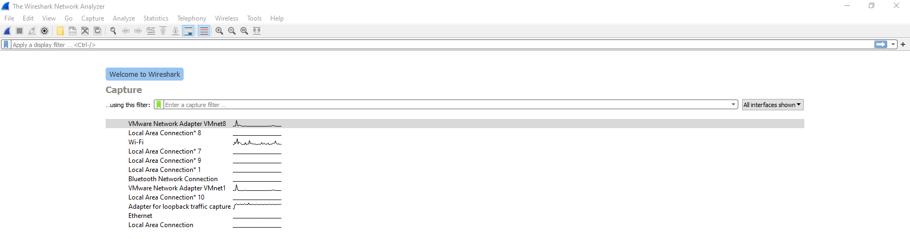

Na imagem, existem várias interfaces. Isso varia de acordo com o computador. É possível também iniciar uma *Live Capture* em uma interface ou carregar um arquivo PCAP.

É importante perceber os gráficos de atividades ao lado de cada interface. Isso indica que uma interface está com tráfego. Capturar em uma interface que não tem atividade, pode ser inútil.

### Live Capture

No topo da lista de interfaces, na bandeirinha verde, é possível escolher uma série de filtros para facilitar o trabalho:

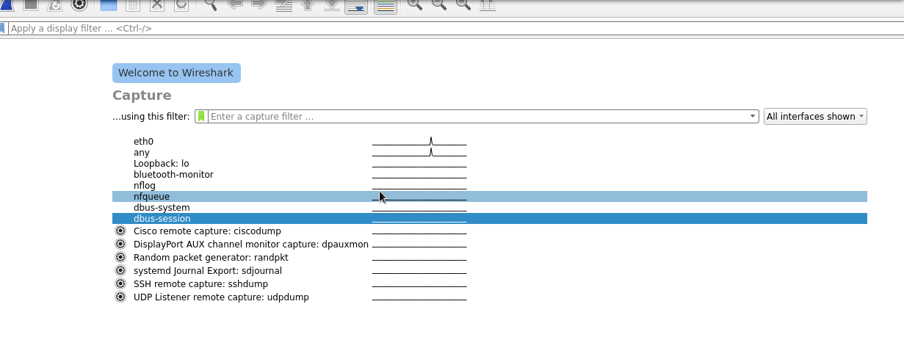

Não é obrigatório selecionar um filtro, mas isso ajuda a melhor organizar o que será mostrado na captura.

Uma vez que você selecionou a interface e filtros, basta clicar em iniciar captura:

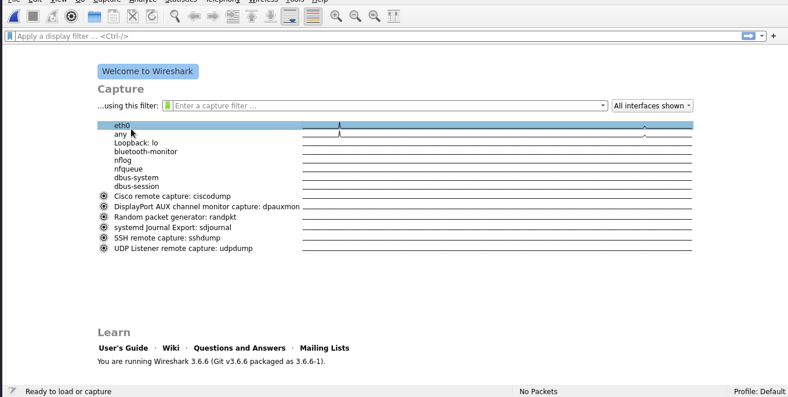

Quando precisar parar a captura, basta clicar no botão Stop (Vermelho) na barra de ferramentas do topo.

### Arquivo PCAP

Caso tenha um arquivo PCAP e queira analisar, basta clicar no menu File->Open e selecionar o arquivo.

### Informações da tela de captura

Tanto quando se faz uma live capture ou se carrega um arquivo PCAP, a tela exibe uma série de informações:

- Packet Number
- Time
- Source
- Destination
- Protocol
- Length
- Packet Info

Juntamente com informações rápidas de pacotes, o Wireshark também codifica pacotes por cores em ordem de nível de perigo, bem como protocolo para poder detectar rapidamente anomalias e protocolos nas capturas.

As informações são úteis, dependendo da necessidade.

### Questões:

- a. ***Read the above and play around with Wireshark.*** *Não há necessidade de resposta*

## Task 4 - Collection Methods  

Existem algumas maneiras de se reunir um arquivo PCAP. Coletar o tréfego e trazer para o Wireshark envolve algumas técnicas: tap, port mirroring, MAC floods, ARP Poisoning. É possível configurar as técnicas em uma live capturing do Wireshark.

### Visão geral dos métodos de coleta

Algumas coisas antes de tentar coletar e monitorar capturas com live capturing:

- Comece com uma captura de amostra para garantir que tudo esteja configurado corretamente e que você esteja capturando o tráfego com sucesso.

- Certifique-se de ter poder computacional suficiente para lidar com o número de pacotes com base no tamanho da rede, isso obviamente variará de rede para rede.

- Garanta espaço em disco suficiente para armazenar todas as capturas de pacotes.

Depois de atender a todos esses critérios e escolher um método de coleta, você pode começar a monitorar e coletar ativamente os pacotes em uma rede.

### Network taps

Consiste em uma implantação física, em que se "toca" (grampo) fisicamente em um cabo de transmissão de dados. Essa técnica é comumente utilizada por times de Threat Hunting/DFIR e Red Teams, objetivando sniff e captura de pacotes.

Existem dois meios principais de grampear um fio. A primeira é usando hardware para grampear o fio e interceptar o tráfego à medida que ele passa, um exemplo disso seria um grampeador de vampiro, conforme ilustrado abaixo.

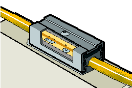

Outra opção para plantar um tap de rede seria um tap de rede inline, que você plantaria entre ou 'inline' dois dispositivos de rede. O tap irá replicar os pacotes conforme eles passam pelo tap. Um exemplo deste toque seria o muito comum Throwing Star LAN Tap.

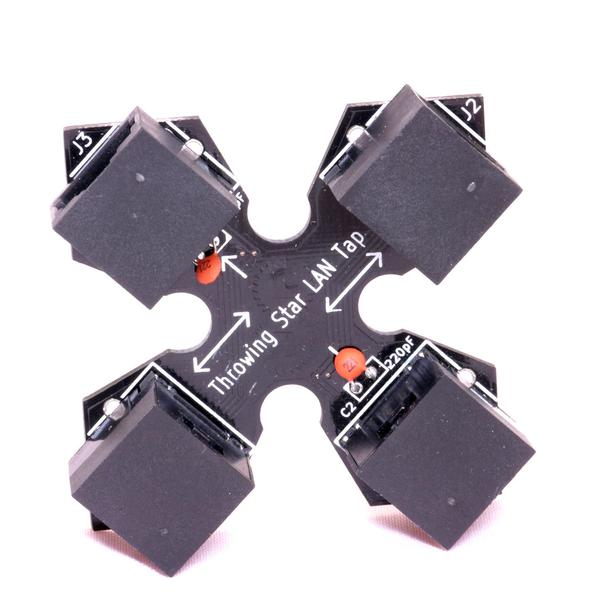

### Mac Floods

MAC Floods é uma tática muito utilizada por Red Teams como forma de sniffing ativo de pacotes. O MAC Flooding destina-se a estressar o switch e preencher a tabela CAM. Assim que a tabela CAM estiver preenchida, o switch não aceitará mais novos endereços MAC e, portanto, para manter a rede ativa, o switch enviará pacotes para todas as portas do switch.

***Nota***: Esta técnica deve ser usada com extrema cautela e com consentimento prévio explícito do contratante de um pentest.

### ARP Poisoning

ARP Poisoning é outra técnica usada por Red Teams para sniffing ativo de pacotes. Por ARP Poisoning você pode redirecionar o tráfego do(s) host(s) para a máquina da qual você está monitorando. Essa técnica não sobrecarregará equipamentos de rede como MAC Flooding, mas ainda deve ser usada com cautela e somente se outras técnicas, como taps de rede, não estiverem disponíveis.

### Questões:

- a. ***Read the above and practice collecting captures, as well as understand the various capture techniques available.*** *Não há necessidade de resposta*

## Task 5 - Filtering Captures 

Aplicar filtros de pacotes é muito importante, sobretudo quando se tem uma captura muito grande com mais de 100.000 pacotes. Na Task 3,foi mostrado como configurar filtro antes de iniciar uma captura. Existe uma segunda forma que é conhecido como filtros de exibição, em que se pode aplicar filtros de exibição de duas maneiras: através da guia analisar e na barra de filtros na parte superior da captura de pacotes.

### Operadores de filtro

Existe uma sintaxe bem simples no Wireshark para utilização em filtros. Abaixo os operadores:

- **and**: *and* / *&&*
- **or**: *or* / *||*
- **equals**: *eq* / *==*
- **not equal**: *ne* / *!=*
- **greater than**: *gt* / *>*
- **less than**: *lt* / *<*

Existem outros operadores que podem ser utilizados no wireshark, mais informações [aqui](https://www.wireshark.org/docs/wsug_html_chunked/ChWorkBuildDisplayFilterSection.html).

### Filtro Básico

Pode-se filtrar as informações de uma captura ou uma arquivo PCAP por IP ou protocolo, dentre outras informações.

***Filtro por IP***: permitirá que se vasculhe o tráfego e veja apenas os pacotes com um endereço IP específico contido nesses pacotes, seja da origem ou do destino.

***Sintaxe***: ip.addr == \<IP Address\>

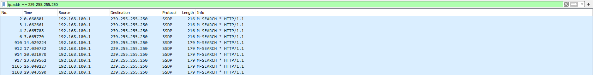

***Filtro por protocolo TCP***: É possível filtrar por uma porta ou protocolo. Com o Wireshark é possível filtrar tanto por número de porta como por nome de protocolo.

***Sintaxe***: tcp.port eq \<Port #\> or \<Protocol Name\>

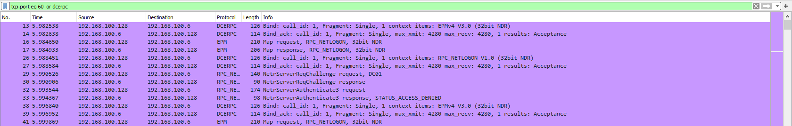

***Filtro por protocolo UPD***: Também é possível filtrar por UDP, bastando mudar o prefixo de TCP para UDP.

***Sintaxe***: udp.port eq \<Port #\> or \<Protocol Name\>

### Questões:

- a. ***Read the above and understand the basics of packet filtering.*** *Não há necessidade de resposta*

## Task 6 - Packet Dissection 

O Wireshark usa a arquitetura OSI para dividir os pacotes. Conhecimento na arquitetura OSI de 7 camadas é importante.

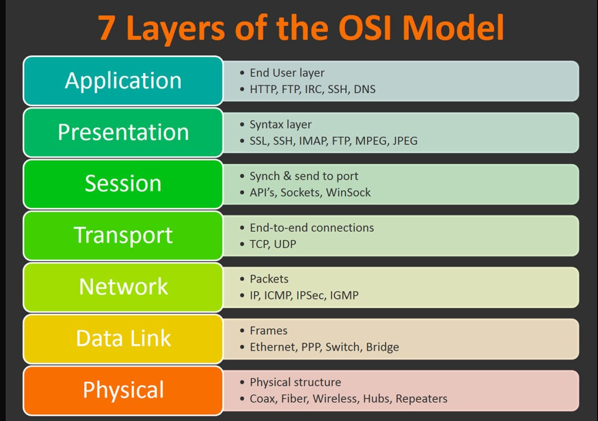

### Detalhes do pacote

Para exibir detalhes de um pacote capturado, basta um duplo clique nele.

Os pacotes consistem em 5 a 7 camadas com base no modelo OSI. Para ilustrar, serão analisados todos eles em um pacote HTTP de uma captura de amostra.

De acordo com a figura acima, pode-se ver as 7 camadas distintas para o pacote: frame/packet, source [MAC], source [IP], protocolo, erros de protocolo, protocolo de aplicação e dados de aplicação. Abaixo, figura com as camadas com mais detalhes.

- ***Frame (Layer 1)***: Exibe qual quadro/pacote está visualizando, bem como detalhes específicos da camada física do modelo OSI.

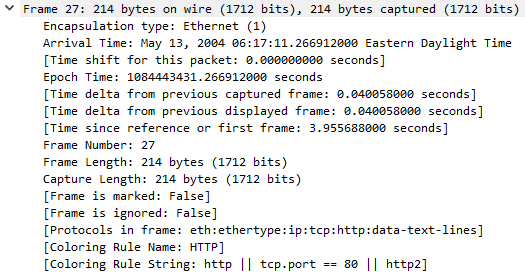

- ***Source [MAC] (Layer 2)***: Exibe os endereços MAC de origem e destino. Relacionado à camada de enlace de dados do modelo OSI.

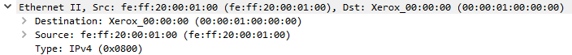

- ***Source [IP] (Layer 3)***: Exibe os endereços IPv4 de origem e destino. Relaciona à camada de rede do modelo OSI.

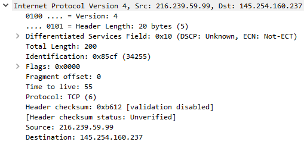

- ***Protocol (Layer 4)***: Exibe detalhes do protocolo usado (UDP/TCP) junto com as portas de origem e destino. Relacionado à camada de transporte do modelo OSI.

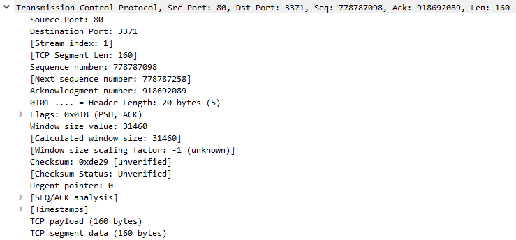

- ***Protocol Errors***: Esta é uma continuação da 4ª camada mostrando segmentos específicos do TCP que precisavam ser remontados.

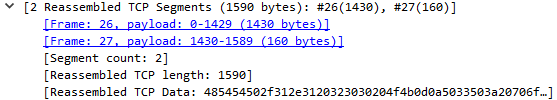

- ***Application Protocol (Layer 5)***: Exibe detalhes específicos do protocolo que está sendo usado, como HTTP, FTP, SMB, etc. Relacionado à camada de aplicação do modelo OSI.

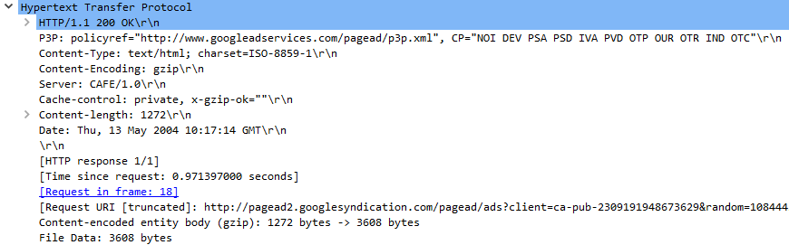

- ***Application Data***: Esta é uma extensão da camada 5 que pode mostrar os dados específicos do aplicativo.

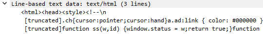

Nota: Mesmo sendo citado o modelo OSI, no texto da task, ficou evidente estar sendo abordado o modelo de camadas TCP/IP.

### Questões:

- a. ***Read the above and move on to analyzing application protocols.*** *Não há necessidade de resposta*

## Task 7 - ARP Traffic

### Visão geral - ARP

ARP (Address Resolution Protocol) é um protocolo da camada 2 que é usado conectar um endereço IP a um endereço MAC, faz um de - para. Esse protocolo possui duas mensagens de interesse nesse momento: REQUEST e REPLY. Uma maneira de identificar em pacotes capturados, consiste verificar     no cabeçalho da mensagem, que pode conter *operation codes*:

- Request (1)
- Reply (2)

Abaixo, você pode ver uma captura de pacote de várias solicitações e respostas ARP:

É importante observar que a maioria dos dispositivos se identificará ou o Wireshark o identificará como Intel_78, um exemplo de tráfego suspeito seria muitas solicitações de uma fonte não reconhecida. No entanto, pode-se habilitar uma configuração no Wireshark para resolver endereços físicos. Para habilitar esse recurso, navegue até *View > Name Resolution >* Certifique-se de que *Resolve Physical Addresses* esteja marcado.

Observando a captura de tela abaixo, podemos ver que um dispositivo Cisco está enviando solicitações ARP, o que significa que devemos confiar nesse dispositivo, no entanto, deve-se sempre ter cautela ao analisar pacotes.

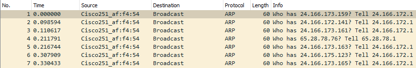

### Trafégo ARP

- ***Pacotes ARP Request***: Pode-se começar a analisar os pacotes examinando o primeiro pacote de solicitação ARP e os detalhes do pacote.

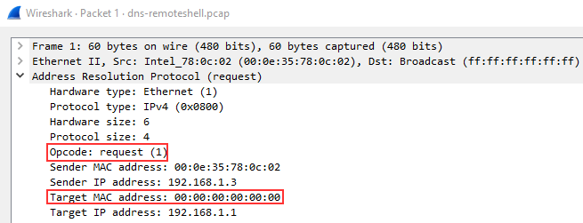

Observando os detalhes do pacote acima, os detalhes mais importantes do pacote estão destacados em vermelho. O Opcode é a abreviação de código de operação e você informará se é uma REQUEST ou REPLY ARP. O segundo detalhe descrito é para onde o pacote está solicitando, neste caso, está transmitindo o pedido para todos.

- ***Pacotes ARP Reply***: 

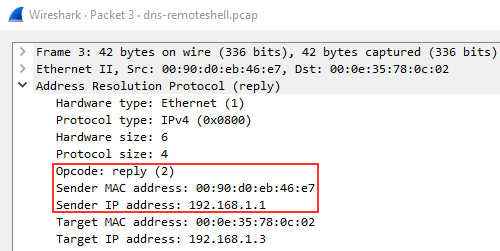

Observando os detalhes do pacote acima, podemos ver no Opcode que é um pacote ARP Reply. Também podemos obter outras informações úteis, como o endereço MAC e IP que foi enviado junto com a resposta, pois este é um pacote de resposta, sabemos que essa foi a informação enviada junto com a mensagem.

O ARP é um dos protocolos mais simples de se analisar, tudo o que se precisa lembrar é identificar se é um pacote de solicitação ou resposta e por quem está sendo enviado.

### Laboratório prático

Para ilustrar será utilizado o arquivo pcap [nb6-startup.pcap](nb6-startup.pcap).

Para carregar o arquivo no wireshark, basta clicar no menu File->Open.

Após abrir, responder as questões.

### Questões:

- a. ***What is the Opcode for Packet 6?*** *request (1)* 

- b. ***What is the source MAC Address of Packet 19?*** *80:fb:06:f0:45:d7*

- c. ***What 4 packets are Reply packets?*** *76,400,459,520*

Para responder a questão ***c***, coloca-se no filtro: arp. Em seguida, no resultado, procura-se por opcodes de replies.

- d. ***What IP Address is at 80:fb:06:f0:45:d7?*** *10.251.23.1*

Para responder a questão ***d***, coloca-se no filtro: eth.addr == 80:fb:06:f0:45:d7 and arp. Em seguida, no resultado, procura-se por reply com esse mac.

## Task 8 - ICMP Traffic

### ICMP - visão geral

O ICMP (Internet Control Message Protocol) é utilizado para analisar nodes em uma redes. É comumente utilizado no utilitário de linha de comando ***ping***. Mais detalhes sobre o ICMP na [RFC792](https://datatracker.ietf.org/doc/html/rfc792).

Na imagem abaixo, pode-se observar como pacotes ICMP aparecem no wireshark. Há um request e um reply.

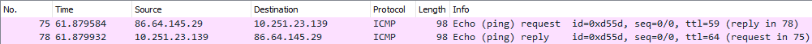

### Visão do tráfego ICMP

- ***ICMP Request***: Na imagem mais abaixou, pode-se perceber detalhes de um ping request. Algumas coisas importantes a se notar nos detalhes do pacote, dentre elas o tipo e código.

Um tipo igual a 8 é um pacote de request. Um tipo igual a 0 é um pacote de reply. Quando esses códigos são alterados ou não parecem corretos, isso geralmente é um sinal de atividade suspeita.

Há dois outros detalhes dentro do pacote que são úteis para analisar: timestamp e data. O timestamp de data/hora pode ser útil para identificar a hora em que o ping foi solicitado, também pode ser útil para identificar atividades suspeitas em alguns casos. Também podemos olhar para a string de dados que normalmente será apenas uma string de dados aleatória.

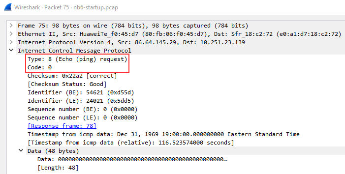

- ***ICMP Reply***: Na imagem mais abaixo, pode-se perceber que o pacote de reply é similar ao de request. A principal diferença que distingue-o do resquest é o código do tipo, no caso do reply, é o 0.

Observe a imagem abaixo para perceber a diferença:

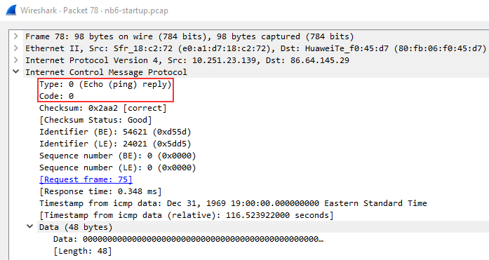

### Laboratório prático

Para responder as questões, basta carregar no wireshark o arquivo [dns_icmp.pcapng](dns_icmp.pcapng). Nele só há dois protocolos, aplique um filtro por icmp.

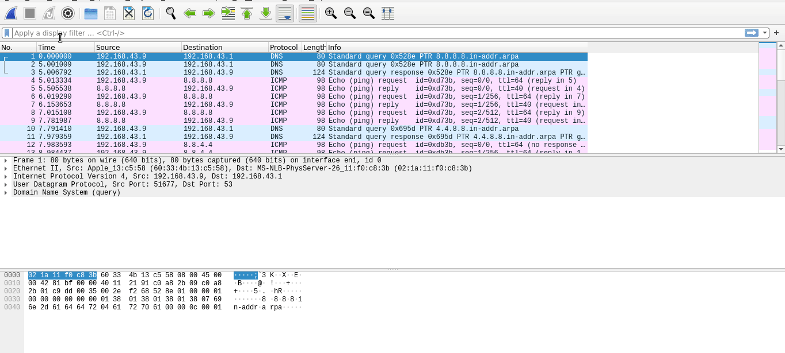

Os pacotes são numerados no wireshark, o que facilita para identificação e responder às questões.
### Questões:

- a. ***What is the type for packet 4?*** *8*

Sobre a questão ***a***, o pacote 4 é um ICMP request, ou seja, 8.

- b. ***What is the type for packet 5?*** *0*

- c. ***What is the timestamp for packet 12, only including month day and year?*** *May 30, 2013*

Para responder a questão ***c***, basta um clique no pacote 12 e inspecionar os detalhes.

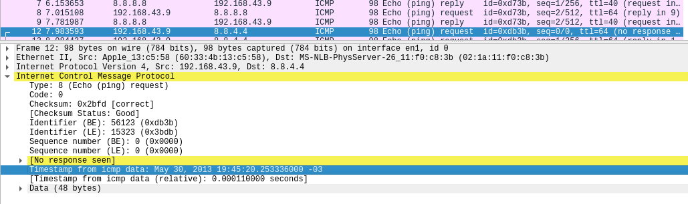

- d. ***What is the full data string for packet 18?*** *08090a0b0c0d0e0f101112131415161718191a1b1c1d1e1f202122232425262728292a2b2c2d2e2f3031323334353637*

Para responder a questão ***d***, basta clicar no pacote 18 e em detalhes localizar o campo ***Data***. Pode-se copiar o valor clicando como botão direito.

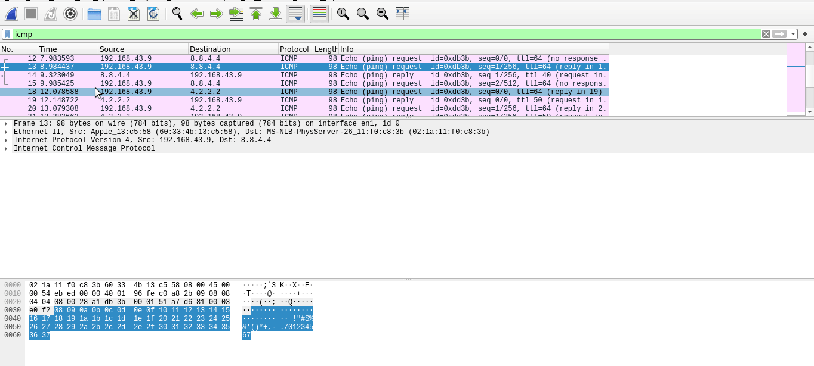

## Task 9 - TCP Traffic 

### TCP - Visão Geral

O TCP (Transmission Control Protocol) trabalha com a entrega de pacotes, incluindo sequenciamento e tratamento de erros. Para mais detalhes, acessar a [RFC 793](https://datatracker.ietf.org/doc/html/rfc793).

Na imagem abaixo, é possível perceber um exemplo com nmap scan, nas portas 80 e 443. Percebe-se que as portas estão fechadas em virtude dos pacotes com RST e ACK em vermelho.

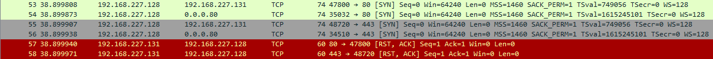

Ao analisar pacotes TCP, o Wireshark pode ser muito útil, pois codifica por cores os pacotes em ordem de nível de perigo. 

O TCP pode fornecer informações úteis sobre uma rede ao analisar, mas também pode ser difícil de analisar devido ao número de pacotes que ele envia. É aqui que você pode precisar usar outras ferramentas como RSA NetWitness e NetworkMiner para filtrar e analisar melhor as capturas.

### Visão geral do tráfego TCP

O mais comum de se observar ao analisar um tráfego TCP é o que se chama de Handshake TCP. O handshake inclui uma série de pacotes com determinadas flags: syn, synack, ack. São usadas para estabelecer uma comunicação.

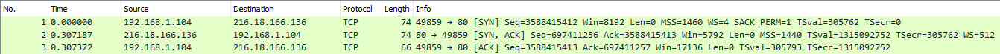

Normalmente, quando esse handshake está fora de ordem ou quando inclui outros pacotes, como um pacote RST, algo suspeito ou errado está acontecendo na rede. A varredura do Nmap na seção acima é um exemplo perfeito disso.

### Análise de pacotes TCP

Para analisar pacotes TCP no wireshark, é preciso ir nos detalhes de cada pacote. Pode-se observar alguns comportamentos e estruturas que os pacotes possuem.

Na imagem abaixo, detalhes de um pacote com a flag SYN. A principal coisa que se procura ao olhar para um pacote TCP é o número de sequência e o número de confirmação.

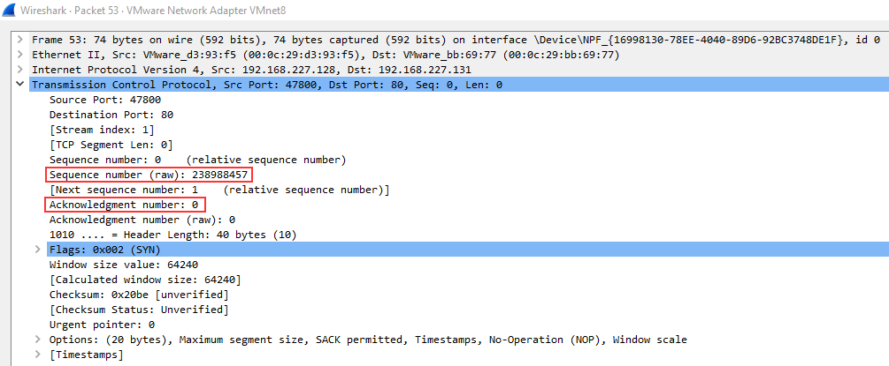

Nesse caso, vemos que a porta não estava aberta porque o número de confirmação é 0.

No Wireshark, também podemos ver o número de sequência original navegando para editar > preferências > protocolos > TCP > números de sequência relativos (desmarque a caixa).

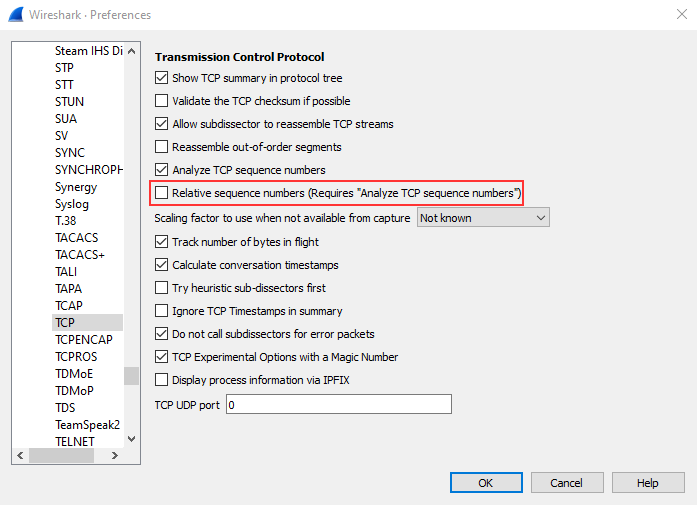

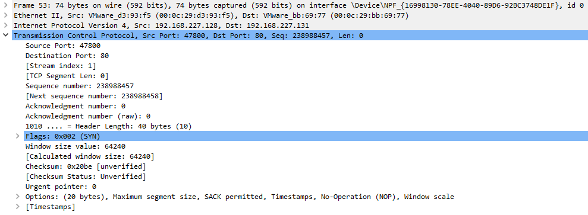

Normalmente, os pacotes TCP precisam ser vistos como um todo para contar uma história, em vez de um por um nos detalhes.

### Questões:

- a. ***Read the above and move into Task 10.*** Não há necessidade de resposta

## Task 10 - DNS Traffic

### Visão Geral - DNS

O DNS (Domain Name Service Protocol) é usado para resolver nomes em endereços IPs. Para maiores detalhes, pode ser consutada a [RFC 1035](https://www.ietf.org/rfc/rfc1035.txt).

Ao se analisar pacotes DNS, deve-se ter em mente:

- Query-response;
- DNS-Servers Only
- UDP

Se algum dos itens acima estiver fora do lugar, os pacotes devem ser examinados mais detalhadamente e devem ser considerados suspeitos.

Na imagem abaixo, pode-se observar a captura de múltiplos pacotes DNS, queries e responses:

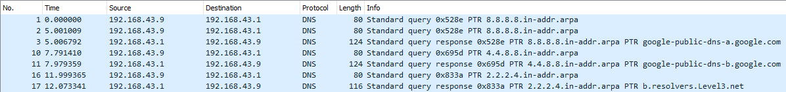

### Visão geral do tráfego DNS

- ***DNS Query***: Observando a consulta na imagem abaixo, há duas informações que podemos usar para analisar o pacote. A primeira informação que podemos ver é de onde a consulta está se originando, neste caso, é UDP 53, o que significa que este pacote passa nessa verificação, se for TCP 53, deve ser considerado tráfego suspeito e precisa ser analisado com mais atenção. Também podemos ver o que está consultando, isso pode ser útil com outras informações para construir uma história do que aconteceu.

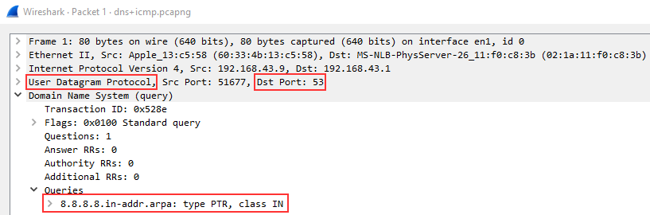

Quando se analisa pacotes DNS, o conhecimento do seu ambiente é extremamente importante, pois facilita o que seria considerado um tráfego normal ou suspeito.

- ***DNS Response***: Na imagem abaixo, pode-se observar um pacote de *DNS Response*, que é similar ao de *DNS Query*, mas ele inclui a resposta que pode ser usada para verificar a consulta.

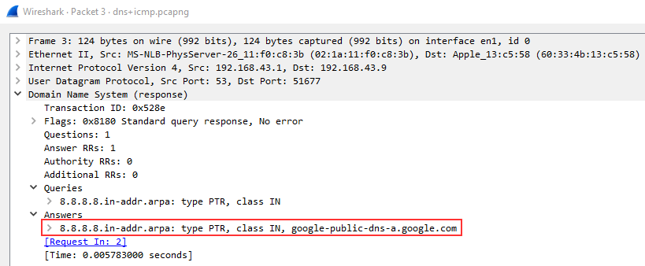

### Laboratório prático

Para análise usando o wireshark, será utilizado [este arquivo](dns_icmp2.pcapng). Basta carregar no wireshark, através do menu ***file -> open***. Esta captura tem apenas dois protocolos (ICMP e DNS), se preferir, pode filtrar ou manter a exibição do ICMP na lista.

### Questões:

- a. ***What is being queried in packet 1?*** *8.8.8.8.in-addr.arpa*

Para responder a questão ***a***, observe abaixo:

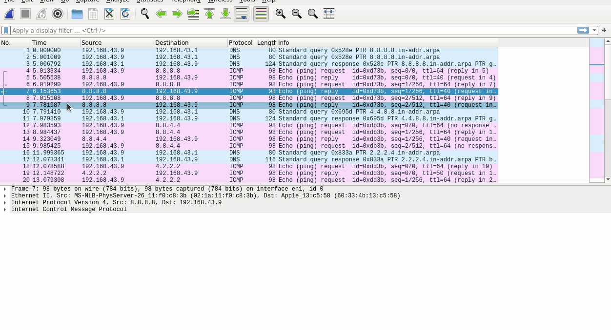

- b. ***What site is being queried in packet 26?*** *www.wireshark.org*

- c. ***What is the Transaction ID for packet 26?*** 0x2c58

As questões **b** e ***c***, podem ser respondidas de maneira análoga a como foi procedido na questão ***a***.

## Task 11 - HTTP Traffic

O HTTP (Hypertext Tranfer Protocol) é comumente usado na world wide web. Também existe uma opção com encriptação, HTTPS, que será discutido na próxima task. De uma maneira simplificada, o HTTP é utilizado por meio do envio de requisições GET e POST para um webserver que hospeda sites. Conhecimento sobre o funcionamento do HTTP ajuda em várias situações de pentest, como: SQLi, Web Shells e outros vetores de ataque usando a web.

### Visão geral do HTTP

Para obter mais informações sobre o HTTP, é recomendável acessar a [RFC 2616](https://www.ietf.org/rfc/rfc2616.txt). O HTTP é um dos protocolos mais diretos para análise de pacotes, o protocolo é direto ao ponto e não inclui nenhum handshake ou pré-requisitos antes da comunicação.

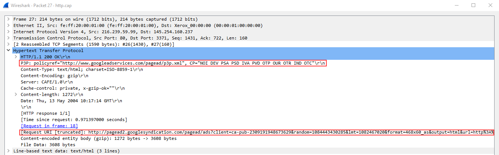

Na imagem acima, pode-se observar um pacote HTTP em que o conteúdo do pacote, inclusive os dados em texto claro, pois não é criptografado como ocorre com o HTTPS. Algumas informações interessante são a URI de request, dados do arquivo e servidor.

### Laboratório prático

Para entender melhor, basta carregar o arquivo [http](http.cap) no wireshark.

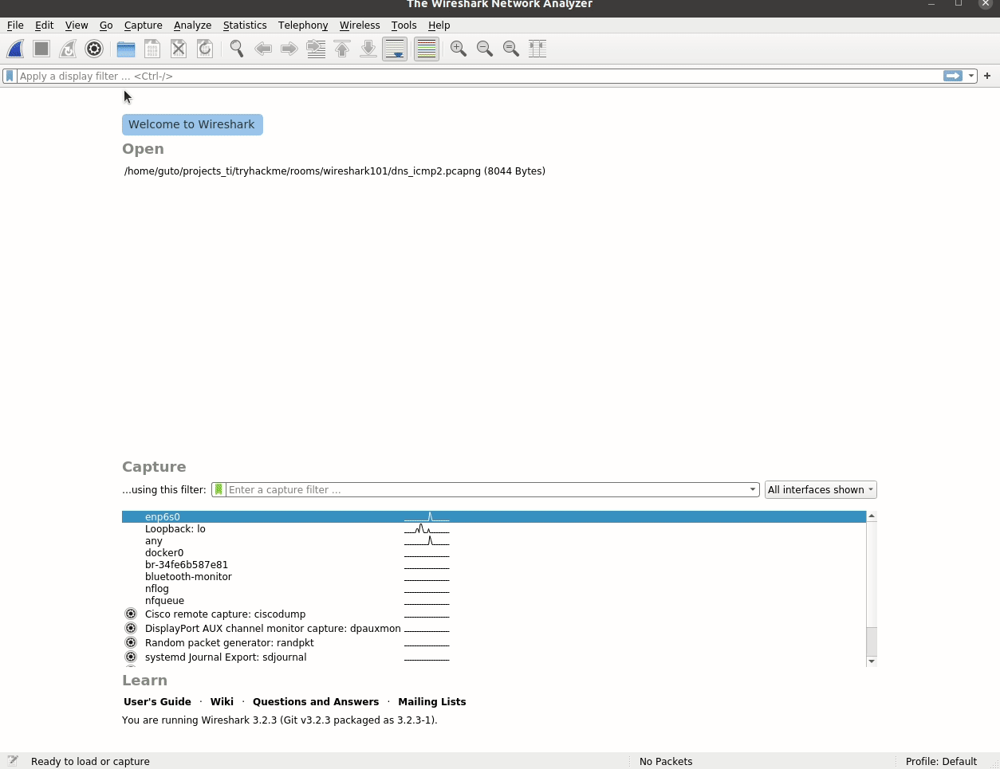

Após o carregamento do arquivo de captura, pode-se observar alguns pacotes HTTP com algumas solicitações (requests). Ao clicar em um pacote HTTP, é possível visualizar os detalhes. Por exemplo, clicando no pacote 4:

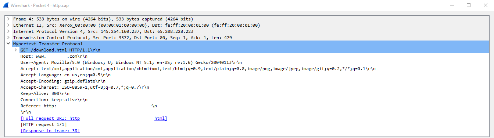

Algumas informações interessantes são perecebidas no detalhe do pacote, como: host, user-agent, requested URI e a response.

O Wireshar fornece algumas facilidades para ajudar na análise. Para ilustrar, existe um recurso muito útil que possibilida organizar os protocolos presentes em uma captura de forma hierarquica. Para isso, basta clicar no menu ***Statistics -> Protocol Hierarchy***.

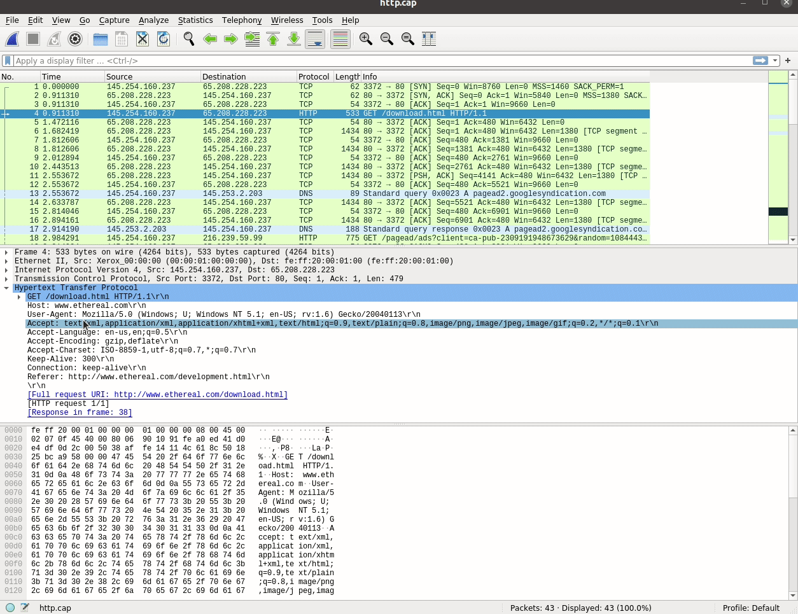

A exibição dessas informações podem ajudar muito em várias situações, como por exemplo, em threat hunting (caça de ameaças).

Outro recurso interessante do Wireshark é a possibilidade de exportar um objeto HTTP. Ele permite organizar todas as URIs requisitadas na captura. Para usar o recurso, basta acessar o menu ***File -> Export Objects -> HTTP***.

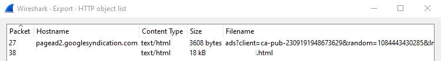

De forma similar ao Protocol Hierarchy, ajuda na identificação rápida de várias informações, que auxiliam em várias situações.

Uma última funcionalidade a citar nessa task, seria o Endpoints. Essa funcionalidade permite o usuário organizar todos os endpoints e IPs identificados na captura. Para usar esse recurso, basta acessr o menu ***Statistics -> Endpoints***.

O HTTP não é um protocolo muito comum de se ver em uso, pois o HTTPS agora é o mais comumente utilizado. No entanto, caso se encontre em uso o HTTP pode ser muito fácil de analisar.

### Questões:

- a. ***What percent of packets originate from Domain Name System?*** *4.7*

Para responder a questão ***a***, basta acessar Statistics -> Protocol Hierarchy.

- b. ***What endpoint ends in .237?*** *145.254.160.237*

Para responder a questão ***b***, basta acessar Statistics -> Endpoints.

- c. ***What is the user-agent listed in packet 4?***

Para responder a questão ***c***, basta acessar os detalhes do pacote 4.

- d. ***Looking at the data stream what is the full request URI from packet 18?*** *http://pagead2.googlesyndication.com/pagead/ads?client=ca-pub-2309191948673629&random=1084443430285&lmt=1082467020&format=468x60_as&output=html&url=http%3A%2F%2Fwww.ethereal.com%2Fdownload.html&color_bg=FFFFFF&color_text=333333&color_link=000000&color_url=666633&color_border=666633*

Para responder a questão ***d***, basta acessar os detalhes do pacote 18.

- e. ***What domain name was requested from packet 38?*** *www.ethereal.com*

- f. ***Looking at the data stream what is the full request URI from packet 38?*** *http://www.ethereal.com/download.html*

## Task 12 - HTTPS Traffic

O HTTPS (Hypertext Transfer Protocol Secure) é bem complexo para realizar análise de pacotes, podendo causar certa confusão ao analisar os pacotes HTTPS.

### Visão geral do tráfego HTTPS

Antes de enviar informação encriptada o cliente e o servidor precisam acordar uma série de etapas para estabelecer um tunelamento seguro:

1. Cliente e servidor acordam com a versão do protocolo;
2. Cliente e servidor selecionam o algorítimo criptográfico que será utilizado;
3. O cliente e o servidor se autenticam um com o outro. Este passo é opcional;
4. Criação de um tunelamento seguro com utilização de uma chave pública.

Pode-se começar a analisar o tráfego HTTPS examinando os pacotes para o handshake entre o cliente e o servidor. Abaixo está um pacote ***Client Hello*** mostrando a camada de registro SSLv2, o tipo de handshake e a versão SSL.

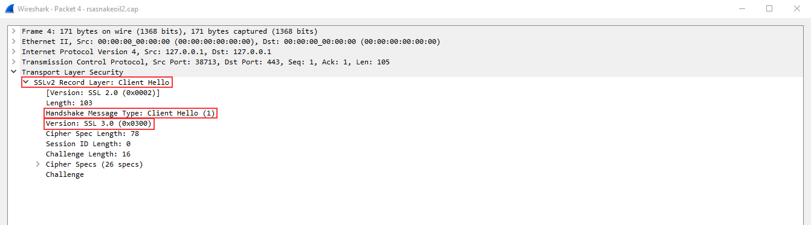

Na imagem abaixo está o pacote ***Server Hello*** enviando informações semelhantes ao pacote ***Client Hello***, mas desta vez inclui detalhes da sessão e informações do certificado SSL.

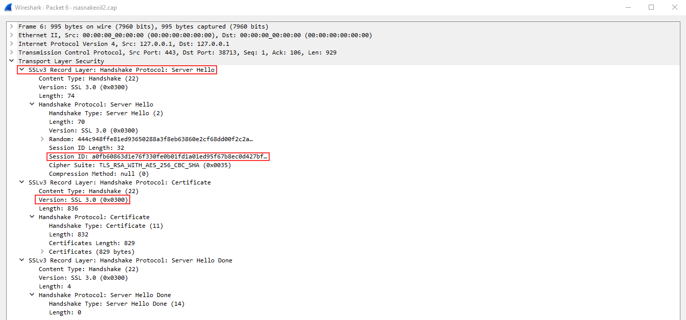

Abaixo, na imagem, está o pacote ***Client Key Exchange***, esta parte do handshake determinará a chave pública a ser usada para criptografar outras mensagens entre o Cliente e o Servidor.

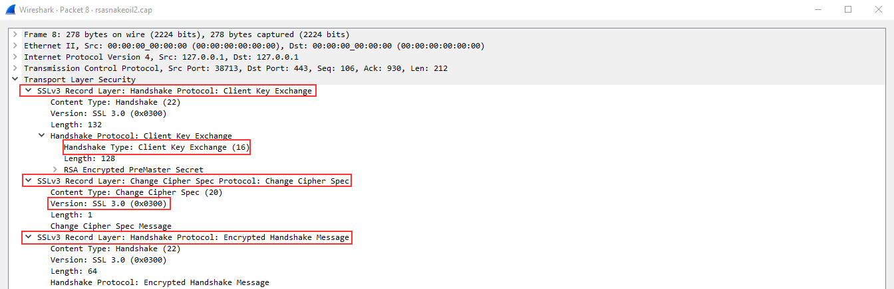

No próximo pacote, o servidor confirmará a chave pública e criará o túnel seguro, todo o tráfego após esse ponto será criptografado com base nas especificações acordadas anteriormente.

O tráfego entre o Cliente e o Servidor agora está criptografado e você precisará da chave secreta para descriptografar o fluxo de dados que está sendo enviado entre os dois hosts.

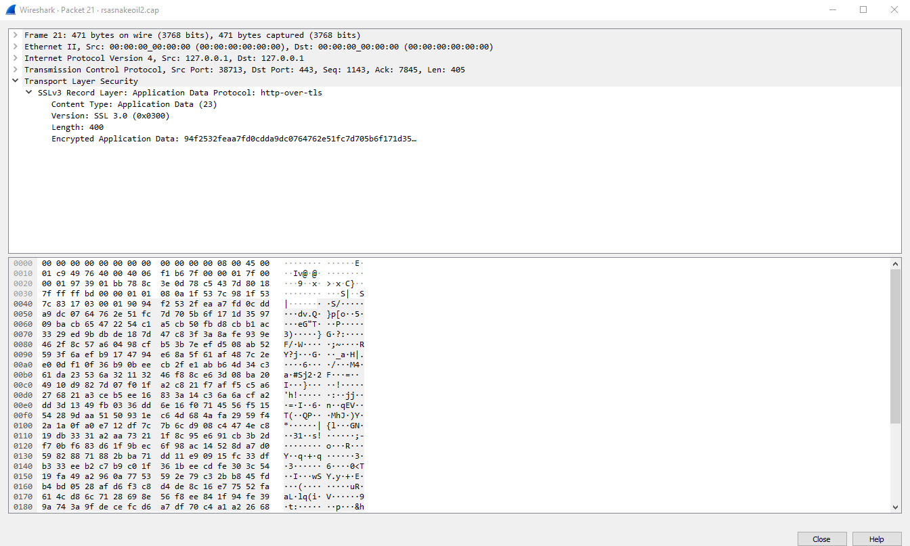

### Laboratório prático

Para executar a análise no Wireshark, foram utilizados os arquivos [rsasnakeoil2.cap](snakeoil2/rsasnakeoil2.cap) e a [chave privada](snakeoil2/rsasnakeoil2.key), que foram disponibilizados para download.

Após carregar o arquivo de captura de pacotes no Wireshark, basta prosseguir.

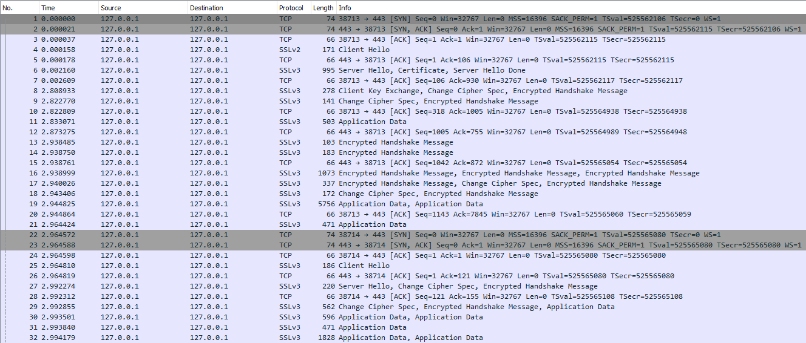

Observando a captura de pacotes da imagem acima, pode-se ver que todas as solicitações são criptografadas. Olhando mais de perto os pacotes, observa-se o handshake HTTPS, bem como as próprias solicitações criptografadas. Para melhor ilustrar, acessa-se os detalhes de um pacote: Pacote 11.

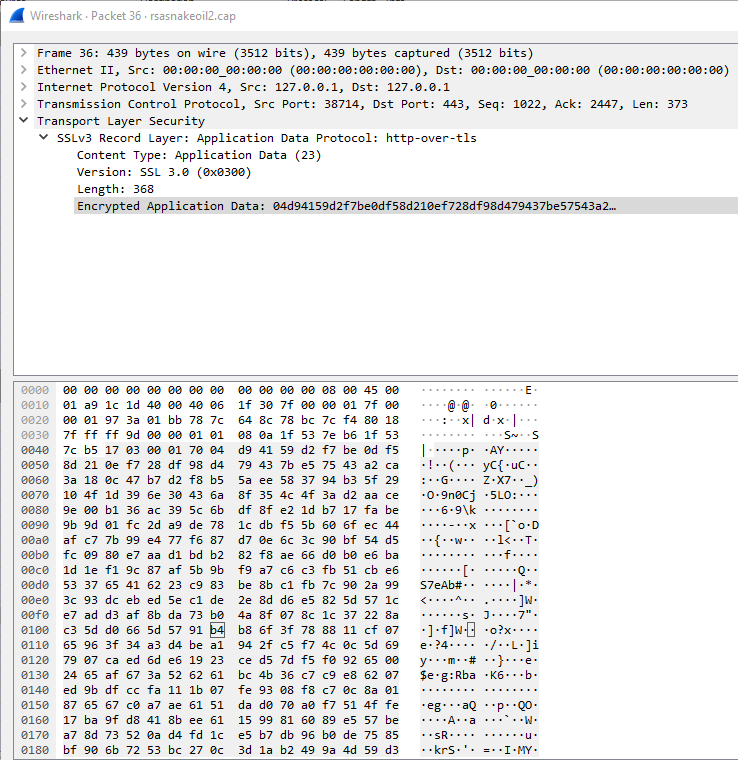

Observa-se pelos detalhes do pacote que os Dados do Aplicativo estão criptografados. Você pode usar uma chave RSA no Wireshark para visualizar os dados não criptografados. Para carregar uma chave RSA, navegue até ***Edit > Preferences > Protocols > TLS > RSA Key List (Button Edit) > [+]***. Se estiver usando uma versão mais antiga do Wireshark, isso será SSL em vez de TLS. Você precisará preencher as várias seções do menu com as seguintes preferências:

- IP Address: 127.0.0.1
- Port: start_tls
- Protocol: http
- Keyfile: RSA key location

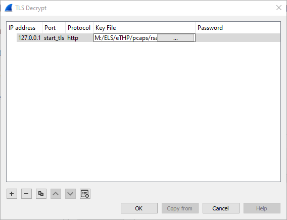

Adiciona-se a chave privada RSA disponibilizada. Agora que temos uma chave RSA importada para o Wireshark, se voltarmos à captura de pacotes, podemos ver que o fluxo de dados não está criptografado.

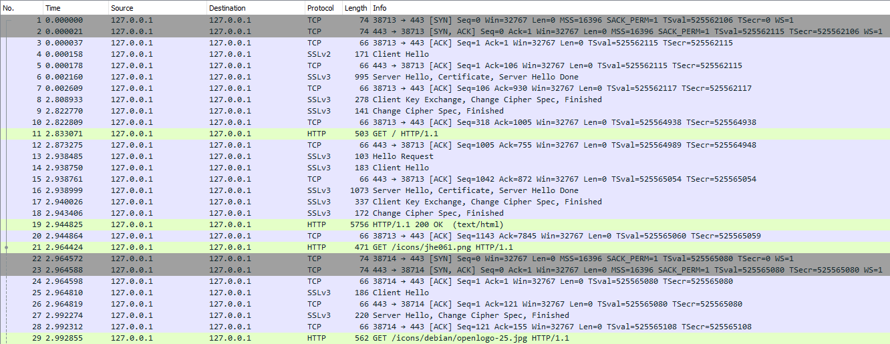

Pode-se observar as requisições HTTP sem criptografia, graças a importação da chave RSA.

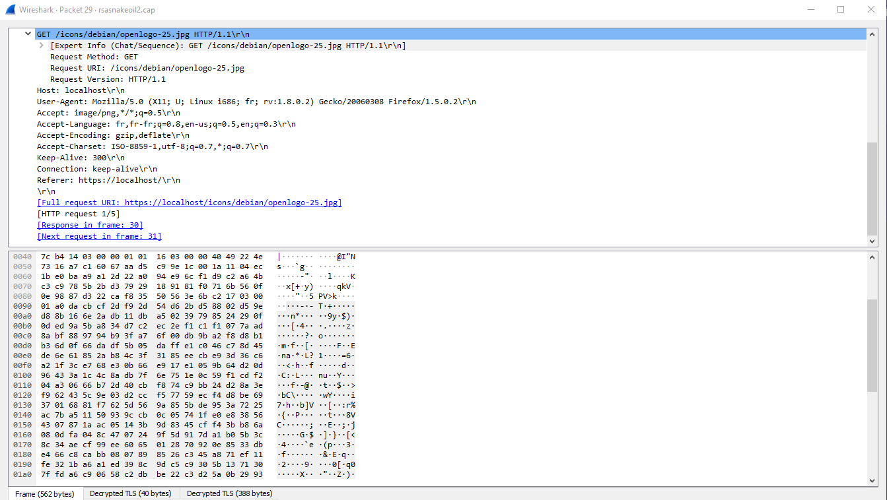

Observando os detalhes do pacote, podemos ver algumas informações muito importantes, como o URI de solicitação e o User-Agent, que podem ser muito úteis em aplicações práticas do Wireshark, como caça a ameaças e administração de rede.

Agora podemos usar outros recursos para organizar o fluxo de dados, como usar o recurso de exportação de objeto HTTP, para acessar esse recurso navegue até ***File > Export Objects > HTTP***.

É evidente que só se conseguiu descriptografar os dados por conta da chave privada.
### Questões:

- a. ***Looking at the data stream what is the full request URI for packet 31?*** *https://localhost/icons/apache_pb.png*

- b. ***Looking at the data stream what is the full request URI for packet 50?*** *https://localhost/icons/back.gif*

- c. ***What is the User-Agent listed in packet 50?*** *Mozilla/5.0 (X11; U; Linux i686; fr; rv:1.8.0.2) Gecko/20060308 Firefox/1.5.0.2*

