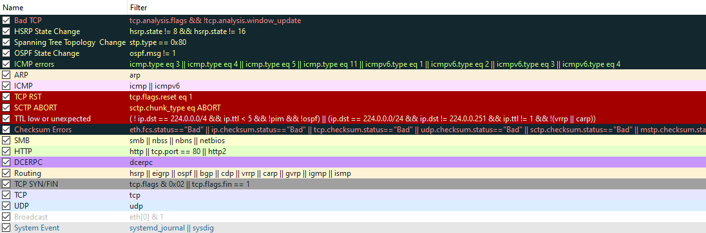

# Introdução

A room oferece oportunidade de aprendizado sobre o básico do Wireshark e como analisar vários protocolos e PCAPs.

# Execução

## Task 1 - Introduction

O Wireshark é uma ferramenta usada para criar e analisar PCAPs (arquivos de captura de pacotes de rede). É uma das melhores ferramentas de análise de pacotes. 

Nesta room, serão abordados os fundamentos da instalação do Wireshark e seu uso para realizar a análise básica de pacotes e examinar detalhadamente cada protocolo de rede comum.

### Questões:

- a. ***Informações*** *Não há necessidade de resposta*

## Task 2 - Installation

A instalação do wireshark é bem simples. Mais informações no [link](https://www.wireshark.org/download.html).

Na maioria das distribuições Linux já existe no repositório de pacotes para instalação, bastando utilizar o gerenciador pacotes para instalar (apt, yum, dnf, etc).

### Questões:

- a. ***Read the above, and ensure you have Wireshark installed.*** *Não há necessidade de resposta*

## Task 3 - Wireshark Overview 

A primeira tela ao abrir o wireshark mostra opções sobre seleção de interface, filtros:

Na imagem, existem várias interfaces. Isso varia de acordo com o computador. É possível também iniciar uma *Live Capture* em uma interface ou carregar um arquivo PCAP.

É importante perceber os gráficos de atividades ao lado de cada interface. Isso indica que uma interface está com tráfego. Capturar em uma interface que não tem atividade, pode ser inútil.

### Live Capture

No topo da lista de interfaces, na bandeirinha verde, é possível escolher uma série de filtros para facilitar o trabalho:

Não é obrigatório selecionar um filtro, mas isso ajuda a melhor organizar o que será mostrado na captura.

Uma vez que você selecionou a interface e filtros, basta clicar em iniciar captura:

Quando precisar parar a captura, basta clicar no botão Stop (Vermelho) na barra de ferramentas do topo.

### Arquivo PCAP

Caso tenha um arquivo PCAP e queira analisar, basta clicar no menu File->Open e selecionar o arquivo.

### Informações da tela de captura

Tanto quando se faz uma live capture ou se carrega um arquivo PCAP, a tela exibe uma série de informações:

- Packet Number
- Time
- Source
- Destination
- Protocol
- Length
- Packet Info

Juntamente com informações rápidas de pacotes, o Wireshark também codifica pacotes por cores em ordem de nível de perigo, bem como protocolo para poder detectar rapidamente anomalias e protocolos nas capturas.

As informações são úteis, dependendo da necessidade.

### Questões:

- a. ***Read the above and play around with Wireshark.*** *Não há necessidade de resposta*

## Task 4 - Collection Methods  

Existem algumas maneiras de se reunir um arquivo PCAP. Coletar o tréfego e trazer para o Wireshark envolve algumas técnicas: tap, port mirroring, MAC floods, ARP Poisoning. É possível configurar as técnicas em uma live capturing do Wireshark.

### Visão geral dos métodos de coleta

Algumas coisas antes de tentar coletar e monitorar capturas com live capturing:

- Comece com uma captura de amostra para garantir que tudo esteja configurado corretamente e que você esteja capturando o tráfego com sucesso.

- Certifique-se de ter poder computacional suficiente para lidar com o número de pacotes com base no tamanho da rede, isso obviamente variará de rede para rede.

- Garanta espaço em disco suficiente para armazenar todas as capturas de pacotes.

Depois de atender a todos esses critérios e escolher um método de coleta, você pode começar a monitorar e coletar ativamente os pacotes em uma rede.

### Network taps

Consiste em uma implantação física, em que se "toca" (grampo) fisicamente em um cabo de transmissão de dados. Essa técnica é comumente utilizada por times de Threat Hunting/DFIR e Red Teams, objetivando sniff e captura de pacotes.

Existem dois meios principais de grampear um fio. A primeira é usando hardware para grampear o fio e interceptar o tráfego à medida que ele passa, um exemplo disso seria um grampeador de vampiro, conforme ilustrado abaixo.

Outra opção para plantar um tap de rede seria um tap de rede inline, que você plantaria entre ou 'inline' dois dispositivos de rede. O tap irá replicar os pacotes conforme eles passam pelo tap. Um exemplo deste toque seria o muito comum Throwing Star LAN Tap.

### Mac Floods

MAC Floods é uma tática muito utilizada por Red Teams como forma de sniffing ativo de pacotes. O MAC Flooding destina-se a estressar o switch e preencher a tabela CAM. Assim que a tabela CAM estiver preenchida, o switch não aceitará mais novos endereços MAC e, portanto, para manter a rede ativa, o switch enviará pacotes para todas as portas do switch.

***Nota***: Esta técnica deve ser usada com extrema cautela e com consentimento prévio explícito do contratante de um pentest.

### ARP Poisoning

ARP Poisoning é outra técnica usada por Red Teams para sniffing ativo de pacotes. Por ARP Poisoning você pode redirecionar o tráfego do(s) host(s) para a máquina da qual você está monitorando. Essa técnica não sobrecarregará equipamentos de rede como MAC Flooding, mas ainda deve ser usada com cautela e somente se outras técnicas, como taps de rede, não estiverem disponíveis.

### Questões:

- a. ***Read the above and practice collecting captures, as well as understand the various capture techniques available.*** *Não há necessidade de resposta*

## Task 5 - Filtering Captures 

Aplicar filtros de pacotes é muito importante, sobretudo quando se tem uma captura muito grande com mais de 100.000 pacotes. Na Task 3,foi mostrado como configurar filtro antes de iniciar uma captura. Existe uma segunda forma que é conhecido como filtros de exibição, em que se pode aplicar filtros de exibição de duas maneiras: através da guia analisar e na barra de filtros na parte superior da captura de pacotes.

### Operadores de filtro

Existe uma sintaxe bem simples no Wireshark para utilização em filtros. Abaixo os operadores:

- **and**: *and* / *&&*
- **or**: *or* / *||*
- **equals**: *eq* / *==*
- **not equal**: *ne* / *!=*
- **greater than**: *gt* / *>*
- **less than**: *lt* / *<*

Existem outros operadores que podem ser utilizados no wireshark, mais informações [aqui](https://www.wireshark.org/docs/wsug_html_chunked/ChWorkBuildDisplayFilterSection.html).

### Filtro Básico

Pode-se filtrar as informações de uma captura ou uma arquivo PCAP por IP ou protocolo, dentre outras informações.

***Filtro por IP***: permitirá que se vasculhe o tráfego e veja apenas os pacotes com um endereço IP específico contido nesses pacotes, seja da origem ou do destino.

***Sintaxe***: ip.addr == \<IP Address\>

***Filtro por protocolo TCP***: É possível filtrar por uma porta ou protocolo. Com o Wireshark é possível filtrar tanto por número de porta como por nome de protocolo.

***Sintaxe***: tcp.port eq \<Port #\> or \<Protocol Name\>

***Filtro por protocolo UPD***: Também é possível filtrar por UDP, bastando mudar o prefixo de TCP para UDP.

***Sintaxe***: udp.port eq \<Port #\> or \<Protocol Name\>

### Questões:

- a. ***Read the above and understand the basics of packet filtering.*** *Não há necessidade de resposta*

## Task 6 - Packet Dissection 

O Wireshark usa a arquitetura OSI para dividir os pacotes. Conhecimento na arquitetura OSI de 7 camadas é importante.

### Detalhes do pacote

Para exibir detalhes de um pacote capturado, basta um duplo clique nele.

Os pacotes consistem em 5 a 7 camadas com base no modelo OSI. Para ilustrar, serão analisados todos eles em um pacote HTTP de uma captura de amostra.

De acordo com a figura acima, pode-se ver as 7 camadas distintas para o pacote: frame/packet, source [MAC], source [IP], protocolo, erros de protocolo, protocolo de aplicação e dados de aplicação. Abaixo, figura com as camadas com mais detalhes.

- ***Frame (Layer 1)***: Exibe qual quadro/pacote está visualizando, bem como detalhes específicos da camada física do modelo OSI.

- ***Source [MAC] (Layer 2)***: Exibe os endereços MAC de origem e destino. Relacionado à camada de enlace de dados do modelo OSI.

- ***Source [IP] (Layer 3)***: Exibe os endereços IPv4 de origem e destino. Relaciona à camada de rede do modelo OSI.

- ***Protocol (Layer 4)***: Exibe detalhes do protocolo usado (UDP/TCP) junto com as portas de origem e destino. Relacionado à camada de transporte do modelo OSI.

- ***Protocol Errors***: Esta é uma continuação da 4ª camada mostrando segmentos específicos do TCP que precisavam ser remontados.

- ***Application Protocol (Layer 5)***: Exibe detalhes específicos do protocolo que está sendo usado, como HTTP, FTP, SMB, etc. Relacionado à camada de aplicação do modelo OSI.

- ***Application Data***: Esta é uma extensão da camada 5 que pode mostrar os dados específicos do aplicativo.

Nota: Mesmo sendo citado o modelo OSI, no texto da task, ficou evidente estar sendo abordado o modelo de camadas TCP/IP.

### Questões:

- a. ***Read the above and move on to analyzing application protocols.*** *Não há necessidade de resposta*

