# Yara

A room ajudará a aprender sobre aplicações e a linguagem Yara relacionado à Threat Intelligence, análise forense e threat hunting.

# Execução

## Task 1 - Introduction


Para o bom entendidmento da room, é esperado uma certa familiaridade com abientes Linux. Além disso esta room não foi projetada para testar seus conhecimentos ou pontuar. Ela serve de incentivo e experimentação.

Para praticar, na Task 4 é possível utilizar Yara. Se preferir, pode instalar Yara em seu próprio sistema.

Yara (Yet Another Ridiculous Acronym) é importante para a área de infosec atualmente. Foi desenvolvida por Victor M. Alavarez ([@plusvic](https://twitter.com/plusvic)) e [@VirusTotal](https://twitter.com/virustotal). Repositório oficial no [GitHub](https://github.com/virustotal/yara).

## Task 2 - What is Yara?


### 2.1 - Sobre a Yara

"O canivete suiço para pesquisa de padrões de malwares (e todos os outros)" (VirusTotal, 2020)

Yara consegue identificar informações com base em padrões binários e textuais, assim como hexadecimal e strings contidos em um arquivo.

Regras podem ser utilizadas para criar labels em padrões. Por exemplo, uma regra (rule) Yara é frequentemente escrita para determinar se um arquivo é malicioso ou não, baseado em features ou padrões, se presentes.

Strings são um componente fundamental em linguagens de programação. Aplicações usam strings para armazenar dados como texto.

Por exemplo, o trecho de código abaixo faz um print "Hello World" com a linguagem Python. O texto "Hello World" será armazenado como uma string.


É possível escrever uma rule Yara para localizar "hello world em uma aplicação ou no sistema operacional.

### 2.2 - Por que malware utiliza strings?

Malware, como o exmeplo de um simples hello world, usam strings para armazenar dados. Abaixo alguns exemplos de dados de vários tipos de malwares que possuem strings características:

| Tipo | Dados | Descrição |
| ---- | ----- | --------- |
| Ransomware | 12t9YDPgwueZ9NyMgw519p7AA8isjr6SMw | Bitcoin Wallet for ransom payments |
| Botnet | 12.34.56.7 | The IP address of the Command and Control (C&C) server |

### 2.3 - Advertência: Análise de Malware

Explicar a funcionalidade de um malware é vasto e está fora do escopo desta room, devido ao tamanho do tópico. Mais detalhes cobertos na task 12 da room [MAL: Introductory room](https://tryhackme.com/room/malmalintroductory). Essa é room já serve de introdução para análise de malware.

### Questões:

- a.  ***What is the name of the base-16 numbering system that Yara can detect?*** *HEX*

- b. ***Would the text "Enter your Name" be a string in an application? (Yay/Nay)*** *Yay*

## Task 3 - Installing Yara (Ubuntu/Debian & Windows)

### 3.1 - Nota

Na VM da Task 4 já está instalado Yara e outras ferramentas utéis.

### 3.2 - Instalando Yara no Kali Linux

Existem duas opções de instalação.

- **Opção 1 - Através do package manager (recomendado)**

- a. Atualização de repositórios:
    
  ```shell
  sudo apt update -y && sudo apt upgrade -y
  ```
- b. Instalando Yara
  
  ```shell
  sudo apt install yara
  ```

- **Opção 2 - Instalação via source code**

- a. Atualização de repositórios:

  ```shell
  sudo apt update -y && sudo apt upgrade -y
  ```

- b. Instalação de pre-requisitos (dependências)
  
  ```shell
  sudo apt install automake libtool make gcc flex bison libssl-dev libjansson-dev libmagic-dev pkg-config
  ```
- c. Download do source code

  Acesse o repositório oficial no github do projeto Yara, página de releases - [Link](https://github.com/virustotal/yara/releases).

  ```shell
  wget wget https://github.com/VirusTotal/yara/archive/v4.2.2.tar.gz
  ```
  Atente para a parte v4.2.2.tar.gz no comando acima. Nela é indicada a versão da release. Ao visitar a página de releases do repositório, pode-se escolher uma versão diferente.

- d. Extraia o arquivo
  
  ```shell
  tar -zxvf v4.2.2.tar.gz
  ```

- e. Compilação e instalação
  
  ```shell 
  cd yara-4.2.2
  chmod +x configure
  ./configure
  chmod +x bootstrap.sh
  ./bootstrap.sh
  make
  sudo make install
  cd yara-4.2.2
  chmod +x configure
  ./configure
  chmod +x bootstrap.sh
  ./bootstrap.sh
  make
  sudo make install
  ```

### 3.3 - Instalando no Windows

A instalação é usando a opção via source code. Realiza-se o download do source code para Windows, descompacta-se e executa-se o binário executável.

### Questões:

- a. ***I've installed Yara and/or are using the attached VM!*** *Não há necessidade de resposta*

## Task 4 - Deploy

Nesta task é apenas indicado para iniciar a VM que já tem Yara instalado. São repassadas as credenciais de acesso SSH:
- Usuário: cmnatic
- Senha: yararules!

### Questões:

- a. ***I've either connected to my instance or installed Yara on my own operating system!*** *Não há necessidade de resposta*

## Task 5 - Introduction to Yara Rules

### 5.1 - Criando a primeira rule yara

A linguagem proprietária que a Yara utiliza para regras (rules) é trivial de se entender, porém difícil de dominar. Isso ocorre porque sua regra é tão eficaz quanto sua compreensão dos padrões que se deseja pesquisar.

Para usar regras é simples. Cada comando ***yara*** requer apenas dois argumentos para ser válido:
- 1. O arquivo de regra que será criado
- 2. Nome do arquivo, diretório ou process ID que a regra será usada.

Cada rule deve ter um nome e uma condição, exemplo de comando:

```shell
yara myrule.yar somedirectory
```
Acima, myrule.yar será usada no diretório "somedirectory".

Perceba que ".yar" é a extensão padrão de rules Yara.

Fazendo uma regra básica, conforme o que se segue abaixo.

- 1. Crie um arquivo chamado "somefile" via comando touch:
  
  ```shell
  touch somefile
  ```

- 2. Abra/crie um arquivo chamado "myfirstrule.yar" usando um editor como o vim ou nano. Adicione o seguinte conteúdo:
  
  ```shell
  rule examplerule {
    condition: true
  }
  ```

O nome da rule no código acima é "***examplerule***", existindo apenas uma condição no exemplo, ou seja, ***condition***. Conforme informado anteriormente, cada rule requer um nome e uma condição válida. Toda rule tem que satisfazer esses requerimentos.

Simplesmente, a rule que foi criada acima verifica se o arquivo/diretório/PID que foi especificado no comando existe via ***condition: true***. Se existir, recebe-se a saída ***examplerule***. 

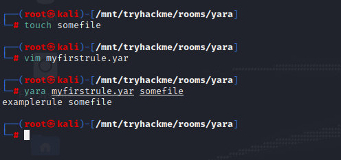

Se não existir, recebe-se a saída error scanning textfile.txt: could not open file.

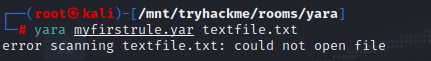

### Questões:

- a. ***One rule to - well - rule them all.*** *Não há necessidade de resposta*

## Task 6 - Expanding on Yara Rules

### 6.1 - Mais sobre condições Yara

Apenas fazer a verificação de um arquivo existe ou não em uma condição, não parece ser tão útil.

Yara possui algumas condições, que podem ser consultadas no [link](https://yara.readthedocs.io/en/stable/writingrules.html). Pode-se observar abaixo os detalhes de algumas keywords.

#### Meta

Seção de uma rule destinada e reservada para informações descritivas da rule feitas pelo autor. Por exemplo, pode-se usar *desc*, abreviação de description, para escrever um resumo do que a rule verifica. Qualquer informação dentro da seção ***meta*** não influencia a rule, similar a um comentário em um código fonte.

#### Strings

Strings podem ser usadas para pesquisar textos específicos ou um hexadecimal em arquivos ou binários, conforme já demonstrado na Task 2. Para exemplificar, digamos que se precise pesquisar pela string "*Hello World!*" em um diretório. A regra ficaria assim:

```shell
rule helloworld_checker {
    strings:
        $hello_world = "Hello World!"
}
```

É evidente que é necessário acrescentar uma condition, pois toda rule tem que ter. Logo o arquivo poderia ficar assim, utilizando a variável criada com strings:

```shell
rule helloworld_checker {
    strings:
        $hello_world = "Hello World!"

    condition:
        $hello_world
}
```

Com a rule acima, se algum arquivo contiver a string "*Hello World!*", então a regra irá dar Match, ou seja, será correspondente. Entretanto, é case sensitive e strings "hello world" ou "HELLO WORLD" não serão encontradas.

Para resolver essa situação, a condição de qualquer variação da string seja encontrada, basta adicionar as variações em outras variáveis e em condition "any of them":

```shell
rule helloworld_checker {
    strings:
        $hello_world = "Hello World!"
        $hello_world_lowercase = "hello world"
        $hello_world_upercase = "HELLO WORLD"

    condition:
        any of them
}
```

Dessa forma, qualquer uma das strings abaixo serão retornadas:

- Hello World!
- hello world
- HELLO WORLD


### 6.2 - Condições

Já foi demonstrada a utilização de ***true*** e ***any of them*** em condições. Mas existem outras, como por exemplo, operadores:
- ***<=***
- ***>=***
- ***!=***

Exemplo:

```shell
rule helloworld_checker {
    strings:
        $hello_world = "Hello World!"

    condition:
        $hello_world <= 10
}
```

A rule acima vai:
- Procurar pela string "*Hello World!*"
- Somente apresente resultado se a rule tiver 10 ou menos correspondências.

### 6.3 - Combinação de Keywords

É possível utilizar ***and***, ***not*** e ***or***, a fim de realizar combinações de condições. Para exemplificar, digamos que se deseja uma rule que tenha correspondência (match) com qualquer arquivo "*.txt*" que tenha em seu conteúdo a string "*Hello World!*". Então a rule ficaria:

```shell
rule helloworld_checker {
    strings:
        $hello_world = "Hello World!"
        $txt_file = ".txt"

    condition:
        $hello_world and $txt_files
}
```

A rule só trará correspondência (resultados) se ambas as condições forem verdadeiras. No exemplo abaixo, não trouxe resultado, pois embora o arquivo tenha a extensão "*.txt*", não possui em seu conteúdo a string "*Hello World!*".

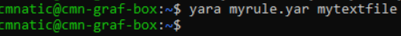

Abaixo um exemplo, quando ocorreu corresponcia de ambas as condições:

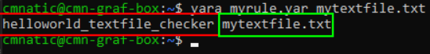

O texto destacado em vermlelho é o nome da rule e o destacado em verde é o arquivo que ocorreu correspondência.

### Anatomia de uma rule Yara

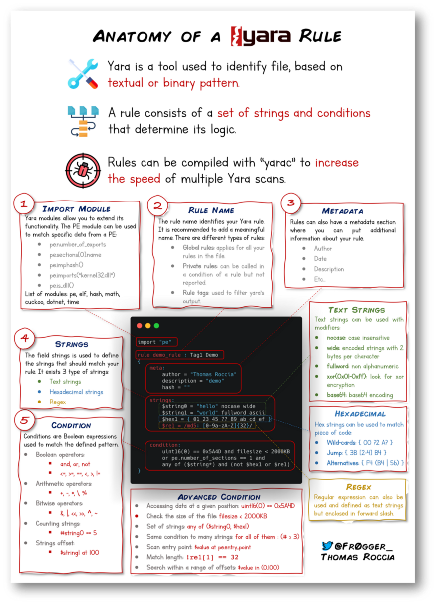

O pesquisador de segurança da informação "fr0gger_" criou e compartilhou no medium um [handy cheatsheet](https://blog.securitybreak.io/security-infographics-9c4d3bd891ef#18dd) que mostra de forma visual (com infográficos) elementos de ume rule Yara, sendo uma excelente referência.

### Questões:

- a. ***Upwards and onwards...*** *Não há necessidade de resposta*

## Task 7 - Yara modules

### 7.1 - Integração com outra bibliotecas (módulos)

Frameworks como [Cuckoo](https://cuckoosandbox.org/) ou [Python PE Modules](https://pypi.org/project/pefile/) podem ser utilizados com Yara, extendendo as possibilidades das rules.

### 7.2 - Cuckoo

Cuckoo Sandbox é um ambiente automatizado de análise de malware. Este módulo permite gerar regras Yara com base nos comportamentos descobertos no Cuckoo Sandbox. Como esse ambiente executa malware, você pode criar regras sobre comportamentos específicos, como strings de tempo de execução e similares.

### 7.3 - Python PE

O módulo PE do Python permite que você crie regras Yara a partir de várias seções e elementos da estrutura do Windows Portable Executable (PE).

Explicar essa estrutura está fora do escopo, pois é abordado na [malware introductory room](https://tryhackme.com/room/malmalintroductory). No entanto, essa estrutura é a formatação padrão de todos os executáveis e arquivos DLL no Windows. Incluindo as bibliotecas de programação que são usadas.

Examinar o conteúdo de um arquivo PE é uma técnica essencial na análise de malware; isso ocorre porque comportamentos como criptografia ou worming podem ser amplamente identificados sem engenharia reversa ou execução da amostra.

### Questões:

- a. ***Sounds pretty cool!*** *Não há necessidade resposta*

## Task 8 - Other tools and Yara

### 8.1 - Ferramentas Yara (Yara tools)

Saber como criar uma rule Yara customizada é útil, mas felizmente não é preciso criar muitas regras do zero para começar a usar o Yara para procurar pelo "mal". Existe muitos recursos disponíveis no [Github](https://github.com/InQuest/awesome-yara) e ferramentas open source (além de algumas comerciais) que podem ser utilizadas para aproveitar Yara em operações de caça e/ou respostas a incidentes.

#### LOKI (O que, não quem, é Loki?)

LOKI é um ***IOC*** (Indicator of Compromise) scanner Open source free, criado por Florian Roth. [Link no Github](https://github.com/Neo23x0/Loki).

Um IOC (Inticator of Compromise - Indicador de comprometimento) é um artefato forense observado em uma rede ou sistema operacional que, com alta confiança, indica uma intrusão.

De acordo com a página do github, a detecção baseia-se em 4 métodos:

1.  Checagem IOC baseada em nome de arquivo (file name)
2.  Checagem com Rule Yara
3.  Checagem baseada em hash
4.  Checagem de conexão de volta - C2 

***C2***: Infraestrutura de comando e controle. Trata-se de um conjunto de programas usados para se comunicar com uma máquina alvo/vítima. Comparável a um shell reverso, mas é mais avançado que isso, geralmente se comunica por meio de protocolos de rede comuns como HTTP, HTTPS e DNS.

Existem checagens adicionais que podem ser feitas com LOKI. Para mais informações basta consultar o Readme na página do projeto no Github.

LOKI pode ser usado em sistemas Windows e Linux. Em ambientes Windows, deve-se realizar o download do [binário](https://github.com/Neo23x0/Loki/releases) que vai poder ser executado tanto em sistems 32 como 64 bits. Para ambientes Linux, pode ser feito o download no mesmo link.

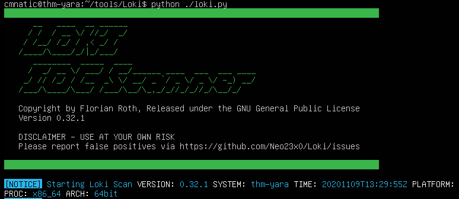

### THOR (programas nomeados com nome de super-herói para super-herói de blue team

***THOR Lite*** é o mais novo scanner IOC e YARA multiplataforma. Possui versões pré-compiladas para Windows, Linux e MacOS. Um bom recurso com o THOR Lite é a limitação de varredura para limitar os recursos exaustivos da CPU. Para obter mais informações e/ou realizar o dowload, basta acessar o [site](https://www.nextron-systems.com/thor-lite/). É necessário realizar uma subscrição na mailing list para obter uma cópia do binário. É importante notar que existe o THOR para clientes corporativos e o THOR lite é a versão free.

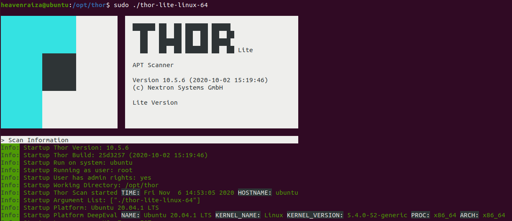

### FENRIR (nomeclatura baseada e mitologia)

É a terceira ferramenta criada por Neo23x0 (Florian Roth), [link](https://github.com/Neo23x0/Fenrir), assim como as duas anteriores citadas (LOKI e THOR). A versão atualizada foi criada para resolver o problema de seus antecessores, onde os requisitos devem ser atendidos para que funcionem. Fenrir é um script bash; ele será executado em qualquer sistema capaz de executar o bash (atualmente até o Windows).

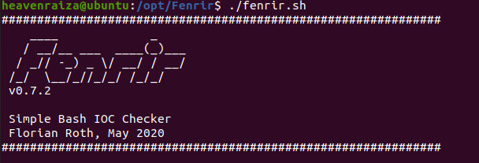

### YAYA (Yet Another Yara Automation)

YAYA foi criado pela [Electronic Frontier Foundation - EFF](https://www.eff.org/deeplinks/2020/09/introducing-yaya-new-threat-hunting-tool-eff-threat-lab), sendo lançada em setembro de 2020. De acordo com o website oficial do projeto: "*YAYA é uma nova ferramenta de código aberto para ajudar os pesquisadores a gerenciar vários repositórios de regras YARA. O YAYA começa importando um conjunto de regras YARA de alta qualidade e, em seguida, permite que os pesquisadores adicionem suas próprias regras, desativem conjuntos de regras específicos e executem verificações de arquivos.*"

Atualmente, YAYA só roda em ambientes Linux.

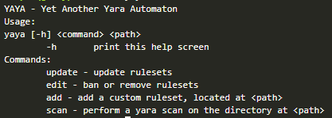

### Questões:

- a. ***Cool tools. I'm ready to use one of them.*** *Não há necessidade de resposta*

## Task 9 - Using LOKI and its Yara rule set

### 9.1 - Usando LOKI

Se você é um analista de segurança, vai necessitar realizar pesquisas em várias fontes como relatórios de inteligência de ameaças (threat intelligence reports), postagens em blogs especializados, etc, coletando informações sobre táticas e técnicas mais recentes ou mesmo antigas que são utilizadas. Normalmente nessas leituras, IOCs (hashes, ips, nomes de domínio, etc) são compartilhados de modo a proporcionar a criação de rules para detectar as ameaças em seu ambiente, assim como também as rules Yara.

Por outro lado, você pode se deparar em uma situação em que encontrou algo desconhecido, que sua pilha de ferramentas de segurança não pode/não detectou. Usando ferramentas como o Loki, você precisará adicionar suas próprias regras com base em suas coletas de inteligência de ameaças ou descobertas de um envolvimento de resposta a incidentes (forense).

Conforme já mencionado, Loki já possui um conjunto de rules Yara que podemos utilizar como ponto de partida em busca de ameaças no terminal.

Na VM sugerida na task 4, navegue até o diteório Loki que está dentro do **~/tools**:

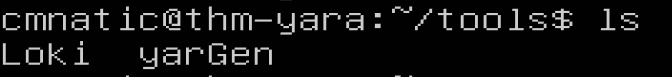

**Nota**: Para demonstrar a utilização, está sendo considerado o uso da VM da task 4.

Para executar o Loki e visualizar o help, basta executar: 

```shell
python loki.py -h
```

Se estiver executando o Loki em seu próprio sistema, primeiro execute com a opção **--update**:

```shell
python loki.py --update
```
Após rodar o comando acima, será criado o diretório ***signature-base***, que é utilizado pelo Loki nos scans, ou seja, é onde tem as assinaturas de ameaças conhecidas. Na VM da task 4, esse comando já foi executado.

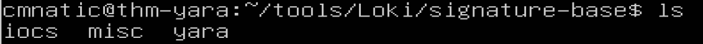

Acesse o diretório e liste o conteúdo. Vários arquivos Yara que podem ser usados com o Loki.

Para executar o Loki, você pode usar o seguinte comando (observe que estou chamando o Loki de dentro do diretório do file 1), na VM da task 4:


**Cenário**: Você é o analista de segurança de um escritório de advocacia de médio porte. Um colega de trabalho descobriu arquivos suspeitos em um servidor da Web em sua organização. Esses arquivos foram descobertos durante a execução de atualizações no site corporativo. Os arquivos foram copiados para sua máquina para análise. Os arquivos estão localizados no diretório ***suspicious-files***. Use o Loki para responder às perguntas abaixo.

### Questões:

- a. ***Scan file 1. Does Loki detect this file as suspicious/malicious or benign?*** *suspicious*

A resposta é exibida ao término da execução do comando indicato mais acima.

- b. ***What Yara rule did it match on?***  *webshell_metaslsoft*

- c. ***What does Loki classify this file as?*** *Web Shell*

- d. ***Based on the output, what string within the Yara rule did it match on?*** *Str1*

- e. ***What is the name and version of this hack tool?*** *b374k 2.2*

- f. ***Inspect the actual Yara file that flagged file 1. Within this rule, how many strings are there to flag this file?*** *1*

- g. ***Scan file 2. Does Loki detect this file as suspicious/malicious or benign?*** benign

Para responder essa questão, deve-se executar novamente o loki, considerando a VM da task 4, assim:

```shell
cmnatic@thm-yara:~/suspicious-files/file2$ python ../../tools/Loki/loki.py -p .
```
Ou seja, dentro do diretório ***~/suspicious-files/file2***, executa-se o Loki.

- h. ***Inspect file 2. What is the name and version of this web shell?*** *b374k 3.2.3*

Para responder essa questão, pode-se executar o comando:

```shell
head -n 20 index.php
```
Ou seja, exibir as 20 primeiras linhas do arquivo.

## Task 10 - Creating Yara rules with yarGen 

### 10.1 - Criando rules Yara com yarGen

Na seção anterior, percebemos que temos um arquivo que o Loki não sinalizou. Neste ponto, não podemos executar o Loki em outros servidores web porque se o file 2 existir em qualquer um dos servidores web, ele não será detectado.

É necessário, portanto, criar uma regra Yara para detectar esse web shell específico em nosso ambiente. Normalmente é isso que é feito no caso de um incidente, que é um evento que afeta/impacta a organização de forma negativa.

Podemos abrir o arquivo manualmente e tentar filtrar linhas e mais linhas de código para encontrar possíveis strings que possam ser usadas em nossa regra Yara que será criada.

O arquivo file 2, possui muitas linhas. Pode-se contar as linhas com o comando:

```shell
strings ARQUIVO | wc -l
```
Ou seja, no cenário da VM da task 4:

```shell
cd ~/suspicious-files/file2
strings 1ndex.php | wc -l
```
Saída:
```shell
3580
```

Se tentar visualizar cada string line do arquivo manualmente, perceberá que será uma tarefa árdua. Isso pode ser feito, por exemplo, com o comando less:

```shell
less 1ndex.php
```
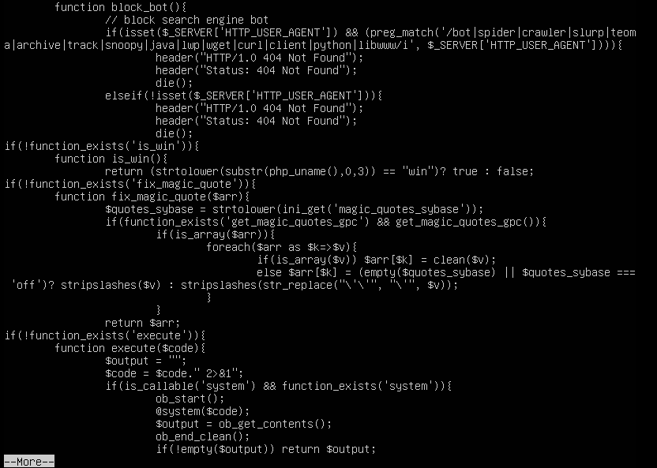

Por sorte, pode-se utilizar yarGen (outra ferramenta criada por Florian Roth) para nos ajudar na tarefa desta task.

O que é yarGen? É um gerador de rules Yara.

Link do projeto no [github](https://github.com/Neo23x0/yarGen).

De acordo com o próprio arquivo README do projeto "*O princípio principal é a criação de regras yara a partir de strings encontradas em arquivos de malware enquanto remove todas as strings que também aparecem em arquivos goodware. Portanto, o yarGen inclui um grande banco de dados de strings de goodware e opcode como arquivos ZIP que devem ser extraídos antes do primeiro uso.*" - Tradução direta.

Para utilizar o yarGen, após realizar um git clone do projeto que está no github, acessar o diretório yarGen e executar o comando abaixo para atualizar a base:

```shell
python3 yarGen.py --update
```
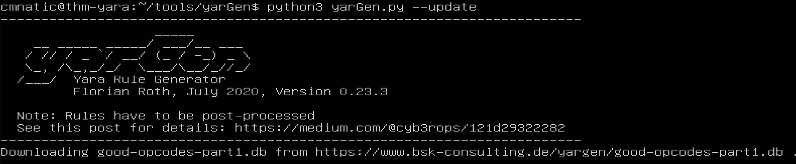

Isso irá atualizar a lista de good-opcodes e good-strings no BD local, a partir do repositório online do projeto.

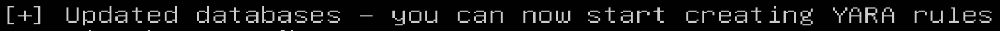

Agora, pode-se executar o comando abaixo para gerar uma rule Yara para o File 2:

```shell
python3 yarGen.py -m /home/cmnatic/suspicious-files/file2 --excludegood -o /home/cmnatic/suspicious-files/file2.yar
```

Esclarecendo o comando anterior:

- **-m** indica o path de arquivos que se deseja criar uma rule Yara.
- **--excludegood** foçar a exclusão de goodware strings (eliminação de falsos positivos)
- **-o** indica a localização e nome do arquivo de rule Yara que será gerado.

Ao finalizar a geração, a saída final será como abaixo:

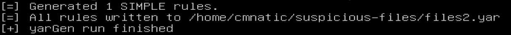

Geralmente, examinaria-se a regra Yara e removeria quaisquer strings que pudessem gerar falsos positivos. Para este exercício, deixou-se a regra Yara gerada como está e testaremos para ver se o Yara sinalizará o arquivo 2 ou não.

**Nota**: Outra ferramenta criada para auxiliar nisso é chamada [yarAnalyzer](https://github.com/Neo23x0/yarAnalyzer/) (também criada por Florian Roth). Essa ferramenta permite analisar suas rules Yara criadas por conta própria ou mesmo pelo yarGen.

Algumas sugestões de leitura sobre o yarGen:

- https://www.bsk-consulting.de/2015/02/16/write-simple-sound-yara-rules/
- https://www.bsk-consulting.de/2015/10/17/how-to-write-simple-but-sound-yara-rules-part-2/
- https://www.bsk-consulting.de/2016/04/15/how-to-write-simple-but-sound-yara-rules-part-3/

### Questões:

- a. ***From within the root of the suspicious files directory, what command would you run to test Yara and your Yara rule against file 2?*** *yara file2.yar file2/1ndex.php*

Para responder a questão, considerando que está usando a VM da task 4, deve-se está dentro do diretório ~/suspicious-files

- b. ***Did Yara rule flag file 2? (Yay/Nay)*** Yay

- c. ***Copy the Yara rule you created into the Loki signatures directory.*** *Não há necessidade de resposta*

Estando dentro do diretório ***~/suspicious-files*** da VM - Task 4:
```shell
cp file2.yar ../tools/Loki/signature-base/yara/
```

- d. ***Test the Yara rule with Loki, does it flag file 2? (Yay/Nay)*** *Yay*

Para responder, primeiro acessa-se o diretório ***~/suspicious-files/file2/***.  Depois executa-se:

```shell
python ../../tools/Loki/loki.py -p .
```

- e. ***What is the name of the variable for the string that it matched on?*** Zepto

Para responder, no output do comando loki, basta ir na linha **MATCHES** procurar por **var**.

- f. ***Inspect the Yara rule, how many strings were generated?*** 20

Basta visualizar o conteúdo do arquivo file2.yar que foi gerado.

- g. ***One of the conditions to match on the Yara rule specifies file size. The file has to be less than what amount?*** 700kb 

Essa resposta está no arquivo de rule gerado.

## Task 12 - Valhalla

### 12.1 - Valhalla

Valhalla é um serviço online Yara, criado e disponibilizado por Nextron-Systems. De acordo com o [website](https://www.nextron-systems.com/valhalla/): *VALHALLA aumenta seus recursos de detecção com o poder de milhares de regras YARA de alta qualidade feitas à mão.* - Tradução direta.


Valhalla pode ser acessado de algumas formas, por exemplo, por sua API ou mesmo através da web no link: https://valhalla.nextron-systems.com/

A partir da imagem acima, devemos denotar que podemos realizar pesquisas com base em uma palavra-chave, tag, técnica ATT&CK, sha256 ou nome de regra.

Dando uma olhada nos dados fornecidos a nós, vamos examinar a primeira regra listada no feed (a partir desta data de entrada).

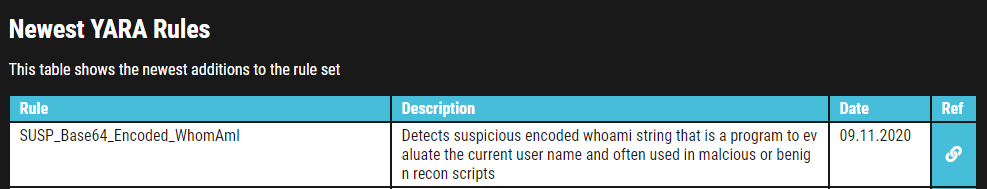

Observa-se o nome da regra, uma breve descrição, um link de referência para obter mais informações sobre a regra, juntamente com a data da regra.

Retomando nosso cenário, neste ponto, sabe-se que os 2 arquivos estão relacionados. Mesmo que Loki tenha classificado os arquivos como suspeitos, pode-se ter o sentimento que eles são maliciosos. Daí a razão pela qual se criou uma regra Yara usando yarGen para detectá-la em outros servidores da web. Mas vamos fingir ainda que você não é conhecedor de código (FYI - nem todos os profissionais de segurança sabem como codificar / script ou lê-lo). Logo, é preciso realizar mais pesquisas sobre esses arquivos para receber aprovação para erradicar esses arquivos da rede.

Hora de usar Valhalla para alguma coleta de inteligência de ameaças, respondendo as questões.

### Questões:

- a. ***Enter the SHA256 hash of file 1 into Valhalla. Is this file attributed to an APT group? (Yay/Nay)*** Yay

Para responder a questão, na saída do Loki, é exibida a hash. Basta adicionar essa hash no campo de query do Valhalla para obter a resposta.


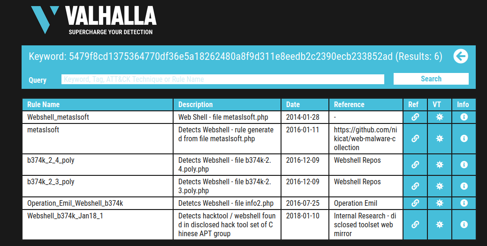

- b. ***Do the same for file 2. What is the name of the first Yara rule to detect file 2?*** *Webshell_b374k_rule1*

Mesmo procedimento feito pra responder a questão a, porém agora no arquivo file2.

- c. ***Examine the information for file 2 from Virus Total (VT). The Yara Signature Match is from what scanner?*** *THOR APT Scanner*

Para responder a questão, basta acessar o virustotal e pesquisar pela hash.

- d. ***Enter the SHA256 hash of file 2 into Virus Total. Did every AV detect this as malicious? (Yay/Nay)*** Nay

- e. ***Besides .PHP, what other extension is recorded for this file?*** *exe*

Na aba datails do resultado da pesquisa no virus total, é possível localizar a resposta.

- f. ***What JavaScript library is used by file 2?*** *zepto*

O link do github https://github.com/b374k/b374k é obtido a partir da pesquisa feita no Valhalla. Basta acessar o repositório e inspecionar o conteúdo do arquivo index.php para obter a resposta.

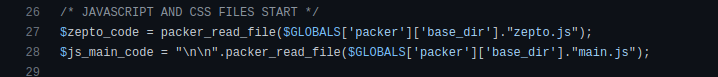

- g. ***Is this Yara rule in the default Yara file Loki uses to detect these type of hack tools? (Yay/Nay)*** *Nay*


