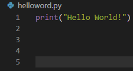

# Yara

A room ajudará a aprender sobre aplicações e a linguagem Yara relacionado à Threat Intelligence, análise forense e threat hunting.

# Execução

## Task 1 - Introduction

Para o bom entendidmento da room, é esperado uma certa familiaridade com abientes Linux. Além disso esta room não foi projetada para testar seus conhecimentos ou pontuar. Ela serve de incentivo e experimentação.

Para praticar, na Task 4 é possível utilizar Yara. Se preferir, pode instalar Yara em seu próprio sistema.

Yara (Yet Another Ridiculous Acronym) é importante para a área de infosec atualmente. Foi desenvolvida por Victor M. Alavarez ([@plusvic](https://twitter.com/plusvic)) e [@VirusTotal](https://twitter.com/virustotal). Repositório oficial no [GitHub](https://github.com/virustotal/yara).

## Task 2 - What is Yara?

### 2.1 - Sobre a Yara

"O canivete suiço para pesquisa de padrões de malwares (e todos os outros)" (VirusTotal, 2020)

Yara consegue identificar informações com base em padrões binários e textuais, assim como hexadecimal e strings contidos em um arquivo.

Regras podem ser utilizadas para criar labels em padrões. Por exemplo, uma regra (rule) Yara é frequentemente escrita para determinar se um arquivo é malicioso ou não, baseado em features ou padrões, se presentes.

Strings são um componente fundamental em linguagens de programação. Aplicações usam strings para armazenar dados como texto.

Por exemplo, o trecho de código abaixo faz um print "Hello World" com a linguagem Python. O texto "Hello World" será armazenado como uma string.

É possível escrever uma rule Yara para localizar "hello world em uma aplicação ou no sistema operacional.

### 2.2 - Por que malware utiliza strings?

Malware, como o exmeplo de um simples hello world, usam strings para armazenar dados. Abaixo alguns exemplos de dados de vários tipos de malwares que possuem strings características:

| Tipo | Dados | Descrição |
| ---- | ----- | --------- |
| Ransomware | 12t9YDPgwueZ9NyMgw519p7AA8isjr6SMw | Bitcoin Wallet for ransom payments |
| Botnet | 12.34.56.7 | The IP address of the Command and Control (C&C) server |

### 2.3 - Advertência: Análise de Malware

Explicar a funcionalidade de um malware é vasto e está fora do escopo desta room, devido ao tamanho do tópico. Mais detalhes cobertos na task 12 da room [MAL: Introductory room](https://tryhackme.com/room/malmalintroductory). Essa é room já serve de introdução para análise de malware.

### Questões:

- a.  ***What is the name of the base-16 numbering system that Yara can detect?*** *HEX*

- b. ***Would the text "Enter your Name" be a string in an application? (Yay/Nay)*** *Yay*
